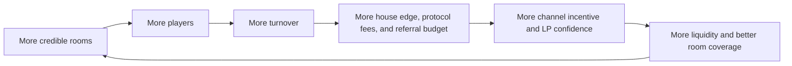

# ArbiGameFi 产品与商业白皮书

> 项目：`ArbiGameFi`
>
> 底层架构：`SSOT`
>
> 文档系列：`Product & Business Whitepaper`
>
> 文档编号：`AGF-WP-BIZ-2026.03`
>
> 状态：`External Draft`
>
> 语言：`zh-CN`
>
> 日期：`2026-03-07`
>
> 基础前提：`grounded in currently implemented protocol capabilities`
>
> 目标读者：`players / LPs / referrers / investors / technical auditors / growth contributors`
>
> 关联文档：`docs/WHITEPAPER.zh-CN.md` · `docs/ARBIGAMEFI-EXECUTIVE-BRIEF.zh-CN.md`

## 摘要

ArbiGameFi 的产品机会，不在于“再做一个链上赌场前端”，也不在于第一阶段就去做白标运营平台，而在于把一个传统上高度黑盒、强托管、低透明度的行业，先做成一个玩家可直接使用的、可验证、非托管、可审计的链上 casino 与 sportsbook 产品。

从商业上看，ArbiGameFi 具备三个最有价值的出发点：

- 对玩家：用钱包直连和链上可验证性，替代平台托管和平台解释。
- 对流动性提供者：用每资产隔离、准备金约束和可证明负债，替代黑盒资金池。
- 对分发者和推荐方：用首触绑定、定价 skyline 与链上预算分配，替代离链人工返佣与对账。

从系统上看，ArbiGameFi 的底层不是单点游戏，而是一套可以承载 casino、sportsbook 与未来垂直玩法的结算内核。`Bank -> SettlementRouter -> GameHub / SportsHub / FutureHub` 这条架构保留协议级扩展能力；但从 go-to-market 上看，当前阶段必须先按单品牌 B2C 产品落地，把玩家下注、自动结算、LP 信任和渠道转化跑通。

本文件的目标是回答：

1. 这个产品当前首先面向谁。
2. 它创造的用户价值是什么。
3. 它的增长飞轮如何形成。
4. 它的商业化抓手在哪里。
5. 在当前代码边界下，哪些能力应该产品化，哪些能力只应作为未来可选项保留。

## Abstract (EN)

ArbiGameFi should be understood as a single-brand B2C casino and sportsbook product built on a protocol-grade settlement kernel. Its business opportunity comes from combining three value propositions at once: non-custodial player experience, auditable bankroll and liability structure for LPs, and on-chain referral economics for channels.

This document explains the product thesis, user segments, commercial model, growth flywheel, go-to-market logic, and realistic roadmap that can be built on the current protocol. It is intentionally constrained by what the contracts already support, and it treats third-party operator or white-label distribution as a future option rather than the current go-to-market motion.

## 1. 产品命题

### 1.1 我们到底在做什么

ArbiGameFi 不是纯“赌博 UI”，也不是当前阶段的白标 SaaS 平台。它是一个先以单品牌 B2C 形态上线的链上 casino/sportsbook 产品，其底层采用 SSOT 账本与结算架构，试图把下面这句话变成真实产品体验：

> 玩家不需要把钱交给平台，也不需要相信平台解释结果；LP 不需要相信平台手工记账；推荐方不需要相信平台人工对账。

这让 ArbiGameFi 的底层更像“链上概率游戏的金融与结算引擎”，但当前产品入口必须像一个用户能直接玩、能直接理解、能直接信任的消费级产品。

### 1.2 为什么这件事值得做

链上博彩和链上概率游戏并不缺产品，真正稀缺的是以下三者同时成立：

- 真正的非托管
- 可审计的准备金与负债
- 可规模化扩展到多种房间玩法的统一底层

多数产品只能做好其中一到两点：

- 中心化平台可以把体验做到极强，但资金与结算不透明。
- 半链上产品能把充值和提现放到链上，但结果与返佣依旧依赖平台解释。
- 单游戏小协议可以做到完全上链，但难以扩展成一个有运营效率的游戏平台。

ArbiGameFi 的机会在于：用协议化结算把“可信”做成底层能力，再通过自营 B2C 产品验证真实下注、LP 供给与渠道分发。只有这条主线跑通后，第三方集成或白标前端才有商业意义。

## 2. 核心用户

### 2.1 玩家

玩家真正关心的不是“协议名字是什么”，而是三个问题：

- 钱是不是在我自己手里，还是必须先充到平台。
- 我输了赢了、退款没退款，到底能不能在链上看清楚。
- 这个产品够不够快、够不够简单、够不够像一个真正能玩的游戏产品。

ArbiGameFi 对玩家的价值主张应当是：

- 钱包原生
- 无托管
- 规则可验证
- 结果可审计
- 出问题时有明确退款路径

### 2.2 流动性提供者

LP 在这个系统里不是被动出资人，而是 bankroll 的风险承接方。LP 最关心的是：

- 资产是否与其他资产混池
- 协议对外到底已经欠了多少
- 未开奖注单是否有足够准备金
- 提现是否受明确规则限制，而不是运营拍脑袋

ArbiGameFi 在这方面的价值非常直接：

- 每资产独立 Bank
- 明确的准备金 `R`
- 明确的外部负债 `PF + XP`
- 明确的最小流动性缓冲

### 2.3 推荐人、KOL 与渠道

推荐方在传统博彩产品中往往面临三个问题：

- 归因不清
- 返佣不透明
- 对账周期长且可被平台修改

ArbiGameFi 的推荐系统为这类角色提供了一个更具确定性的合作层：

- 首触绑定
- skyline 增量定价
- 链上预算拆分
- 可被审计的返利负债

### 2.4 技术审计者与未来集成方

从更高一层看，ArbiGameFi 的协议结构还可以服务于未来的：

- 游戏房间运营方
- 白标前端
- 聚合器
- 数据分析与监控层

但这些角色不是当前 go-to-market 的第一优先级。v1 前端应优先服务玩家、LP、推荐方和协议运营者；未来集成能力应当作为底层可选性保留，而不是倒逼当前前端过早复杂化。

## 3. 用户价值主张

### 3.1 对玩家的价值

玩家视角下，ArbiGameFi 应该被表达为：

- `Connect wallet`
- `Choose room`
- `Place bet`
- `Get settled or refunded on-chain`

而不是一堆合约术语。

真正打动玩家的卖点应是：

- 不需要充值到平台钱包
- 规则不是平台说了算
- 随机数异常时不是无限等，而是有超时退款路径
- 可以独立验证历史下注和结算

### 3.2 对 LP 的价值

LP 视角下，ArbiGameFi 不是“博弈游戏项目”，而是：

- 一套有准备金纪律的 bankroll 系统
- 一套能证明自己没有混账和黑箱负债的金库体系
- 一套可以逐资产扩展的风险隔离架构

### 3.3 对渠道的价值

渠道视角下，ArbiGameFi 不是“谈返佣抽成”，而是：

- 可绑定的首触关系
- 可证明的分配路径
- 可重建的预算逻辑
- 更低的争议成本

## 4. 产品形态

### 4.1 产品不是单页，而是三层结构

ArbiGameFi 最合理的产品结构不是“首页 + 一个游戏页”，而是三层：

1. 获取层
2. 房间层
3. 审计层

### 4.2 获取层

获取层负责把不懂协议的人转化为愿意尝试的用户。它应该承担：

- 价值主张表达
- 非托管与公平性的初步信任建立
- Featured rooms 导流
- 轻量实时证明，而不是重型后台数据

### 4.3 房间层

房间层是玩家真正花时间的地方。每个游戏房间必须围绕同一条用户路径设计：

1. 先选结果
2. 再定金额
3. 最后确认并上链

这是产品层最重要的原则。技术透明度应该下沉到第二层，而不是和主操作争抢注意力。

### 4.4 审计层

`/bets`、`/liquidity`、`/claims`、`/account` 这类页面的职责不是获客，而是：

- 让专业用户和深度用户审计协议
- 让 LP 看清风险
- 让玩家查清自己的历史行为
- 让异常处理有操作入口

这类页面不该压在首页首屏。

## 5. 产品护城河

### 5.1 与中心化平台相比

中心化平台的强项是：

- 体验成熟
- 游戏多
- 运营强

但它们的弱点也很明显：

- 必须托管玩家资金
- 返佣与活动无法被外部验证
- 资金与负债结构通常不可审计

ArbiGameFi 不应该试图在第一天就复制它们全部内容，而应该打自己的差异化：

- 无托管
- 可验证结算
- 可审计负债
- 协议级推荐分配

### 5.2 与半链上产品相比

很多所谓“链上赌场”只是：

- 钱包登录在链上
- 部分入金出金在链上
- 结果和返佣仍在平台后端

ArbiGameFi 的差异在于其关键真相已经被拆成可查询的链上事实源。这意味着它的底层是协议级内核，但第一产品形态仍然应该是可转化、可留存的 B2C casino/sportsbook。

### 5.3 与单游戏小协议相比

单游戏协议可以做到纯链上，但通常面临：

- 玩法单一
- 风险模型只适配单个游戏
- 缺少统一的推荐与流动性体系

ArbiGameFi 的优势在于：它已经为多房间扩展准备好了统一底层。

## 6. 商业模式

### 6.1 当前代码已经表达出的商业抓手

在不引入任何额外代币叙事的情况下，当前协议已经具备明确商业化抓手：

- House edge
- 协议费用负债 `PF`
- 推荐预算体系
- LP bankroll

这四者已经足以支撑一套基本商业模型。

### 6.2 收入来源

从当前实现出发，协议收入最自然的来源是：

- 注单结算中的 house-edge 相关费用确认
- 在推荐预算分配后留在协议侧的费用部分
- 未来可选的集成、数据或房间分发收入

其中前两项已经在协议代码中具备明确语义，第三项属于产品与 BD 层的延展，不应在技术语义上写成已实现事实，也不应成为当前前端架构复杂化的理由。

### 6.3 成本结构

主要成本会来自：

- VRF 成本
- 链上 gas 成本
- 获取用户的分发成本
- 房间与内容运营成本
- 审计、安全与治理运营成本

因此，ArbiGameFi 的商业模型不是“零成本软件抽水”，而是：

- 用链上可信度换用户和 LP 信任
- 用协议化返利降低渠道对账摩擦
- 用统一结算内核降低每新增一个自营房间或垂直玩法的边际成本

## 7. 增长飞轮

### 7.1 飞轮描述

ArbiGameFi 的增长不应依赖单一买量，而应围绕一个多角色飞轮：

### 7.2 飞轮的关键前提

这个飞轮能否成立，不取决于说得多漂亮，而取决于四件事是否同时成立：

- 房间体验足够好
- 结算足够稳定
- 返利路径足够清晰
- LP 对准备金系统足够有信心

少任意一个，这个飞轮都会变成单边增长。

## 8. Go-to-Market 路线

### 8.1 第一阶段：可信房间

第一阶段的目标不是“游戏最多”，而是先建立“这个系统可信而且能玩”的认知。产品重点应当是：

- 把少数几个房间做成可玩的旗舰房间
- 把链上流程做到足够顺滑
- 把资金与结算信任建立起来

### 8.2 第二阶段：Bankroll 故事

当玩家侧体验稳定后，下一步要强化的是 LP 叙事：

- 每资产独立 Bank
- 可解释的准备金
- 可解释的负债
- 可解释的提现边界

如果 LP 不理解系统，增长就无法形成稳定供给侧。

### 8.3 第三阶段：渠道扩张

当玩家和 LP 两端站稳后，推荐与渠道系统才真正值得放大。此时可以强调：

- 首触绑定
- 链上预算拆分
- 可审计返利
- 更低争议成本

### 8.4 第四阶段：开放式分发

长期来看，ArbiGameFi 不必被限制为单一站点。协议级结算内核可以让更多前端、房间运营方和集成方调用。但这必须发生在自营产品已经验证真实需求之后，而不是在 MVP 阶段提前为未验证的白标业务承担复杂度。

- 哪个协议最适合承载链上概率房间
- 哪个协议最能让渠道与 LP 愿意长期合作

## 9. KPI 框架

### 9.1 玩家侧

- 日活玩家
- 首次连接到首次下注转化率
- 重复下注率
- 房间停留时长
- 退款率

### 9.2 协议侧

- 总下注流水
- 已结算注单占比
- `finalize` 平均耗时
- `refund` 占比
- VRF 成本占流水比例

### 9.3 LP 侧

- 每资产 TVL
- LP 净流入
- 提现成功率
- `free / NAV` 安全余量
- 准备金利用率

### 9.4 渠道侧

- 有效推荐绑定率
- 推荐玩家下注转化
- 推荐预算分配占比
- 渠道留存

## 10. 品牌与对外叙事

### 10.1 最该说的是“非托管、可验证、能直接玩的 casino/sportsbook”

更准确的对外说法应是：

- 非托管 casino 与 sportsbook
- 可验证结算
- 链上 bankroll 与房间系统
- 底层由协议级结算内核支撑

如果只把自己包装成“又一个 casino”，会把最有价值的协议差异主动降级；但如果只说“结算底层”，又会让普通玩家不知道为什么要下注。正确叙事应该是：用户玩的是一个清晰的 B2C 产品，可信度来自底层可验证协议。

### 10.2 最适合的三层叙事

对外叙事建议分成三层：

1. 面向普通用户：钱包原生、即时可玩、结果可查
2. 面向深度用户和 LP：准备金、负债、退款路径和审计性
3. 面向未来合作伙伴：底层可集成、可分发、可扩展，但这不是当前 MVP 的主入口

## 11. 风险与约束

### 11.1 产品风险

- 体验若不够顺滑，用户不会因为“技术正确”而留下来
- 游戏房间设计若混乱，可信度优势会被 UX 抵消
- 过多把审计信息堆到主界面，会伤害转化

### 11.2 商业风险

- 仅有可信结算，不足以自动形成增长
- 若 LP 规模不足，房间规模会受限
- 若渠道收益表达不清，推荐系统优势难以放大

### 11.3 监管风险

概率游戏天然伴随地区合规问题。当前协议代码没有实现地区合规执行层，因此这部分必须通过产品接入、运营策略和部署策略处理，而不能在文档里假装已经解决。

## 12. 当前最现实的产品路线图

### 12.1 先把房间体验做对

对当前产品来说，最优先的不是继续扩写后台页，而是把房间的主流程做对：

1. 选结果
2. 选金额
3. 确认下注
4. 明确等待、结算或退款反馈

### 12.2 再把首页做成真正的获取层

首页应承担：

- 价值主张
- Featured rooms
- 非托管与公平性证明
- 轻量 live proof
- 清晰 CTA

而不是协议仪表盘。

### 12.3 最后再放大审计层和渠道层

`/bets`、`/liquidity`、`/claims`、`/account` 与推荐体系，是重要但不该抢第一转化动作的部分。它们更适合在产品成熟后成为深度用户、LP、推荐方和协议运营者的信任工具。

## 13. 非目标

当前这份商业白皮书不承诺以下内容：

- 已经存在的协议代币
- 已经存在的 DAO 治理模型
- 已经存在的大规模白标生态
- 已经完成的全球合规覆盖
- 已经成熟的多链全球化运营网络
- 已经验证的第三方 operator 平台需求

这些都可以是未来方向，但不该在当下文档里写成现状。

## 14. 结论

ArbiGameFi 的商业机会不在于复制一家中心化赌场，而在于建立一种新范式：

- 钱包原生
- 非托管
- 可验证结算
- 可审计 bankroll
- 可协议化分发

如果技术层的可信度成立，而产品层又能把房间体验做得足够顺滑，那么 ArbiGameFi 就会先成为一个能真实获客、下注、结算和沉淀 LP 信任的 B2C 产品。只有在这条主线成立之后，它的协议级内核才有机会进一步承载更多房间、渠道和外部集成。

从这个角度看，ArbiGameFi 最重要的长期资产不是某一个房间，而是：

- 可信资金层
- 可扩展结算层
- 可分发增长层

这三层一旦同时成立，产品就不再只是“能玩”，而是“有可能形成网络效应”。
