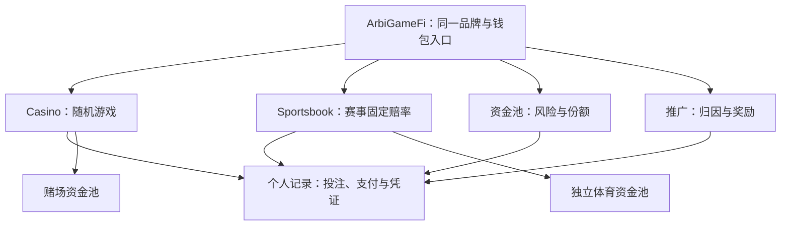

# ArbiGameFi 产品与商业白皮书

> 项目：ArbiGameFi · 文档编号：AGF-WP-BIZ-2026.09-r2
>
> 文档性质：产品设计与发展路线 · 设计状态：Design Draft（设计草案）· 编辑状态：Review Copy
>
> 日期：2026-09-26 · 语言：zh-CN，附英文摘要 · 读者：玩家、LP、推广伙伴、产品与协议建设者

本文定义 ArbiGameFi 要成为怎样的产品、参与者为何加入，以及实现这一目标的机制和路线。产品定位承接[既有架构方向](strategy/fullstack-product-architecture.md)；新增经济与治理设计以“推荐方案”或“待决”标注，不能据此视为已经批准或部署。当前版本、开放范围与验收记录分别见[发布事实表](release/STATUS-v1.5.zh-CN.md)和[仓库复盘](audit/RepositoryReview-2026-09-25.zh-CN.md)。

## 摘要

ArbiGameFi 要建设一个以钱包为入口、以可核验结算为基础的 B2C casino 与 sportsbook。玩家能在投注前理解规则和支出，在投注后追踪结果和支付；LP 能选择承保的资金池、理解风险并获得明确的风险补偿；推广伙伴能按公开规则获得可核对的报酬。项目的商业基础应是这些参与者之间可持续的价值交换。

产品采用同一品牌与账户体验，共享资金核算和结算基础，但赌场随机游戏与体育赛事保持独立的结果机制、风险边界和资金池。优先完成可反复使用的赌场体验，再在独立验收下推出窄范围体育产品。新的游戏、资产或商业模式，应由用户需求和实际运行能力推动。

本文推荐先设计清楚 LP、协议和推广之间的收入分配，再扩大真实资金参与。合约能够完成一笔结算，只证明机制能执行；产品成立还需要玩家理解、LP 愿意持续承担风险、协议能够支付服务成本。

## Abstract (EN)

ArbiGameFi is designed as a single-brand B2C casino and sportsbook built on inspectable settlement. Players should understand the rules and costs before signing and follow their bets to a payment or an eligible refund. Liquidity providers should choose a defined risk pool and receive an explicit economic allocation for underwriting that risk. Referrers should earn transparent, reconcilable rewards within a sustainable budget. Casino and sports share an accounting and settlement foundation while retaining separate bankrolls and outcome mechanisms. This paper defines the intended product and development path; proposed economic changes remain design candidates, and deployment facts are maintained separately.

## 1. 为什么建设这个产品

钱包解决了签名与资产访问，却没有自动解决投注产品的三个问题：用户是否看得懂自己在签什么，资金提供者是否知道自己在承担什么，以及结果出现之后能否顺利拿到应得支付。

ArbiGameFi 的设计从这三个问题出发：

| 参与者面临的问题                                      | 产品要提供的价值                 | 对设计的要求                                   |
| ----------------------------------------------------- | -------------------------------- | ---------------------------------------------- |
| 玩家难以区分授权、投注、等待和结算，也难核对实际支出  | 从签名前预览到最终收据的完整体验 | 费用分项、状态明确、失败可恢复、支付可核对     |
| LP 看见流水或 APY，却无法判断风险、收益来源和退出条件 | 可选择、可解释的承保产品         | 池隔离、风险补偿、真实净值、准备金和可提现额度 |
| 推广伙伴难确认归因、计提和领取差异                    | 规则清楚且可追溯的分销关系       | 归因确认、奖励账本、释放条件、预算约束         |
| 运营方需要维持赔率、结算与服务质量                    | 有收入来源、有责任边界的持续经营 | 成本核算、容量管理、可观测性、异常响应         |

首个市场形态是面向终端用户的单品牌产品。协议保留纵向扩展能力，前端围绕玩家、LP 和推广伙伴的任务组织；白标平台、第三方运营商门户与平台代币不作为实现这一价值主张的前提。

## 2. 产品全貌



### 2.1 Casino：先把一局做完整

赌场产品以可解释的规则、及时的状态反馈和自动结算为基础。设计范围涵盖 Dice、Coin Toss、Roulette、Keno、Plinko、Sic Bo、Slots、Baccarat；这些玩法共享投注、费用、钱包和收据体验，具体概率与赔付规则各自说明。

新玩法的优先级应低于现有玩法的完整体验。每款游戏都必须回答：如何选择、最多投入多少、怎样获胜、可能获得多少净派彩、何时停止、在哪里核对结果。不能用一套固定胜率或固定回报率替代具体规则。

### 2.2 Sportsbook：面向事件的另一条产品线

体育产品的目标是让用户从赛事发现、固定赔率选择，一直跟踪到结果确认与支付。首个范围沿用[体育产品设计](strategy/sportsbook-production-roadmap.md)：赛前固定赔率单关、足球 1X2 起步、单链、单资产与独立 Sports Bank，使用受控限额。

赛事结果由现实事件与证据决定。产品需要独立的赔率提供、结果报告、争议处理、取消规则与事件敞口控制，不能套用赌场“等待随机数开奖”的说明。滚球、串关、特殊投注和共用赌场资金池不进入首个体育版本。

### 2.3 共同的产品底座

个人中心统一呈现用户的投注、LP 份额和推广奖励，但保留网络、资产、资金池与产品域的边界。同名资产在不同链或不同池的余额和义务不能混算。

网站应允许未连接钱包的访客先阅读规则、查看池信息与示例收据。需要签名时才连接钱包。移动端突出钱包入口，沿用钱包选择器和对应连接方式，保留目标页面；钱包内浏览器与外部钱包连接都要有完整路径。产品不能依赖普通网页枚举手机上所有已安装钱包。

## 3. 参与者的动机与权利

| 角色       | 参与动机                               | 产品应提供的权利与信息                                               | 所承担的代价                                                  |
| ---------- | -------------------------------------- | -------------------------------------------------------------------- | ------------------------------------------------------------- |
| 玩家       | 游戏和赛事体验，了解规则并核验结算     | 签名前确认金额、规则、费用；查看原始凭证；在合约规定状态下结算或退款 | 投注可能损失，支付 gas 与相应服务费用，承担合约及结果机制风险 |
| LP         | 以资本承保风险，获得明确分配的经济补偿 | 选择资金池、持有份额、核对净值与负债、按公开条件退出                 | 玩家结果波动、资本占用、资产和治理风险                        |
| 推广伙伴   | 带来有效用户，获得可持续报酬           | 明确归因、计提、资格、释放与领取条件，核对收入来源                   | 获客成本、奖励波动、领取条件和反滥用约束                      |
| 协议运营方 | 提供可持续的游戏与结算服务             | 按公开机制获得协议收入，管理被明确授予的参数与服务                   | 运维、开发、随机数或赛事数据接入、支持与异常响应成本          |

平台不持有用户私钥，投注和 LP 资金会进入 Bank 智能合约。资金处于合约中时，用户依赖的是代码、资产与授权治理的约束。LP 是风险资本提供者；其份额不等于存款保本凭证。

新增设计应让已接受的投注条款能够被事后核对，并明确参数变更如何影响已有义务。退款时间、奖励资格和治理变更的通知及生效规则需要在协议设计中定案，不能仅靠页面文字赋予尚未实现的权利。

## 4. 用户旅程决定功能优先级

### 4.1 玩家：从发现到下一次使用


授权成功只意味着合约获得额度，不能被当作投注成功。用户应清楚知道下一次签名的用途；已有足够授权时无需重复授权。金额、净派彩、原生币请求费和钱包 gas 分项显示，报价变化时重新确认影响。

提交后以同一笔投注持续展示确认、随机数、结算或退款状态。正常结算由服务自动推进；手工操作用于恢复。拒签、余额不足、池暂停、网络错误和链读延迟各自提供有用下一步。结果未知时先找回交易，不自动重复下注。回到页面或切换设备后，应能通过钱包与链上记录继续跟踪。

收据的默认内容是用户能理解的投入、实际使用金额、退款、净派彩和结果；链、合约、投注 ID、随机数信息与交易哈希作为可展开的核验信息。动画服务于等待反馈，最终显示以结算事实为准。

### 4.2 体育玩家：从赔率到事件终态

```text
发现赛事 → 选择结果与固定赔率 → 确认有效报价和规则 → 签署票据
        → 跟踪赛事/结果提议/争议状态 → 最终结算或按规则作废退款
```

票据保存签署时的赔率、适用规则和市场身份。赔率过期或规则版本变化时，用户重新确认；结算按已接受票据执行。延赛、取消、异常结果与争议都需要可读的处理路径、负责角色和证据入口。体育票据何时可退款由市场规则与状态决定，不能假设与赌场超时退款相同。

### 4.3 LP：先理解承保，再决定投入

LP 页面先说明该池承保什么、使用哪种资产、资本如何获得补偿，再展示存入操作。入金前预览份额和费用；持有期间分开展示净值变化、已占用准备金、外部负债与当前可提现额度；退出前展示当前限制及原因。

池净值、用户投资回报和游戏收入采用不同口径。用户收益计算需要完整处理存取款、份额转移和估值时间；数据不完整时直接说明范围。收益展示必须能追溯到现金流与份额价值，不能从流水、毛派彩或局部记录拼成 APY。

### 4.4 推广伙伴：从分享链接到核对报酬

推荐链接保留落地页、网络与来源意图；连接后说明归因状态。推广后台把有效归因、已计提、待解锁、待释放和可领取区分显示，并解释金额变化。推广报酬应来自已定义的分配预算，与 LP 补偿和协议经营成本共同设计。

## 5. 可持续经济设计

### 5.1 必须同时成立的条件

玩家购买的是游戏或赛事体验；LP 提供承保资本；协议提供产品与运行服务；推广伙伴承担获客工作。设计必须说明每一方的补偿来源，并确保同一收入不会被重复承诺。

推荐采用以下经济原则，具体实现与参数在 P0 定案：

1. **LP 有独立的风险补偿分配。** 玩家长期净支出形成的经济空间不能全部转为协议与推广负债，让 LP 只承担波动。
2. **分配预算封闭。** 协议、推广、玩家激励和风险资本的分配使用共同口径；增加一种激励必须指出资金来源。
3. **先满足已承诺支付与准备金。** 收入可计提不等于随时可转出，LP 和其他领取方的出金都要遵守偿付及流动性约束。
4. **经济模型按玩法和池验证。** 概率、净派彩、整数取整、批量停止、极端结果与交易成本都进入模型；体育池另算赔率质量、相关性和事件风险。
5. **正的长期期望不等于稳定回报。** LP 补偿比例是收入分配参数，不是 LP 的 APY，也不消除短期亏损与资本占用。

### 5.2 用同一张账解释现金流

对一笔赌场投注，令 U 为实际使用的投注金额，G 为毛派彩，F 为毛派彩中扣减的费用，N 为玩家净派彩，P 和 X 分别为新增协议与推广等外部负债：

```text
N = G - F
LP 净值变化 = U - N - P - X
池 NAV = 实际资产余额 - 协议应付费 - 推广等外部负债
```

单笔净值变化从接受投注前算到最终结算后，排除其他入金、赎回、捐赠与资产变化。U−G 是毛派彩口径 GGR；它与 LP 净收益不同。完整定义与机制推导见[技术白皮书](WHITEPAPER.zh-CN.md)。

设计收入分配时，应先验证各玩法的 U−N 及其分布，再决定 P、X 和留在 NAV 中的部分。给 PF 或 XP 换名称不会改变这张账；奖励领取是偿还已经计入的负债，不能再次计入 LP 亏损。

### 5.3 推荐候选：分配实际产生的派彩扣减

**推荐优先评估的方案 B，尚待决策与实现：**以实际产生的 F 为可分配预算，明确留给 LP 的份额，再在剩余部分中分配协议与推广。

```text
λ = 留给 LP 的费用比例，0 < λ < 1，具体数值待定
P + X ≤ (1 - λ) × F
留在 NAV 的费用部分 = F - P - X
```

合约实现需规定整数取整与余数归属，且始终满足 `P + X ≤ F`。这样 `N + P + X ≤ G`，不会因外部分配额外增加超过该局毛派彩的支付与负债总额。LP 同时承担 U−G 的游戏盈亏；费用留存不意味着每局净值都增加。

该方案现金流直观，能让分配与实际费用一致。代价是毛派彩为零时不产生该笔协议与推广分配，收入随中奖路径波动；伙伴报酬和运营预算需要据此设计。λ、协议与推广之间的比例、无人推荐时的归属、是否设运营补充预算，都需要量化后决定。

此方案需要修改经济计算与验证相应偿付上界，不能仅靠调整既有推荐比例实现，也不能把这份白皮书当作执行合约变更的指令。

### 5.4 其他候选与取舍

| 方案                              | 分配方法                                                 | 主要价值                         | 需要解决的问题                                           |
| --------------------------------- | -------------------------------------------------------- | -------------------------------- | -------------------------------------------------------- |
| A：流水预算先保留 LP 份额         | 按实际使用流水与费用率形成预算，只把其中一部分计为 PF/XP | 渠道计提较易按有效流水解释       | 输局仍产生外部负债；必须重算偿付、最坏敞口与风险资本补偿 |
| B：实际派彩扣减分配，推荐优先评估 | 从 F 中分出 PF/XP，其余留在 NAV                          | 分配不超过实际费用，逐笔核对简单 | 报酬随中奖路径波动，需验证伙伴与协议成本覆盖             |
| C：分期净收入分配                 | 按期核算收入、成本与亏损弥补，再分配可分收入             | 可在分配前考虑一段时期的真实结果 | 亏损结转、高水位、申赎公平性和延迟领取明显增加复杂度     |

首个经济版本应选择能够说明并验证的单一主模型。C 可保留为后续研究方向，不应为了展示复杂经济体系而提前引入。人工向池回补资金可以改变净值，却不能替代可持续的自动分配机制。

### 5.5 商业可行性的判断方式

协议收入需要覆盖运行、维护、数据和支持成本；推广支出需要对应真实留存用户带来的贡献；LP 需要在风险与资本占用之后仍愿意参与。低金额投注中的 gas 和随机数成本也影响玩家体验，不能仅用名义费率评价竞争力。

评估时同时报告每款游戏的理论分布、压力情景与真实运行样本，并分别列出玩家总成本、LP 净值变化、协议收入、渠道支出和服务成本。补贴或捐赠单列，防止把有限补贴形成的收益当作长期机制。具体费率、最低经济投注额、资金容量与投放预算由这些结果决定。

## 6. 信任、控制与体验的关系

可信产品应把控制权与异常路径设计清楚。资金核算由 Bank 承担，结算权限由 Router 管理，赌场与体育各自的 hub 管理生命周期；随机数或赛事报告并不替代资金与权限约束。

治理需要哪些能力、哪些变更延后生效、用户如何获知、已有投注和 LP 退出怎样受影响，应成为产品条款的一部分。推荐评估高影响权限的延迟生效与通知机制，并明确紧急暂停与恢复的责任；具体机制待决。多签门槛本身不等于时间锁，网页关闭入口也不等于链上停止接收投注。

正常路径应自动完成，异常时用户仍可凭链上身份和收据核对进度，在合约允许状态下主动推进结算或退款。网站、RPC、keeper、随机数服务或资产异常均有不同影响，状态页和帮助信息应给出准确的恢复动作。

暂停机制优先阻止新增风险，并保留符合状态的既有投注结算与退款路径。LP 赎回和奖励领取属于不同的出金权利，可能受到准备金、缓冲和暂停限制；界面必须显示其各自条件。不能用“可自主结算”暗示所有资产都能在任意时刻退出。

负责任游戏应落实到实际可执行的设置：支出提示、会话提醒、自我排除与限额分别说明作用范围。只在浏览器本地生效的设置不得描述成跨设备或链上强制限制。产品增长以知情使用为前提，不能通过隐藏费用、伪造收益或催促追回损失来提高投注转化。

## 7. 发展路线

以下 P0–P5 是本稿建议的产品阶段安排，与 v1.5 等代码或发布版本无关。将经济定案和 LP 产品前置于扩大资本与渠道增长，是为了先解决风险补偿与成本来源；原有 sportsbook MVP 方向继续并行推进，其公开发布单独验收。各阶段定义用户价值与退出条件，不承诺上线日期；已有实现可经核验满足部分条件，无需为换文档重复建设。完整工作项见[项目路线图](roadmap.md)。

| 阶段                       | 产品目标                               | 进入下一阶段的关键条件                                                     |
| -------------------------- | -------------------------------------- | -------------------------------------------------------------------------- |
| P0 产品与经济设计定案      | 明确面向谁、承诺什么、如何分配价值     | 经济主模型、LP 补偿、费用与治理待决项有记录；模型覆盖玩法、偿付与成本      |
| P1 Casino 完整用户闭环     | 首次和再次使用都能完成一局并理解结果   | 桌面和真实手机钱包路径、授权衔接、未知交易恢复、自动结算及收据通过验收     |
| P2 LP 与推广经济闭环       | 承保和获客具有可核对、可持续的规则     | 定案经济机制经过实现与验证，LP 账与奖励账能对齐，申赎和领取限制可理解      |
| P3 小范围运行与公开增长    | 以受控真实运行验证服务质量与商业假设   | 流动性容量、费用、运行指标、响应与恢复能力满足预先确定的范围，再逐步扩大   |
| P4 Sportsbook 独立产品发布 | 完成从赛前赔率到赛事终态的第二条产品线 | 独立资金池、赔率与结果规则、争议作废、敞口控制及自动终结通过独立验收       |
| P5 经验证的扩展            | 用成熟能力服务已证实的新需求           | 每项新市场、资产、链或合作模式有需求与经济证据，且不削弱原有偿付和运维能力 |

Sportsbook 的用户研究、赔率与结果政策、风险设计可与 P1–P3 并行。它是既定产品方向；发布仍需独立完成资金、证据与运行条件，不能借用赌场验收结论。

近期实施从 P0 经济与权限设计决策开始，同时推进不依赖这些决策的 P1 体验修复。P2 完成后再扩大 LP 募集和渠道激励；P3 用小范围运行确定扩大规模的条件。营销页面与入门资料服务这一路线，应同时让用户看见产品目标、可使用功能和下一步参与方式。

## 8. 需要定案的产品决策

| 决策             | 当前推荐方向                         | 定案需要回答的问题                                             |
| ---------------- | ------------------------------------ | -------------------------------------------------------------- |
| LP 风险补偿      | 先比较 B 与 A，优先验证 B            | 留存比例能否补偿风险与资本占用，协议和渠道剩余预算是否可行？   |
| 推荐奖励政策     | 使用封闭预算与清晰归因，保持首版简单 | 层级、资格、释放、无人推荐的收入归属与反滥用规则怎样影响各方？ |
| 变更与退出条款   | 明确已有义务保护，评估高影响变更延迟 | 哪些参数逐单快照，哪些变化需通知，暂停和治理变化时如何退出？   |
| 首次公开运行范围 | 按资金容量和真实运行能力限制范围     | 资产、池、最大投注、服务指标和异常响应的可承诺范围是什么？     |
| 体育首个产品版本 | 赛前足球 1X2 单关、独立池            | 赔率来源、规则、结果证据、挑战与裁决责任如何落定？             |

白皮书提供这些决策的目标和约束；定案后通过设计记录、实现、验证与发布使它们成为真实产品。发现当前代码不能支持目标时，应提出差距和改进方案，而不是让目标退化为现有功能清单。

## 9. 设计与现实如何衔接

截至 [2026-09-25 发布事实表](release/STATUS-v1.5.zh-CN.md)，v1.5 已形成八款赌场游戏及双链部署基础，网站主网投注仍未公开启用，体育产品未纳入该发布。现经济分配也尚未实现本文推荐的 LP 费用留存方案。这些信息用于识别实施起点，后续状态由事实表维护。

产品原则与协议机制见[技术白皮书](WHITEPAPER.zh-CN.md)，对外简述见[项目简介](ARBIGAMEFI-EXECUTIVE-BRIEF.zh-CN.md)，具体缺陷与历史证据见[仓库复盘](audit/RepositoryReview-2026-09-25.zh-CN.md)。白皮书不承担复盘台账或实时运营状态页的职责。
