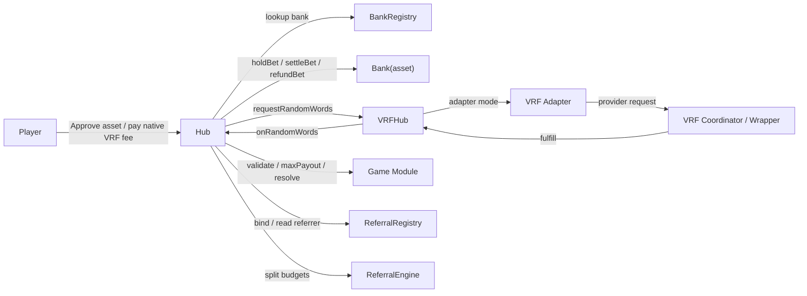
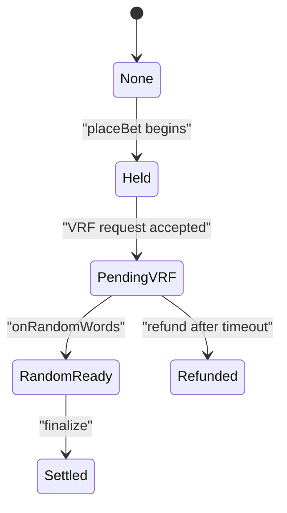

# ArbiGameFi 技术白皮书

> 项目：`ArbiGameFi`
>
> 底层架构：`SSOT`
>
> 文档系列：`Technical Whitepaper`
>
> 文档编号：`AGF-WP-TECH-2026.03`
>
> 状态：`External Draft`
>
> 语言：`zh-CN`
>
> 日期：`2026-03-07`
>
> 代码基线：`current mainline contracts`
>
> 目标读者：`auditors / LPs / technical partners / investors`
>
> 关联文档：`docs/WHITEPAPER.product.zh-CN.md` · `docs/ARBIGAMEFI-EXECUTIVE-BRIEF.zh-CN.md`

## 摘要

ArbiGameFi 是一套面向全链上概率游戏场景的资金、结算与随机数协调协议。它的目标不是仅仅把若干游戏规则部署到链上，而是把博彩业务中最关键、最容易失去信任的几个环节做成可验证的链上事实：

- 资金托管由每资产独立金库承担
- 每笔下注都有全局唯一生命周期记录
- 随机数请求、收费、退款与回调状态可重建
- 推荐返利与玩家回馈首先表现为链上负债，而不是离链记账
- 风险流入可以暂停，但已形成债务必须保持可结算、可退款

ArbiGameFi 当前实现围绕三个单一事实源构建，也就是其底层的 SSOT 架构：

- `Bank`：每种资产的会计与托管事实源
- `Hub`：每笔下注的生命周期事实源
- `VRFHub`：随机数费用、请求状态和退款信用事实源

在此基础上，游戏模块被收敛为纯语义模块，只负责校验、最大赔付上界计算和开奖解析，不直接触碰资金。协议因此形成一套清晰的责任划分：游戏决定结果，资金系统决定偿付边界，Hub 决定生命周期，VRFHub 决定随机数运输与费用记账。

本文严格基于当前仓库中的合约代码、部署脚本、架构文档与不变量测试撰写。它描述的是“当前实现已经做到了什么”，而不是未来路线图或市场宣传版本。

## Abstract (EN)

ArbiGameFi is an on-chain capital, settlement, and randomness-coordination protocol for probability-based gaming. Its core design does not center on front-end presentation, but on turning the most trust-sensitive parts of gaming into auditable on-chain facts: segregated per-asset custody, a global bet lifecycle registry, explicit VRF fee and refund accounting, and liabilities for referral and player rewards that are recorded before they are paid out.

The current implementation is built around an SSOT architecture with three primary sources of truth: `Bank` for per-asset accounting and custody, `Hub` for bet lifecycle, and `VRFHub` for randomness transport and fee bookkeeping. Game modules remain pure semantic modules. This document describes what the current contracts actually implement, the solvency model they enforce, the trust assumptions they still rely on, and the limits of the present design.

## 1. 文档范围与读者

本文主要面向以下读者：

- 审计机构与安全研究者
- 机构合作方与流动性提供者
- 需要理解协议边界的前端、SDK 与数据团队
- 需要掌握协议真实能力与约束的投资人和运营方

本文回答四类问题：

1. 协议在链上到底记录了什么事实。
2. 资产、准备金、费用和返利负债如何记账。
3. 一笔下注从接受到开奖、结算或退款的完整生命周期如何收敛。
4. 哪些部分是 trust-minimized，哪些部分仍依赖治理、VRF 提供方或外部资产假设。

本文不试图解决以下问题：

- 法律、牌照与地区监管判断
- 品牌、营销、用户增长与活动策略
- 尚未落地在当前合约中的代币经济学
- 前端产品体验与运营页面设计

## 2. 协议命题

中心化博彩系统的核心矛盾不是“UI 是否炫酷”，而是以下几类信任断点：

- 用户必须把资产先交给平台托管。
- 平台可以自行解释赔率、开奖结果、退款条件与推荐返佣。
- 资金池、活动负债与未开奖准备金往往共用同一套离链账本。
- 当随机数或后台系统异常时，用户往往不知道是否能拿回钱，以及应由谁触发退款。

ArbiGameFi 的协议命题是：

> 对于链上概率游戏，最重要的不是“把所有事情都去中心化”，而是把真正决定偿付与公平性的事实源上链，并让它们具备明确的、不依赖运营解释的责任边界。

这意味着协议重点上链的不是视觉层，而是：

- 托管与偿付边界
- 注单生命周期
- 随机数费用与回调状态
- 推荐预算与负债生成
- 风险开关与债务活性语义

## 3. 设计原则

### 3.1 单一事实源

协议不使用一个“大而全”的万能合约，而是按事实类型拆分：

- 资产事实写入 `Bank`
- 生命周期事实写入 `Hub`
- 随机数费用与请求事实写入 `VRFHub`

### 3.2 每资产隔离

每种支持的 ERC20 资产对应一个独立 `Bank(asset)`。协议不使用跨资产共享资金池，也不允许在 v1.x 中把某个资产重新映射到另一家 Bank。

### 3.3 风险流入与债务流出分离

当出现异常时，协议优先停止新增风险，但不阻止已有债务的履约。暂停语义因此不是“停机”，而是：

- 停新增下注
- 停 LP 可选出金
- 停可选费用/返利领取
- 保持 `finalize` 与 `refund` 可调用

### 3.4 游戏与资金解耦

游戏模块不持有资产、不发起转账、不维护生命周期状态。它们只做三件事：

- 校验参数
- 计算最大潜在赔付
- 根据随机数解析结果

### 3.5 可证明而非仅可阅读

协议并不满足于“代码看起来合理”，而是通过不变量测试和差分测试持续证明关键关系，例如：

- `NAV = B - PF - XP`
- 准备金覆盖
- 可选出金域检查
- 预算守恒
- 债务流出活性

## 4. 系统总览

### 4.1 组件角色

| 组件 | 职责 | 是否托管资产 |
| --- | --- | --- |
| `Bank` | 单资产托管、净值计算、准备金、LP 份额、协议费与 XP 负债桶 | 是 |
| `BankRegistry` | `asset -> Bank` 单向注册表 | 否 |
| `Hub` | 注单注册、定价快照、VRF 协调、结算与退款 | 否 |
| `VRFHub` | VRF 报价、收费、退款信用、请求簿记、回调桥接 | 适配器模式下主要保留退款信用；内置模式下也可能保留已收取费用 |
| `ReferralRegistry` | 首触推荐关系图 | 否 |
| `DefaultReferralEngine` | 推荐预算数学分配 | 否 |
| 游戏模块 | 校验、最大赔付、开奖解析 | 否 |
| `ChainlinkV2PlusWrapperAdapter` | 外部 VRF 包装器适配 | 否 |

### 4.2 架构图

### 4.3 责任边界

协议的依赖方向是硬约束，而不是编码习惯：

- `Bank` 不依赖具体游戏模块
- `Hub` 不直接实现游戏规则
- `VRFHub` 不知道资金如何托管
- 模块不直接依赖 `Bank` 或 `VRFHub`

这样可以把协议拆成三条清晰链路：

- 资金链路
- 生命周期链路
- 随机数链路

## 5. 信任模型

### 5.1 Trust-minimized 的部分

以下性质在当前实现中尽量通过链上规则与不变量约束，而不是依赖运营解释：

- 每资产资金隔离
- 下注后准备金锁定
- 注单状态机
- 随机数请求状态
- 推荐预算的拆分方式
- XP 负债的形成、解锁与释放规则
- 暂停语义

### 5.2 仍需外部假设的部分

协议并不是“零信任宇宙”，它仍依赖一些外部条件：

- VRF 提供方应提供不可预测随机性
- 托管资产 ERC20 应符合标准行为
- 治理密钥应具备足够的运营安全
- 外部适配器和协调器应按预期工作

### 5.3 风险边界

如果外部 VRF 失效，协议的目标不是继续假装开奖，而是：

- 阻止新增风险
- 允许已挂起注单走向 `refund`

如果治理被攻破，攻击者仍可：

- 修改参数
- 注册新资产或模块
- 调整风险开关

但在不升级核心逻辑的前提下，治理不能：

- 通过救援函数提走 Bank 的主资产
- 改写已快照的历史注单参数
- 用暂停阻止已存在注单的 `finalize/refund`

## 6. 核心状态与会计语义

### 6.1 关键记号

对于某一资产对应的 `Bank`：

- `B`：Bank 合约持有的该资产真实余额
- `PF`：`protocolFeesPayable`
- `XP`：`externalPayablesTotal`
- `R`：`totalReserved`
- `NAV`：`B - PF - XP`

其中 `XP` 不是虚拟积分，而是以托管资产记账的外部负债。当前实现细分为：

- `xpAccruedTotal`
- `xpLockedTotal`
- `xpHoldbackTotal`

因此：

- `XP = xpAccruedTotal + xpLockedTotal + xpHoldbackTotal`

### 6.2 会计恒等式

当前实现和不变量测试共同维护以下事实：

1. `totalAssets() == NAV == B - PF - XP`
2. `B >= PF + XP`
3. `NAV >= R`
4. 所有可选出金必须满足剩余净值仍覆盖准备金与最小流动性缓冲

这套约束的意义是：协议不会把账上余额简单视为“可自由提取的现金”，而是始终先扣除：

- 协议费负债
- XP 外部负债
- 未开奖准备金
- 最小流动性缓冲

### 6.3 最小流动性域

对于当前净值：

- `MinLiq = NAV * minLiquidityBps / 10000`
- `free = max(NAV - R - MinLiq, 0)`

任何可选出金成功后都必须满足：

- `NAV_after >= R`
- `NAV_after - R >= MinLiq(NAV_after)`

这条域检查统一作用于：

- LP `withdraw`
- LP `redeem`
- 治理提取协议费
- 用户领取已归属 XP

### 6.4 LP 份额语义

`Bank` 提供 ERC4626-like 的份额行为：

- `deposit`
- `mint`
- `withdraw`
- `redeem`

但该金库并不是“任何时间都自由赎回”的纯 ERC4626 结构，因为它同时要承担下注准备金与外部负债管理。因此 LP 流动性实际上服从风控域，而不是单纯服从份额换算。

### 6.5 XP 负债的本质

XP 在当前实现里更接近“可延迟结算的外部收益负债”，而不是营销意义上的经验值系统。它对 `NAV` 的影响是真实的：

- XP 增加，`NAV` 下降
- XP 领取，Bank 真实转出资产
- XP 锁定和 holdback 只是负债成熟路径的不同阶段

## 7. 下注生命周期

### 7.1 生命周期状态机

`Held` 在成功路径中通常是一个极短暂的中间状态。因为 `placeBet` 会在同一笔交易中继续完成 VRF 请求并进入 `PendingVRF`。如果 VRF 请求失败，整笔交易回滚，不会留下半接受状态。

### 7.2 接受下注

`Hub.placeBet(...)` 的成功路径如下：

1. 检查资产未处于 `riskInPaused`
2. 校验 `StakeSpec`
3. 找到资产对应 `Bank`
4. 找到 `gameId` 对应模块
5. 调用模块 `validate`
6. 计算 `stake = amountPerRoll * betCount`
7. 计算 `reserved = module.maxPayout(...)`
8. 生成定价与推荐快照
9. 将 Bet 写入 `Hub`
10. 调用 `Bank.holdBet(...)`
11. 计算 VRF 费用
12. 调用 `VRFHub.requestRandomWords(...)`
13. 进入 `PendingVRF`

### 7.3 下注时快照的内容

每笔下注都会快照以下核心语义：

- 游戏类型
- 游戏模块地址
- 托管资产
- 对应 Bank
- 下注参数哈希
- 推荐配置 ID
- 基础 house edge
- 实际 house edge
- 用户允许的最大 house edge
- skyline 哈希

这样做的意义是：结算依据的是“下注被接受当时的规则”，而不是结算当时的最新治理参数。

### 7.4 挂起至随机数就绪

当 `VRFHub` 收到协调器回调后：

- 未知请求直接忽略
- 失活请求直接忽略
- 对 `Hub` 的回调采用 `try/catch`

`Hub.onRandomWords(...)` 则会：

- 写入 `randomHash`
- 保存原始随机数
- 立即清理 `requestToBetId`
- 将状态切换为 `RandomReady`

### 7.5 结算

`finalize(betId)` 为 permissionless 入口。任何人都可以在随机数就绪后帮助协议推进结算。

结算阶段会：

1. 用模块 `resolve(...)` 解析 `(payoutGross, refundAmount)`
2. 检查 `payoutGross + refundAmount <= reserved`
3. 计算 `feeOnPayout`
4. 得到玩家实际收到的 `payoutNet`
5. 依据 `usedTurnover = stake - refundAmount` 计算推荐预算
6. 生成 XP 负债计划
7. 调用 `Bank.settleBet(...)`
8. 标记注单为 `Settled`

### 7.6 退款

当注单在 `PendingVRF` 停留时间超过 `refundTimeoutSeconds` 时，任何人都可以调用 `refund(betId)`。退款路径不依赖治理参与，也不依赖运营人员手工处理。

## 8. 随机数子系统

### 8.1 VRFHub 的定位

`VRFHub` 不是一个薄包装器，而是随机数收费与状态管理的协议层。它负责：

- 根据 gas、确认数和 word 数报价
- 接收原生币支付
- 即时退回多付金额
- 为退回失败金额建立 `refundCredit`
- 记录请求归属
- 统一接收并转发随机数回调

### 8.2 报价语义

在无适配器模式下，费用按公式计算：

- `fee = baseFeeWei + callbackGasLimit * gasPriceWei + numWords * wordFeeWei + confirmations * confirmationsFeeWei`

在当前 `Hub` 实现里，`callbackGasLimit` 还会根据 `betCount` 动态估算并设上限。这意味着下注笔数会直接影响随机数回调成本。

### 8.3 退款信用

如果玩家支付的原生币超过实际要求：

- 协议优先最佳努力即时退款
- 若退款失败，则将差额记入 `refundCredit`
- 玩家后续调用 `claimRefund()` 领取

这保证“多付 VRF 费用”不会因为收款人地址行为异常而永久丢失。

### 8.4 fulfill-never-revert

`VRFHub` 的重要设计原则是回调桥接尽量不 revert：

- 非协调器调用只被忽略
- 未知/失活请求只被忽略
- `Hub` 回调失败只记录事件，不让外部随机数提供方承受消费端回滚

### 8.5 两种运行模式

`VRFHub` 的原生币余额含义取决于运行模式：

- 适配器模式下，已收取费用被转发给适配器/包装器，`VRFHub` 理论上主要保留退款信用。
- 内置模式下，`VRFHub` 也可能保留已收取的费用本体。

当前实现没有提供“治理任意提走 `VRFHub` 原生币”的专门后门。

## 9. 游戏语义层

### 9.1 公共接口

所有游戏模块都实现统一接口：

- `validate(params, stakeSpec)`
- `maxPayout(params, stakeSpec)`
- `resolve(params, stakeSpec, betId, randomWords)`

这让 Hub 不需要理解具体游戏，只需要依赖模块给出的：

- 接受条件
- 最坏赔付上界
- 开奖结果

### 9.2 当前内置模块

| 模块 | 规则摘要 | 赔付摘要 |
| --- | --- | --- |
| `Dice` | 100 面骰子，玩家选 `cap`，若结果 `> cap` 则命中 | 单轮 `amount * 100 / (100 - cap)` |
| `Coin Toss` | 正反二元事件 | 单轮命中赔付 `2 * amount` |
| `Roulette` | 欧式轮盘，支持 bitmask 或结构化下注 | 单轮命中赔付 `amount * 37 / popcount(mask)` |
| `Keno` | 40 选 10，使用预计算 gain table | 单轮赔付由 gain table 决定 |

### 9.3 Multi-roll 与停止条件

所有模块共享 `StakeSpec`：

- `amountPerRoll`
- `betCount`
- `stopGain`
- `stopLoss`

协议不会把多轮下注拆成多笔独立注单，而是在一笔注单内累计：

- 已使用流水
- 累计 gross payout

若触发停止条件，剩余轮次不执行，其未用下注额形成 `refundAmount`。

### 9.4 最大赔付上界

各模块都必须通过 `maxPayout(...)` 提前给出准备金上界。这个上界不是“期望赔付”，而是对最坏情况下总支出的保守保护。`Bank` 会基于这个值锁定准备金。

## 10. 定价、推荐与 XP 负债

### 10.1 两层 house edge

协议中同时存在：

- `baseHouseEdgeBps`
- `effectiveHouseEdgeBps`

推荐人可选择把自己的定价提高到高于基础 edge，但不能低于基础 edge，并且受治理设定的上限约束。

### 10.2 Skyline 定价

当一名玩家通过推荐路径进入时，协议会沿推荐链向上扫描，构造 skyline：

- 只记录真正把 edge 从当前上限继续抬高的节点
- 每一段记录其增量 `incBps`

因此 skyline 不是“完整推荐树”，而是一条“增量定价贡献链”。

### 10.3 用户保护

下注时玩家可以提交 `maxHouseEdgeBps`。如果实际形成的 `effectiveHouseEdgeBps` 超过用户愿意接受的上限，则下注直接拒绝。

### 10.4 预算生成

在 `finalize` 中，协议不是直接把全部 edge 收益立即转给推荐方，而是先计算预算：

- `baseBudget`
- `deltaBudget`

基础预算来自基础 edge 的一部分，增量预算来自 skyline 增量 edge 的一部分。没有被分出去的预算，以及缺失收款人的部分，会进入协议费用负债。

### 10.5 预算守恒与现金流语义

这里需要区分两类数值：

- `feeOnPayout`：本次结算时从 `payoutGross` 中扣下的玩家净收款差额
- `protocolFeeAccrual` 与 `XP` 负债：协议在账面上确认的费用与外部负债

当前实现通过预算守恒不变量约束：

> 每笔已结算下注所对应的 house-edge accrual，必须等于 `PF` 增量与 `XP` 增量之和。

换句话说，协议不允许“边际定价收益”在账面上失踪，也不允许推荐预算在账外漂移。

### 10.6 XP 三桶模型

推荐收益与玩家回馈最终进入三种负债桶：

- `accrued`：立即可领取
- `locked`：等待玩家流水阈值满足
- `holdback`：按时间线性成熟

这让协议可以表达更精细的返利成熟路径，而不需要在结算时立即对外转账。

### 10.7 首触推荐图

`ReferralRegistry` 实现首触绑定：

- 玩家只能绑定一次推荐人
- 不允许自推荐
- 使用有界深度反环检查
- `binder` 一次性设为 `Hub`

下注时若玩家尚无推荐关系，`Hub` 可通过传入的 `affiliate` 做一次最佳努力绑定。

### 10.8 Holdback 的滚动释放

当前实现中，holdback 不是独立分片各自倒计时，而是滚动线性释放：

1. 新增 holdback 进入前，先把当前已成熟部分同步到 `accrued`
2. 再把剩余 holdback 与新增 holdback 合并
3. 最后把释放终点重置为 `now + holdbackVestingSeconds`

这种设计的优点是实现简单、审计清晰、桶总额守恒明确。代价是新增 holdback 会重置剩余池子的成熟窗口。

## 11. 风险控制与安全属性

### 11.1 暂停语义

`riskInPaused` 的目标是阻断新增风险，而不是冻结全系统。

暂停时被禁止的动作：

- `placeBet`
- LP `withdraw/redeem`
- `claimProtocolFees`
- `claimXPAccrued`

暂停时仍允许的动作：

- `finalize`
- `refund`
- `unlockXPLocked`
- `syncXPHoldback`

### 11.2 准备金优先级

`Bank.holdBet(...)` 在接受下注后立即检查：

- 新增准备金后的 `NAV >= R_after`
- 新增准备金后的 `NAV - R_after >= MinLiq`

因此，协议不会先接受下注、再事后发现自己无力覆盖最坏情况。

### 11.3 无主资产后门

`Bank.rescueToken(...)` 明确禁止救援 `asset` 本身。这意味着治理不能通过“辅助救援函数”绕开 Bank 的会计边界，把主资产偷走。

### 11.4 债务流出活性

协议要求以下路径不应依赖治理协助：

- 随机数就绪后的 `finalize`
- 随机数超时后的 `refund`
- 返利成熟后的 `unlock/sync`
- VRF 多付款项的 `claimRefund`

这是一种面向生产环境的活性设计，而不是只关注资金安全、忽视用户可退出性。

### 11.5 关键不变量

当前实现重点证明以下性质：

- `totalAssets() == NAV`
- `B >= PF + XP`
- `NAV >= R`
- 可选出金后仍满足最小流动性域
- 结算结果始终不超过 `reserved`
- `requestId -> betId` 仅在 `PendingVRF` 有效
- XP 桶迁移不改变 `XP_total`
- 预算守恒
- 适配器模式下 ETH/退款信用守恒

### 11.6 剩余风险

当前架构仍有明确的剩余风险：

- 治理密钥妥协
- VRF 提供方异常
- 非标准 ERC20 行为
- MEV 与链上前置/夹子导致的体验问题

这些风险并未被“代码自动消除”，而是通过边界收缩、参数治理和运行时流程去降低。

## 12. 治理与部署模型

### 12.1 两步治理

核心合约采用两步治理切换：

1. `transferGovernance`
2. `acceptGovernance`

这避免了单步误操作导致治理权直接丢失。

### 12.2 可治理参数

当前治理可以控制：

- 风险开关
- 最小流动性参数
- house edge 与 affiliate 上限
- 推荐配置
- VRF 费用参数
- 适配器配置
- 新游戏模块注册
- 新资产与 Bank 注册

### 12.3 不可直接破坏的边界

在不升级逻辑代码的前提下，治理不能直接做到：

- 提走 Bank 的主资产
- 改写历史下注快照
- 把某资产路由到另一家已存在 Bank
- 用暂停阻断既有注单的结算和退款

### 12.4 当前部署拓扑

当前部署脚本采用直接部署而非代理模式，典型拓扑为：

1. 部署 `ChainlinkV2PlusWrapperAdapter`
2. 部署 `VRFHub`
3. 部署 `BankRegistry`
4. 部署 `ReferralRegistry`
5. 部署 `DefaultReferralEngine`
6. 部署 `Hub`
7. 为每种资产部署一个 `Bank`
8. 注册游戏模块

这说明当前协议更接近“参数可治理的固定逻辑系统”，而不是“通过代理持续可变更核心逻辑”的系统。

## 13. 当前实现范围

### 13.1 已实现的能力

- 每资产独立托管金库
- 全局注单生命周期注册
- 四个标准游戏模块
- 多轮下注与停止条件
- 随机数收费、回调、退款信用
- 首触推荐图
- skyline 增量定价
- XP 三桶负债模型
- 风险流入暂停与债务流出活性

### 13.2 当前实现中的显式边界

以下约束已经直接体现在代码里：

- 单笔下注 `betCount <= 100`
- skyline 最多记录 `6` 段增量定价贡献
- 推荐配置最多支持 `6` 层分配位
- 推荐反环检查最多向上遍历 `32` 跳
- `holdbackVestingSeconds` 需位于 `(0, 365 days]`
- `minLiquidityBps` 需位于 `[0, 10000]`

这些上限是当前实现为了 gas、状态规模和审计复杂度做出的工程约束，不意味着协议理论上只能支持这些值。

### 13.3 当前未实现或未承诺的内容

- 协议代币与治理代币经济学
- 通用代理升级框架
- 委托下注或 relayer 下注
- 跨资产共享准备金池
- 更复杂的做市和二级份额流动性
- 法律合规执行层
- 前端运营与会员系统

### 13.4 最准确的协议定位

如果仅以当前代码为准，ArbiGameFi 最准确的定位不是“一个链上赌场前端项目”，而是：

> 一套面向全链上概率游戏场景的、可证明资金托管、注单生命周期管理、随机数费用协调与返利负债记账协议。

## 14. 后续演进方向

在不破坏 SSOT 原则的前提下，ArbiGameFi 后续版本最自然的扩展方向包括：

- 增加更多纯函数游戏模块
- 支持更多被单独隔离的资产金库
- 引入更成熟的治理流程，例如多签和时间锁
- 提升监控、异常恢复和发布工件体系
- 在保持预算守恒的前提下，扩展更复杂的推荐策略

这些演进的前提不应是牺牲事实源清晰度，而是让更多功能继续锚定在现有三类真相上：

- `Bank` 的资产与负债真相
- `Hub` 的生命周期真相
- `VRFHub` 的随机数与费用真相

## 15. 结论

ArbiGameFi 当前实现真正有价值的地方，不是“已经做了多少个游戏”，而是它把一个原本高度依赖平台解释的业务，收敛成了若干条可以验证、可以重建、可以持续测试的链上事实：

- 钱在谁手里
- 哪些钱是已知负债
- 哪些钱已经预留给未开奖风险
- 哪一笔下注目前处于什么状态
- 哪个随机数请求对应哪笔注单，是否存在退款信用
- 哪部分推荐收益已经形成真实负债

这使得协议具备一种适合长期迭代的底层特征：

- 产品可以变化
- 游戏可以增加
- 前端可以重做
- 运营可以调整

但只要不破坏 SSOT 的三套核心事实源，协议的底层可信度仍然可以维持一致。

## 附录 A：核心公式

### A.1 会计

- `XP = xpAccruedTotal + xpLockedTotal + xpHoldbackTotal`
- `NAV = B - PF - XP`
- `MinLiq = NAV * minLiquidityBps / 10000`
- `free = max(NAV - R - MinLiq, 0)`

### A.2 可选出金域

- `NAV_after >= R`
- `NAV_after - R >= MinLiq(NAV_after)`

### A.3 下注与结算

- `stake = amountPerRoll * betCount`
- `reserved = module.maxPayout(params, stakeSpec)`
- `usedTurnover = stake - refundAmount`
- `payoutNet = payoutGross - feeOnPayout`

### A.4 预算

- `baseHEAmt = usedTurnover * baseHouseEdgeBps / 10000`
- `deltaHEAmt = usedTurnover * (effectiveHE - baseHE) / 10000`
- `baseBudget = baseHEAmt * baseBudgetBps / 10000`
- `deltaBudget = deltaHEAmt * deltaBudgetBps / 10000`

## 附录 B：术语表

| 术语 | 含义 |
| --- | --- |
| SSOT | Single Source of Truth |
| Bank | 单资产托管与会计事实源 |
| Hub | 注单生命周期事实源 |
| VRFHub | 随机数费用与请求事实源 |
| PF | 协议费用负债 |
| XP | 外部收益负债总额 |
| R | 未开奖准备金总额 |
| NAV | `B - PF - XP` |
| Holdback | 线性成熟的延迟负债 |
| Skyline | 推荐链上有效增量定价贡献路径 |

## 附录 C：代码阅读顺序

建议按如下顺序进入代码：

1. `src/core/Bank.sol`
2. `src/core/Hub.sol`
3. `src/core/VRFHub.sol`
4. `src/core/interfaces/SSOTTypes.sol`
5. `src/engines/referral/ReferralRegistry.sol`
6. `src/engines/referral/DefaultReferralEngine.sol`
7. `src/modules/dice/DiceModule.sol`
8. `src/modules/cointoss/CoinTossModule.sol`
9. `src/modules/roulette/RouletteModule.sol`
10. `src/modules/keno/KenoModule.sol`
11. `docs/constitution/SSOT.v1.2.md`
12. `docs/audit/invariants-map.md`
13. `test/invariants/Invariants.t.sol`
