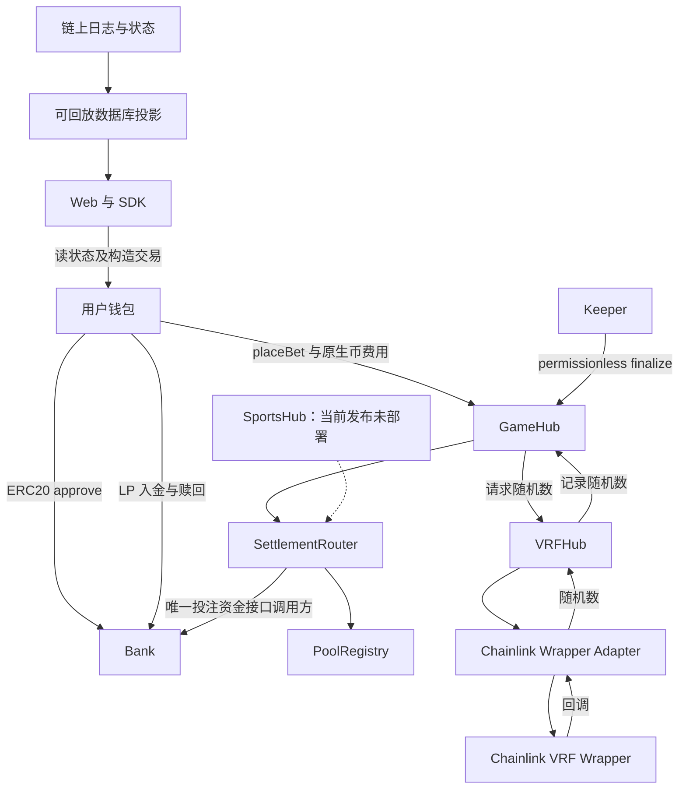
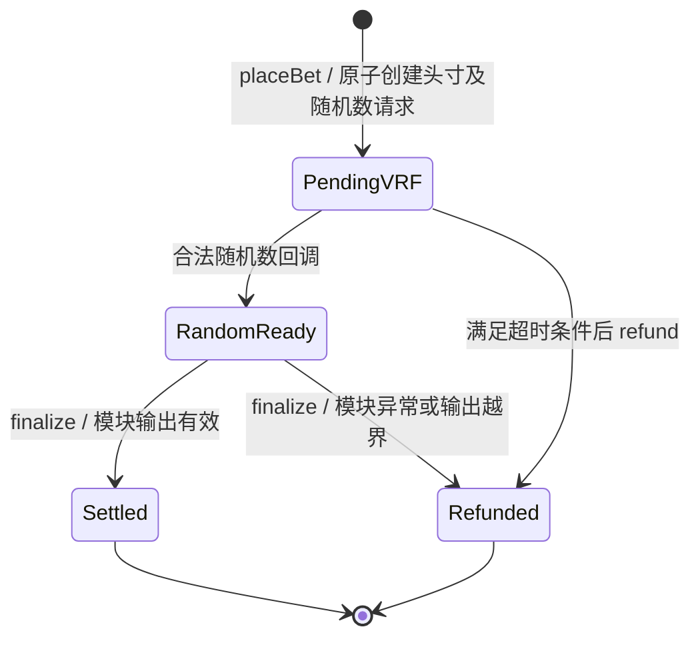

# ArbiGameFi 技术白皮书

> 项目：ArbiGameFi · 架构：Single Source of Truth（SSOT）
>
> 文档编号：AGF-WP-TECH-2026.09-r1 · 状态：Review Copy
>
> 发布基线：v1.5 · 代码基线：`aaa5c807d09f72e972bfad286901c3bb3e88b9ee`
>
> 日期：2026-09-25 · 语言：zh-CN，附英文摘要
>
> 读者：技术集成者、审查者、LP 与运营人员

本文说明指定代码基线的机制与限制，不构成安全认证、收益预测或公开上线许可。网站开放范围、链上暂停和参数快照见[发布事实表](release/STATUS-v1.5.zh-CN.md)；完整复盘与待办见[独立系统复盘](audit/RepositoryReview-2026-09-25.zh-CN.md)。产品说明与短版入口分别见[产品白皮书](WHITEPAPER.product.zh-CN.md)和[项目简介](ARBIGAMEFI-EXECUTIVE-BRIEF.zh-CN.md)。

## 摘要

ArbiGameFi 将链上游戏分成资金账本、池路由、头寸生命周期、随机数传输和纯游戏规则。Bank 持有单一资产，SettlementRouter 统一管理头寸与结算权限，GameHub 管理 casino 回合，VRFHub 对接随机数。网页、SDK、keeper 和数据库提供访问、自动执行与查询服务；最终资金状态由合约决定。

当前 v1.5 在 Base 与 Base Sepolia 部署八款 casino 游戏。主网已完成八款游戏各一笔真实单轮验收，但网站主网投注仍未开放；SportsHub/SportsRiskEngine 是保留的代码能力，未部署进当前双链发布。合约可调用、网站可使用、业务已验收是三个不同事实。

## Abstract (EN)

ArbiGameFi separates asset custody and accounting, pool routing, position ownership, casino lifecycle, and randomness transport. The v1.5 release contains eight casino modules on Base and Base Sepolia. Mainnet single-round acceptance covers one bet per game; public mainnet betting remains disabled in the website. Sportsbook code is not deployed in the current releases. Funds enter Bank smart contracts when users bet or provide liquidity. Permissionless settlement and conditional refunds reduce dependence on the operator, but do not eliminate governance, token, network, randomness-provider, or software risks. House-edge deductions, protocol/referral liabilities, and LP returns are distinct quantities.

## 1. 系统边界与事实源



| 组件                       | 职责                                                | 不承担的职责                 |
| -------------------------- | --------------------------------------------------- | ---------------------------- |
| Bank                       | 持有一种资产；维护 LP 份额、PF、XP、准备金 R；转账  | 不解析游戏规则、不生成随机数 |
| PoolRegistry               | 注册 poolId 与 asset/Bank/domain；控制池和 hub 准入 | 不持有投注资金               |
| SettlementRouter           | 分配全局 positionId，绑定 owner hub 与池快照        | 不自行决定开奖结果           |
| GameHub                    | 参数与费用校验、回合快照、VRF、结算或退款           | 不直接调用 Bank 投注结算接口 |
| VRFHub / Adapter           | 请求映射、原生币费用、回调与 detach                 | 不计算玩家派彩               |
| 游戏模块                   | `validate / maxPayout / resolve` 纯规则             | 不托管资产、不维持玩家账户   |
| ReferralRegistry / Engine  | 推荐绑定与奖励计划计算                              | 不直接向推荐者转账           |
| Web / SDK / keeper / index | 人机交互、交易编排、自动结算、查询                  | 不取代链上账本               |

pool 的 asset、Bank、domain 在注册后不可重映射；Bank 不可被另一个 pool 重用。同一种资产可以有不同池，不能把“单资产 Bank”解释为全网每个资产只有一个 Bank。路由头寸快照防止结算时错误重选池；池被关闭会阻止新头寸，不应被当作删除已有债务。

依据：[Bank](../src/core/Bank.sol)、[PoolRegistry](../src/core/PoolRegistry.sol)、[SettlementRouter](../src/core/SettlementRouter.sol)。

## 2. 资产托管与账本

### 2.1 钱包与合约之间的资金边界

平台不持有玩家私钥，也不要求先充值平台账户。下注时，Bank 使用 ERC20 授权从玩家钱包拉取 stake；LP 入金同样进入 Bank。结算与退款按合约规则支付给已记录的玩家。因此，“钱包直连”不等于“资金始终留在钱包”，智能合约持有期间仍有代码和权限风险。

资产假设是正常转账语义的 ERC20。Bank 按参数额记账，不能据此宣称支持所有扣费转账、重基准或黑名单资产的任意行为；发行方冻结或异常转账可以影响债务支付。

### 2.2 单个 Bank 的会计恒等式

以该资产最小单位计算：

```text
B   = asset.balanceOf(Bank)
PF  = protocolFeesPayable
XP  = xpAccruedTotal + xpLockedTotal + xpHoldbackTotal
NAV = B - PF - XP
R   = totalReserved
Bank.totalAssets() = NAV
```

PF 与 XP 是对外负债，不是 LP 资产；R 是尚未解除的最坏派彩预留。`B >= PF + XP` 是 NAV 可计算的条件。核心结算控制维护 `NAV >= R`，但这依赖授权组件、正确参数和资产行为，不是面对任意外部损害的偿付保证。

### 2.3 入金、份额与缓冲

份额采用 ERC4626-like 接口，不能等同完整标准认证。令 `V = 10 ** asset.decimals()`，虚拟资产与份额偏移的兑换关系为：

```text
shares = assets × (totalSupply + V) / (NAV + V)
assets = shares × (NAV + V) / (totalSupply + V)
```

deposit/convert 向下取整，mint/withdraw 所需输入按相应方向向上取整；零份额入金被拒绝。虚拟偏移降低初始捐赠稀释攻击的经济收益，不代表 LP 永不亏损。

新投注在接收 stake 后以当时 NAV 检查：

```text
R_after = R_before + reserved
NAV - R_after >= floor(NAV × riskReserveBps / 10000)
```

可选出金使用独立的 `withdrawalBufferBps`，缓冲基于出金前 NAV：

```text
buffer = floor(NAV_before × withdrawalBufferBps / 10000)
NAV_after >= R + buffer
```

LP 赎回减少 NAV；PF/XP 支付同时减少 B 与对应负债，不能把三者都当成相同的 NAV 扣减。具体可支出上限还受资产余额及相应负债余额限制。暂停时 deposit/mint、LP 提现、PF/XP 领取和新投注被阻止。旧 `minLiquidityBps` getter/setter 保留为 `riskReserveBps` 的兼容别名，不再同时控制出金缓冲。

依据：[Bank 份额、缓冲与资金接口](../src/core/Bank.sol)、[AccountingLib](../src/libs/AccountingLib.sol)、[相关单元测试](../test/unit/SecurityFixes.t.sol)。

## 3. 一笔 casino 投注的生命周期



1. SDK 读取指定网络与 release、资产和池状态，校验游戏参数，计算 stake、最大派彩与 VRF 报价。
2. ERC20 allowance 不足时授权 **Bank**。该步骤不下注；已有足够授权可以跳过。
3. 玩家向 GameHub 提交 `placeBet` 和原生币费用。GameHub 校验模块与价格边界，经 Router 创建头寸，由 Bank 拉取 stake 并预留最坏派彩。
4. VRF 请求与上述操作同属一笔原子交易；调用回滚时不会保留半笔已接受投注，但失败交易仍可能消耗 gas。
5. Wrapper 回调通过 Adapter 与 VRFHub 到达 GameHub；结果进入 `RandomReady`。随机数准备完成不等于已支付。
6. 任何地址可调用 `finalize`；keeper 通常代为自动执行。有效输出得到 `Settled` 终态；部分未使用 stake 可作为 refundAmount 随净派彩一起返还。
7. 若模块 `resolve` 抛错、退款超过 stake，或 gross payout 加退款超过 reserved，GameHub 的异常路径退回整笔 stake，记录 `Refunded`。

`betId` 对应 Router 的全局 positionId；收据应联合核对 chainId、GameHub、betId、请求号与正式交易回执，不能只使用一个数字 ID。

### 超时与退款限制

`refund` 只对 `PendingVRF` 且 `block.timestamp >= placedAt + refundTimeoutSeconds` 的回合开放。它返还 stake，不退还已经支付的链上 gas 或保证收回已经发生的 VRF 服务费用。

`refundTimeoutSeconds` 是治理可修改的全局参数，当前未逐单快照，也没有专门上界检查。治理变更会影响已有等待回合的可退款时点。因此 permissionless 指满足条件后无需管理员代签，不意味着任何时候无条件退出。

异常模块退款是在 `finalize` 中处理已获随机数的坏输出，不应向普通输局提供任意取消。Bank 暂停不直接阻止 settle/refund，但 token 转账失败、合约缺陷或链不可用仍可能使调用失败。

依据：[GameHub](../src/core/GameHub.sol)、[GameHubE2E](../test/unit/GameHubE2E.t.sol)、[SecurityFixes](../test/unit/SecurityFixes.t.sol)。

## 4. 随机数与原生币费用

当前部署使用 Chainlink VRF Wrapper Adapter。GameHub 报价包含 callback gas 等请求参数；报价可能随上游成本改变，SDK 会重新读取并提供费用缓冲。钱包交易 gas 与 VRF 请求费是不同支出。

VRFHub 的 fulfill 入口对非 coordinator 调用记录 Ignored 后返回；Adapter 对非法 wrapper 调用也返回。GameHub 的随机数接收入口则对非 VRFHub 调用 revert。对未知、已 detach、重复或不适用的请求，传输路径会忽略或记录事件；下游 hub 回调采用 try/catch，避免其业务 revert 直接扩散到传输层。合法首次回调会使请求失活；若 hub 回调失败，不会因重复回调自动重试，仍在 PendingVRF 的投注可在满足超时条件后退款。此设计不应写为“任何调用、任何资源条件下永不 revert”：入口语义不同，gas 等外部条件也有边界。

多付原生币采用尽力退款；退款接收失败时形成 `refundCredit`，由有权领取者后续申请。已经服务的请求不能因投注本金退款而自动撤销其成本。

VRF 证明约束随机数来源；它不证明游戏赔率、资产偿付、治理决策或前端显示都正确。需要分别核对模块、报价和结算凭证。

依据：[VRFHub](../src/core/VRFHub.sol)、[Wrapper Adapter](../src/adapters/chainlink/ChainlinkV2PlusWrapperAdapter.sol)。

## 5. 八款游戏与报价

| 模块      | 参数及玩法概要                             |
| --------- | ------------------------------------------ |
| Dice      | over/under、目标值，按可中奖点数计算毛派彩 |
| Coin Toss | 正反面二选一                               |
| Roulette  | 欧式 0–36 与支持的下注项                   |
| Keno      | 号码组合与赔付表                           |
| Plinko    | 固定 8 行、9 个桶位，选择风险档位          |
| Sic Bo    | 三骰结果与支持的投注项                     |
| Slots     | 符号组合与赔付表                           |
| Baccarat  | 闲、庄、和及模块定义的规则                 |

模块通过 `validate` 校验参数，`maxPayout` 为预留提供上界，`resolve` 根据随机数计算毛派彩及退款。GameHub 的 betCount 范围为 1–100；批量回合和 stopGain/stopLoss 受具体模块与 StakeSpec 约束。StopLogic 用毛派彩与已使用 stake 的差值判断停止，发生在 fee-on-payout 之前，不能按钱包最终净收入理解。它是该笔批量投注的停止条件，不是跨会话账户级风控。

不要给全部游戏套用固定 RTP、胜率或倍率。实际净派彩取决于所选玩法、整数取整、投注快照中的费用及已执行回合；单局胜率也不等于长期回报率。

规则源码见 [modules](../src/modules)，前端规则与参数编码应与签名发布中的 ABI、manifest 和 golden vectors 对齐。

## 6. 费用、协议收入与 LP 经济

这一节是对旧文档的重要澄清：**玩家派彩扣减、按流水计提的 PF/XP，以及 LP 净值变化并非同一指标。**

对一次正常结算，定义：

```text
S = stake                 U = S - refundAmount
G = payoutGross           h = effectiveHouseEdgeBps
F = floor(G × h / 10000)   N = G - F = payoutNet
P = 本次 protocolFeeAccrual
X = 本次新增 XP 总额
```

基础与增量推荐预算以 U 和相应 edge 计算。未纳入预算的部分、无人可分配的 sink 进入 P，奖励分配进入 X。它们不是简单从本局 F 中再次分出的一笔现金；输局 G=0 时，仍可能产生按 U 计算的 P/X。

排除其他同期 LP 流入流出、捐赠与资产外部变化，从接受投注前到结算后的净变化为：

```text
本文毛派彩口径 GGR = U - G
ΔNAV = U - N - P - X
     = GGR + F - P - X
```

因此 GGR 不能标成 LP 净收益，`流水 × edge` 也不能直接当作 LP 收入。PF/XP 已从 NAV 扣除，后续领取不能再算一次 LP 亏损。

**可复算示例（机制解释，不是回报预测）：**Coin Toss 单轮下注 1 USDC，公平二选一，毛中奖派彩 2 USDC，edge=2%，总 PF+XP 计提 0.02 USDC。赢时 N=1.96，LP 净变化 `1-1.96-0.02=-0.98`；输时 N=0，LP 净变化 `1-0-0.02=+0.98`。在该理想等概率、无其他流动与费用的模型下，LP 期望变化为零，仍承担结果方差。不同模块、取整和配置需独立计算；这不是对所有策略或全部运营成本的完整分析。

这说明现有机制不能直接支持“LP 获得庄家优势，因此稳定正收益”的宣传。是否及如何为 LP 提供可持续补偿，需要单独评估和决策，本文不通过更换文案改变合约经济。

依据：[GameHub.finalize](../src/core/GameHub.sol)、[Bank.settleBet](../src/core/Bank.sol)、[输局仍计提负债的测试](../test/unit/GameHubE2E.t.sol)。

## 7. 推荐与 XP

ReferralRegistry 为首触绑定，拒绝自指，并对向上链路做最多 64 hops 的有界环检查；这不是任意规模推荐图绝对无环的证明。网页的 ref 缓存、链上绑定和奖励实际入账是不同步骤。

GameHub 支持基础预算、逐层比例与增量 skyline；base/effective house edge、referralConfigId 与 delta skyline 在投注时记录快照；但基础 uplines 与 Bank 流水资格在 finalize 时读取，不能称全部推荐关系和资格逐单冻结。直接 first-touch 绑定不能改写，但祖先后续绑定、资格参数变化可能影响未结算回合的基础奖励分配和可领取状态。可扩展的级数不是已运行的渠道政策，实际配置见[事实表](release/STATUS-v1.5.zh-CN.md)。

XP 以资产计价，属于真实负债：

| 桶       | 含义                               | 出口                                 |
| -------- | ---------------------------------- | ------------------------------------ |
| accrued  | 已可申请领取                       | 本人调用领取，受暂停与可选出金约束   |
| locked   | 对应 sourcePlayer 的流水条件未满足 | 条件满足后任何人可触发解锁至 accrued |
| holdback | 尚未成熟的保留部分                 | 按计划同步成熟部分至 accrued         |

解锁和成熟同步是桶间移动，不直接转币。新 holdback 先同步已成熟金额；已有未结束的释放计划不会因新奖励延长终点。它不是每份奖励独立锁满一天，也不是旧版“每次新增重新计时”。治理可设后续释放周期（1 秒至 365 天）与流水阈值（最高一千万整资产单位），界限不代表默认值永远不变。

依据：[ReferralRegistry](../src/engines/referral/ReferralRegistry.sol)、[DefaultReferralEngine](../src/engines/referral/DefaultReferralEngine.sol)、[Bank](../src/core/Bank.sol)。

## 8. 治理与暂停

当前关键 casino 治理已转给 2/3 Safe；guardian 只有暂停权限，不能解除暂停、换 guardian 或转走资金。keeper 不拥有正常治理权限。Safe 的签名门槛不证明签名者是三个独立组织，也不自动构成时间锁或去中心化治理。

| 操作                                        | 权限与限制                             |
| ------------------------------------------- | -------------------------------------- |
| Bank 暂停                                   | governance 或 guardian                 |
| Bank 解除暂停／更换 guardian                | governance                             |
| 调整缓冲、解锁与释放参数                    | governance，受各自代码上界限制         |
| 领取 PF                                     | governance，受暂停和可选出金约束       |
| rescueToken                                 | governance；不能救援本 Bank 的 ASSET   |
| 登记新游戏、池/hub 准入、费用和退款时间配置 | 对应合约 governance，受具体接口限制    |
| Casino finalize / 条件退款                  | permissionless；仍受状态与转账条件约束 |

部署为非代理合约，固定代码不等于固定参数或无治理风险。游戏 ID 注册后不能覆盖已注册模块；PoolRegistry、VRFHub 配置等仍有明确授权能力。治理对新 hub 的注册与 pool 准入属于强信任权限：Router 信任获准 hub 的结算输入，Bank 不重算游戏规则和 PF/XP 预算。禁止 rescue 本 Bank 资产并不能推出恶意治理无法损害资金。Safe 结构检查属于发布时校验，不是这些合约永久强制三名 owner 或两份签名。权限边界以[部署验证](../script/release/VerifyGovernanceV15.s.sol)及对应源码为准。

## 9. Sportsbook 的范围

仓库保留 SportsHub、SportsRiskEngine 与前端/SDK 实现，当前 v1.5 双链发布不包含其部署。它使用赔率签名、授权结果报告者、quorum、挑战与裁决流程，不能复用“每局由 VRF 开奖”的 casino 说明。

票据退款需市场达到 Voided 等允许状态，没有与 casino 相同的普通用户自助 PendingVRF 超时退款。未来启用需要单独的赔率提供、结果治理、资金与业务验收。代码中的 EIP-712 版本 `1.3` 是签名域语义，不应为文档标注 v1.5 而机械修改。

依据：[SportsHub](../src/core/SportsHub.sol)、[SportsRiskEngine](../src/core/SportsRiskEngine.sol)。

## 10. 应用、结算服务与索引

SDK 会校验 release、链和参数，再编排授权及投注；授权回执成功但读节点暂未同步时允许有限只读重试。未知的钱包提交结果不能被当成明确未提交而自动重发，否则可能产生重复投注。

keeper 监听并扫描回合，维护结算队列、重试与持久游标。自动执行降低手工操作负担，但没有固定结算时延保证。链、RPC、VRF、gas 余额或服务故障均会影响时延。

PostgreSQL 保存可回放投影与收据，不替代链上事实。余额/累计值的链读、日曲线/榜单的索引，以及网页示意图必须区分来源。当前索引链重组处理、部署健康判定、数据库灾备与完整告警覆盖仍有待办，详见[复盘报告](audit/RepositoryReview-2026-09-25.zh-CN.md)。

## 11. 证据等级与剩余限制

- 本地单元、差分和不变量测试检查选定输入与约束；绿色结果不是全输入的数学证明。
- 签名 release 绑定 manifest、ABI、向量和摘要；不能替代发布人身份与私钥保管要求。
- 浏览器源码验证说明编译源与部署代码的匹配类别；Similar Match、Exact Match 与第三方审计不能混称。
- 主网八款各一笔单轮验收覆盖真实 VRF、自动结算与账本核对，不覆盖所有参数、多轮退出、全部故障或所有手机钱包。
- Sepolia 恢复与部分退款演练有各自限定范围；未执行的全量数据库故障或真实超时全额退款不能写为已通过。
- 实际历史 Bank 义务不会因旧脚本、卷或服务器目录删除而消失。

本文件替代旧白皮书中的单 Hub 路径、单一流动性缓冲、四游戏、holdback 重置和无条件退出等表述。历史版本通过 Git 保留；历史规范与报告仍可作为证据阅读，但必须带其版本和范围。
