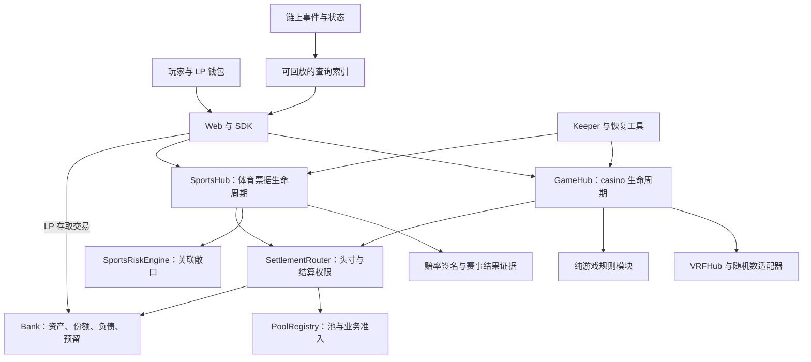
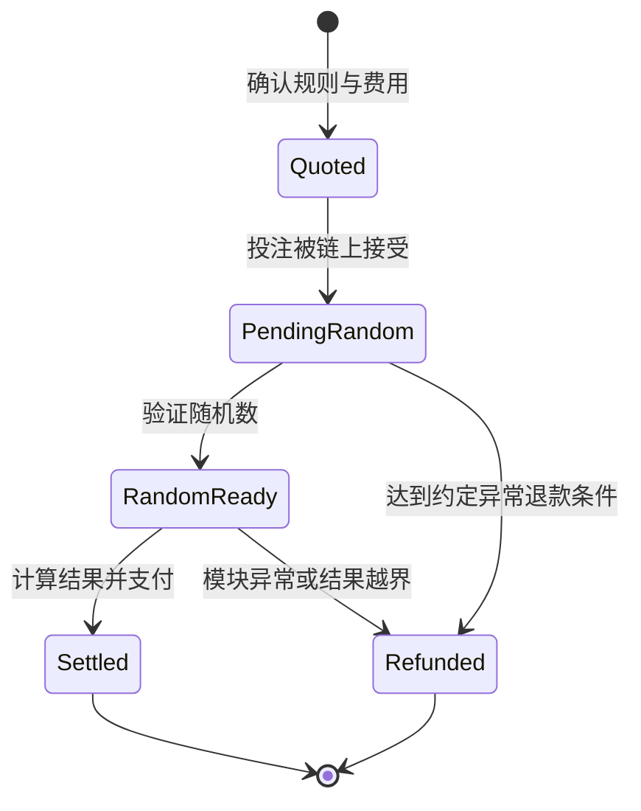

# ArbiGameFi 技术白皮书

> 文档编号：AGF-WP-TECH-2026.09-r2 · 设计状态：Design Draft（设计草案）· 编辑状态：Review Copy
>
> 日期：2026-09-26 · 语言：zh-CN，附英文摘要 · 架构：Single Source of Truth（SSOT）
>
> 读者：协议与产品设计者、实现者、LP、技术合作方及审查者

本文定义 ArbiGameFi 为实现产品目标所需的机制、约束与演进方向，是实现和评审的设计输入。[产品白皮书](WHITEPAPER.product.zh-CN.md)解释用户价值与商业模式，[路线图](roadmap.md)安排交付顺序。既有方向依据[产品架构决策](strategy/fullstack-product-architecture.md)；新增的经济分配、退出保护和治理约束在文中标为**提案**，具体方案尚需定案。设计目标不等于已经部署的能力；版本现状与实现差距分别查阅[发布事实表](release/STATUS-v1.5.zh-CN.md)和[系统复盘](audit/RepositoryReview-2026-09-25.zh-CN.md)。

## 摘要

ArbiGameFi 的目标是让玩家、流动性提供者与推广伙伴围绕同一套可验证结算规则参与 casino 与 sportsbook。玩家应能在签名前理解成本，在接受投注后获得明确的结算或异常处置权利；LP 应获得与承担风险相对应的经济权益，并能核对资产、负债与退出能力；推广和协议运营应从有边界的收入预算获得补偿。

为此，系统将资金账本、结算权限、业务生命周期、随机数与现实事件证据分开。单资产 Bank 负责资金与负债，SettlementRouter 绑定头寸及其结算主体，GameHub 和 SportsHub 分别管理两类业务。网站与自动化服务使流程易用，链上状态提供最终的资金依据。扩展新业务必须先确定风险与证据模型，再接入统一结算内核。

经济设计的目标是形成玩家定价、LP 风险补偿、协议运营与渠道奖励之间可持续的分配关系。本稿优先评估“按实际派彩扣减分配、明确保留 LP 份额”的候选模型；它是需要验证和决策的新设计，并非当前合约机制的重新命名。

## Abstract (EN)

ArbiGameFi aims to provide a wallet-native casino and sportsbook built on a verifiable settlement kernel. This paper specifies the intended architecture, participant rights, economic constraints and delivery dependencies. Banks account for assets and liabilities; a router binds positions to their settlement owners; separate hubs handle random casino outcomes and evidence-based sports results. LP risk compensation, bounded external revenue allocation and intelligible exit conditions are design requirements to resolve before scaling. Allocation from actual payout deductions is a proposed economic model, not a claim about deployed contracts. Release status and implementation reviews are maintained separately.

## 1. 设计目标与取舍

| 要解决的问题                   | 目标设计                                     | 如何判断设计成立                               |
| ------------------------------ | -------------------------------------------- | ---------------------------------------------- |
| 用户无法核对规则、报价和支付   | 签名前报价与接受后的规则快照相连，结果可复算 | 同一回合可从输入、随机数或结果证据推导到净支付 |
| 有资金余额却无法判断偿付能力   | 区分 LP 资产、外部负债和未结算预留           | 按池重建账本，异常路径仍维护资金约束           |
| LP 承担波动却缺乏明确收入来源  | 预先定义 LP 风险收益预算与费用归属           | 对每种玩法计算期望、方差、取整和压力情景       |
| 自动化停机导致用户失去后续路径 | 正常自动结算，符合条件后可由用户或第三方推进 | 停止 keeper 后仍可完成已接受头寸的有效终态     |
| 游戏与体育使用不同信任模型     | 独立业务 hub、风险预算与结果证据             | 随机数证明与体育赛事裁决分别验收               |
| 增长掩盖经济亏空               | 渠道奖励与运营成本进入同一预算模型           | 奖励不被当作新增收入，补贴有来源和终点         |

首要交付是单品牌 B2C 产品。底层保留扩展性，但新链、新资产、第三方运营平台和新游戏都应由真实需求及风险能力推动。技术复杂度优先用于资金、结果与故障恢复；用户正常使用不应需要理解内部模块名称。

## 2. 目标架构：统一资金规则，分离业务判断



图中连线表示调用或数据关系，签名由用户钱包完成。目标职责保持如下边界：

| 组件                       | 必须承担的职责                               | 设计理由                             |
| -------------------------- | -------------------------------------------- | ------------------------------------ |
| Bank                       | 单一资产、LP 份额、PF/XP 负债、预留与支付    | 让资金守恒和偿付约束集中可审查       |
| PoolRegistry               | 将 poolId 绑定 asset、Bank、业务域，管理准入 | 限定一笔业务使用哪份资本             |
| SettlementRouter           | 全局头寸 ID、池快照、owner hub、唯一终态     | 已接受债务不能随路由重配置转移或消失 |
| GameHub                    | 接受报价、冻结规则、请求随机数、结算或退款   | 同一回合有完整且可追踪的生命周期     |
| 纯游戏模块                 | 参数校验、最大派彩、确定性结果计算           | 新玩法不重复实现托管和治理           |
| SportsHub / RiskEngine     | 固定赔率票据、结果处理、相关风险上限         | 体育结果存在外部证据和集中敞口       |
| VRFHub / Adapter           | 请求、来源校验、回调和失败记录               | 随机数传输与游戏支付解耦             |
| 推荐组件                   | 归因与有上限的奖励计算                       | 奖励生成和实际资金支付分离           |
| Web / SDK / keeper / index | 清晰报价、签名编排、自动执行、历史查询       | 让正常流程简单，让恢复路径可用       |

一个 Bank 只容纳一种资产；同一资产可以有多个池。**资产相同不代表风险相同。** 目标默认将 casino 与 sportsbook 的资本预算分开；若未来共享 Bank，必须显式说明共同承保范围、关联风险和准入条件。仅有不同 hub 或 pool 名称不能宣称已隔离全部风险。

## 3. 资金与负债：LP 拥有剩余净资产

用户保管钱包私钥。下注或提供流动性时，资金转入 Bank 智能合约；结算按照已接受规则支付给记录的收款人。用户不需要向平台托管账户预充值，但合约持有资金期间存在代码、授权和资产行为风险。

以单个 Bank 的资产最小单位为计量单位：

```text
B   = Bank 持有的资产余额
PF  = 应付协议费用
XP  = 应付推荐奖励总额，包括可领、待解锁和保留部分
NAV = B - PF - XP
R   = 尚未解除的赔付预留
```

PF 和 XP 是外部债务；LP 持有 NAV 的份额权益。R 表示已经被承诺用途占用的资本，不能再次作为无约束可用资金。设计必须明确并验证 `B >= PF + XP`、`NAV >= R` 在支持的资产和合法状态转换下成立。异常代币转账或恶意授权组件不在数学式自身的保护范围内，因此资产准入与治理约束同样属于系统设计。

份额兑换沿用带虚拟偏移的设计：`V = 10 ** asset.decimals()`，兑换比率为 `(totalSupply + V) / (NAV + V)`。入金所得份额向下取整，指定份额铸造或指定资产提取所需输入向上取整；每种接口必须定义零值和舍入边界。接口兼容程度应逐项验证，不能只凭相似命名宣称完整标准兼容。

新增负债应在产生时从 NAV 扣除。向池外领取 PF/XP 时，资产和负债同步减少，不能再次记为 LP 成本；费用返还池内形成的净值增加属于单独回补。存取款、份额转移、直接捐赠和经营结果必须分别归因。这些规则同时约束合约、索引与页面指标。

## 4. 经济设计：先分配风险收益，再确定商业费率

### 4.1 统一口径

对一个最终结算的 casino 回合，令 `S` 为投入金额，`Q` 为未使用本金退款，`U = S - Q` 为实际使用流水；`G` 为按游戏规则计算的毛派彩，`h` 为派彩扣减率，`F = floor(G × h)`，`N = G - F` 为净派彩，`P`、`X` 为新增协议与推荐负债。h 在公式中采用小数形式，数学域为 `0 ≤ h ≤ 1`，对应 0–10000 bps；产品采用的更窄定价范围在 P0 定案，并受玩家接受报价的上限约束。

排除同期存取款、捐赠和外部资产变化，完整回合对 LP 的贡献为：

```text
毛派彩口径 GGR = U - G
ΔNAV = U - N - P - X
     = U - G + F - P - X
```

这一定义用于设计分配机制，而不仅用于解释报表。若定价产生的全部期望边际都流向 P 和 X，LP 仍承担方差，却没有明确的风险补偿；仅把页面改成“收益不保证”无法解决这个经济问题。

### 4.2 三种候选机制

| 候选                                | 分配方式                                                         | 主要取舍                                                                                 |
| ----------------------------------- | ---------------------------------------------------------------- | ---------------------------------------------------------------------------------------- |
| A：流水预算保留 LP 份额             | 由实际使用流水与定价参数计算预算，先保留 LP 部分，其余形成 PF/XP | 渠道收入较容易按流水预测，但仍可能在本局未收取派彩费用时产生外部负债，需额外覆盖路径风险 |
| **B：实收派彩扣减分配（推荐评估）** | 仅将实际 F 的一部分形成 PF/XP，保留部分留在 NAV                  | 外部债务以实际扣减为上限，逐笔守恒清楚；渠道收入随中奖与派彩波动                         |
| C：按期已实现收益分配               | 按预先定义的损失结转、资本缓冲和可分配收益结算各方               | 可强化亏损补偿，但需要高水位、入退金归因与周期边界，复杂度和等待时间更高                 |

本稿建议在 P0 优先验证 B，并以 A 做经济和渠道体验对照；C 保留为后续研究。**这不是已批准的费率或合约变更。** 最终选择还需结合每种游戏的毛派彩期望、风险资本、链上执行费用、用户接受度与运营预算。

### 4.3 候选 B 的可执行约束

设 LP、协议、推荐的目标比例为 `αL、αP、αX`，均非负，合计为 1，且 `0 < αL < 1`；αL 对应产品白皮书中的 λ。具体数值待定。计算外部负债时采用预算内向下取整，剩余保留在 LP 净值中：

```text
P <= floor(αP × F)
X <= floor(αX × F)
L = F - P - X
P + X <= F
ΔNAV = U - G + L
```

没有有效推荐人时，未分配的推荐预算去向必须预先定义；本稿候选规则为留在 NAV，不能在未说明的情况下转为额外协议提取。返佣层级、资格、保留和成熟只改变 X 内部归属及支付时机，不得突破总预算。

这个模型还给出一个资金约束：`N + P + X <= G`；加上未使用本金退款 Q 后，总支付与新增外部负债不超过 `G + Q`。如果该值已被最坏派彩预留覆盖，费用分配就不会额外突破同一回合的毛派彩上界。实现仍须处理舍入、并发预留与异常退款，不能只依赖公式代替测试。

**示例仅用于比较：**公平二选一，投入 1 USDC，即 1,000,000 个最小单位；以下金额均以 USDC 展示，计算先在最小单位取整。假设有有效推荐人且预算足额分配，U=1，G 为 2 或 0，h=2%，αL=50%、αP=25%、αX=25%。玩家中奖时 F=0.04，N=1.96，P+X=0.02，LP 变化为 -0.98；未中奖时 F=P=X=0，LP 变化为 +1。理想等概率下，LP 每笔期望变化为 +0.01，协议与推荐各为 +0.005，玩家预期净损失为 0.02，尚未计 gas 与运营成本。**上述比例为演算输入，不是项目费率承诺；正期望仍可能对应长期或短期实际亏损。**

### 4.4 定价与可持续性验证

对玩法 j，令 `r_j = E[G] / U`。对固定 U，忽略整数舍入、费用随局变化与其他现金流时，候选 B 在完整按比例分配的情况下给出：

```text
玩家预期净派彩 / U = (1 - h) × r_j
LP 预期贡献 / U   = 1 - r_j + αL × h × r_j
协议预期预算     = αP × h × r_j × U
推荐预期预算     = αX × h × r_j × U
```

`r_j=1` 是一个分析条件，不能默认对所有游戏、参数和整数金额成立。完整报价表需要逐项计算毛、净派彩分布，以及批量停止规则对分布和使用流水的影响；当 U 随停止结果变化时，应计算联合分布，不能直接套用固定 U 的简式。

每种候选的验收至少涵盖：全输与连续最大中奖、最小金额舍入、不同精度、批量提前停止、退款、返佣资格变化、低流动性与拥挤退出。经济测试要同时报告期望和尾部资本损失。协议预算必须能够覆盖其承担的 keeper、基础设施与维护成本；若需要补贴，应写明资金来源及结束条件。

新分配机制涉及 GameHub、奖励引擎、Bank 校验、事件、SDK 与指标口径。对于固定部署代码，需要明确新版本和迁移路径；不能通过调整现有返佣比例，宣告已经为 LP 建立新的经济权益。

## 5. 风险资本与退出能力

接受投注前，应预留覆盖所接受规则的最坏支付，并检查新风险缓冲；允许可选出金前，应检查独立的退出缓冲。两项参数服务不同目标：前者限制新增敞口，后者维持运行与退出余量。当前架构的计算基线是：

```text
接受 stake 后：NAV - R_after >= floor(NAV × riskReserveBps / 10000)
可选出金后： NAV_after >= R + floor(NAV_before × withdrawalBufferBps / 10000)
```

因此，NAV、未占用资本、新风险额度和可提取金额是不同量。LP 页面应分别提供含义清楚的值，最大提取额以实际合约限制为准。

目标风控应按资本规模设置单注、单玩法、单池与相关事件敞口，结合波动与压力情景决定增长速度。不能用“总流水增长”推导可无限增加下注上限。Sportsbook 还必须处理同场赛事、互斥结果及组合票据的关联风险，不能只复用 casino 单局上界。

**退出保护提案：**对“停止新风险”和“停止自愿出金”设定更明确的原因、权限及恢复路径；参数调整不应追溯性削弱已接受头寸的支付或超时权利。是否增加独立暂停开关、受约束退出模式、参数延迟及更强快照，是 P0 需要定案的机制问题。现部署的暂停会同时影响新投注、LP 存取和 PF/XP 领取，不能提前宣传为“暂停时 LP 随时可退”。

## 6. Casino：一笔签名对应可解释的完整生命周期



Quoted 是签名前体验状态，其余是链上生命周期的设计表达。授权不足时先授权 Bank，随后单独签署投注；授权本身不会开始游戏。投注接受、stake 转入、预留创建和随机数请求应保持原子性。失败回滚不保留半笔已接受投注，但仍可能消耗交易 gas。

回合应绑定 chainId、合约、positionId、具体游戏模块及规则版本、参数、定价、接收人以及决定其经济结果的配置。已有 gameId 不可重注册的约束应保持，新规则用新身份发布。**提案：**退款期限和会影响该回合奖励分配的规则也应明确冻结范围，避免治理变更无声改变已有等待回合。

随机数回调只记录必要状态，复杂游戏计算与支付由独立 finalize 完成。正常路径由 keeper 自动执行；用户或第三方可在状态允许时推进相同结果，不能挑选重抽。模块异常输出应走明确退款终态，正常输局不能因此获得任意取消权。

超时退款的目标是让没有取得所需随机数的回合有可预期出口。退款范围应区分本金、未使用费用和已发生的服务成本；gas 与已消耗 VRF 服务不应被文案暗示为必退。当前全局可变退款时间未逐单快照，是上述设计目标需要解决的差距。

首阶段产品围绕 Dice、Coin Toss、Roulette、Keno、Plinko、Sic Bo、Slots、Baccarat 建立规则与报价目录。增加玩法前，应完成参数域、最大派彩与实际 resolve 的一致性验证。批量投注的停止条件要说明按毛结果还是钱包净额计算；现有 StopLogic 按毛结果计算，不是跨会话损失限制。

## 7. Sportsbook：对现实事件建立独立证据链

Sportsbook 是产品方向中的第二条完整业务线。目标首版沿用[体育产品路线](strategy/sportsbook-production-roadmap.md)：赛前固定赔率单关、足球 1X2、单链单资产、独立 Sports Bank 和受控限额。数据源与资金规模未经验证前不扩展复杂组合玩法。

1. **报价：**签名覆盖事件、市场、选项、赔率、资产、有效期、链与验证合约等必要字段；过期或跨域报价不能被接受。
2. **承保：**RiskEngine 在出票前校验最坏派彩与相关事件敞口。票据记录已接受赔率，后续行情不能改写旧票。
3. **结果：**预先说明证据来源、报告者权限或门槛、结果提交与确认步骤；链上可复核的是该流程与输入，现实结果的准确性仍依赖所选择的证据机制。
4. **争议：**规定挑战窗口、争议证明、裁决责任和冲突结果处理。延赛、中止、数据源中断及长期无结果必须各有最终处理规则。
5. **支付：**只有符合生命周期的最终结果才能结算；作废后按照已接受退款规则返还本金，不能把待裁决状态包装成玩家可随时取消。

具体数据提供方、报告/裁决模型、最长无结果时限和作废规则属于 **Sportsbook 待决设计**。应先完成规则矩阵与故障演练，再承接真实体育风险；不能把 casino 的 VRF 证明和退款路径直接复用于赛事票据。

## 8. LP 产品：从份额权益到可核对的经营结果

LP 的核心体验应是“选择承保范围 → 了解经济分配与损失情景 → 入金 → 跟踪权益 → 在规则允许时退出”。份额代表剩余净资产的比例权益，不能表示固定债息。

目标数据层应提供：

- 按 chain、Bank、资产和区块限定的 NAV、份额、预留、外部负债与退出能力。
- 完整份额价格历史和资金流归因，分开存取款、份额转移、捐赠、游戏结果和费用计提。
- 依据完整记录计算的个人成本与收益；记录不完整时明确不可计算，不用局部历史假装完整收益。
- 在相同资金口径下计算回撤与期间表现，并公开采样区间和数据新鲜度。

经营分析采用第四节的 ΔNAV 口径；GGR 和流水可作为业务量指标，不能替代 LP 盈亏。XP 领取是资产与应付款的同步减少，不应使历史经营收益突然增加。这些要求应驱动合约事件与索引设计；现有页面能拿到什么字段，不应决定最终该给 LP 看什么。

## 9. 推广经济：可核对的归因和有边界的奖励

目标是让推荐者知道推荐关系何时成立、哪些行为计入奖励、奖励何时可领，并能与资金账本对账。初期渠道结构应简单，增加层级要有可验证的获客价值；算法支持更多级数不等于产品必须采用更多级数。

奖励设计需要共同定案：归因规则、基于哪个费用预算、资格与反滥用条件、成熟/保留期、无人可分配时的去向。邀请码显示或本地缓存不是链上奖励凭证。多级绑定需要明确图结构与检查边界，不能依赖有限跳数检查宣称任意规模绝对无环。

XP 是资产计价的奖励负债，不是新增代币发行。可领、待解锁和保留部分之间迁移不能创造额外预算；已有奖励的权利和时间规则应可追溯。成熟不等于已转账，领取还应遵守已公开的流动性与暂停规则。渠道报价如提高玩家成本，必须在玩家签名前完整显示。

## 10. 治理：紧急响应快，改变经济承诺可审查

既有架构采用治理账户、guardian 与无特权 keeper 分工。guardian 可暂停新风险，恢复和经济参数属于治理能力；用户推进合法结算不依赖 keeper 的专属许可。实际每个入口仍应根据部署的权限表核对。

**治理演进提案：**按行为影响分级，紧急暂停保留快速响应；新增可信 hub、修改经济分配、改变退款条件或资本缓冲应具备明确边界、可见的生效信息和对应延迟/退出安排。具体延迟与哪些参数按回合快照尚需定案。授权新 hub 尤其重要，因为资金层不重新计算全部业务规则，准入本身就是承保信任决策。

多签提供密钥决策门槛，不能自动代替上述机制。非代理合约固定代码，仍可能存在可配置参数和强准入权限。目标是将用户需要信任的决策尽量缩小、明确且可检查，而不是用“去中心化”省略权限说明。

## 11. 应用与运行：使可验证机制成为日常体验

签名前展示总投入、可能支付、授权对象、交易 gas、随机数费用和所用网络。移动端连接与钱包内使用路径应通过真实设备验证；页面不宣称能枚举系统内所有已安装钱包。已经签名的交易结果未知时，先恢复查询与确认状态，不自动重发投注。

等待过程应区分钱包确认、链上接受、随机数准备、最终支付；失败提示提供具体原因和下一步，不让用户猜“重试”会不会再下一注。正常结算由 keeper 完成，故障恢复入口保留投注身份和原始交易证据。

keeper 必须能在重启后重建任务、确认已完成状态并处理重复事件。索引应能回放、处理重组、对齐区块和恢复缺口；数据库与网页缓存不成为资金真相。发布采用可核对的代码、构建、部署与配置身份，运行监控覆盖受理到支付的时延、滞留回合、资金与服务费用，而不仅是进程存活。

## 12. 实现顺序与设计验收

详细工作由[路线图](roadmap.md)维护。以下是本稿建议的阶段安排：将经济定案和 LP 产品前置于扩大资本与渠道增长，是为了先解决风险补偿与成本来源；原有 sportsbook MVP 方向继续并行推进，其公开发布单独验收。

| 阶段                       | 技术交付的目的                           | 必须形成的判断                                  |
| -------------------------- | ---------------------------------------- | ----------------------------------------------- |
| P0 产品与经济设计定案      | 选择分配、退出和治理方案，建立统一计量   | 每方收入从哪里来、承担什么成本和尾部风险        |
| P1 Casino 完整用户闭环     | 规则与报价一致、签名与状态恢复、自动结算 | 玩家可以独立完成正常流程并理解异常出口          |
| P2 LP 与推广经济闭环       | 实现已定经济模型、事件与历史账本         | LP 权益、渠道奖励和协议预算逐笔守恒、历史可对账 |
| P3 小范围运行与公开增长    | 资本上限、运行监控、恢复能力和版本发布   | 在明确规模内稳定运行，增长不超出偿付与服务能力  |
| P4 Sportsbook 独立产品发布 | 赔率、结果、争议、作废与关联风险         | 体育业务用自己的证据和异常流程通过验收          |
| P5 经验证的扩展            | 根据需求增加资产、玩法、链或集成         | 新业务不破坏已有头寸权利、隔离和运行能力        |

P4 的研究和原型可与 P1–P3 并行；公开承担体育风险需要独立通过条件。阶段名不是合约版本号，不暗示未经安排的发布时间。

## 13. 从目标设计回到实施证据

下表只定位差距，不取代设计，也不宣告差距已修复。实现观察来自 2026-09-25 的仓库复盘；最新状态应重新核对。

| 目标                      | 已有实现基础                              | 接下来需要解决的差距                                 |
| ------------------------- | ----------------------------------------- | ---------------------------------------------------- |
| 独立 LP 风险补偿          | Bank NAV/份额、派彩扣减、PF/XP 账本       | 现流水预算机制不等于候选 B；需要经济决策、实现及迁移 |
| 可预期的在途权利          | Casino permissionless finalize 与条件退款 | 全局退款时间未逐单快照；暂停与可选出金边界需重新设计 |
| 完整 LP 经营可视化        | 链上状态、事件和现有索引                  | 完整成本、资金流归因与历史指标需要按目标补齐         |
| Casino 与 sportsbook 产品 | 八款 casino 与体育代码基础                | 体育发布需独立赔率、结果、风险和业务验收             |
| 可审查治理                | 多签治理、guardian 暂停、固定部署代码     | 多签不自动提供参数延迟或在途经济保护                 |

实现参考：[Bank](../src/core/Bank.sol)、[SettlementRouter](../src/core/SettlementRouter.sol)、[GameHub](../src/core/GameHub.sol)、[VRFHub](../src/core/VRFHub.sol)、[SportsHub](../src/core/SportsHub.sol)、[SportsRiskEngine](../src/core/SportsRiskEngine.sol)、[Referral Engine](../src/engines/referral/DefaultReferralEngine.sol)。新设计应在这些实现是否满足目标的判断之后形成明确变更，不能仅改白皮书就宣称功能已经交付。
