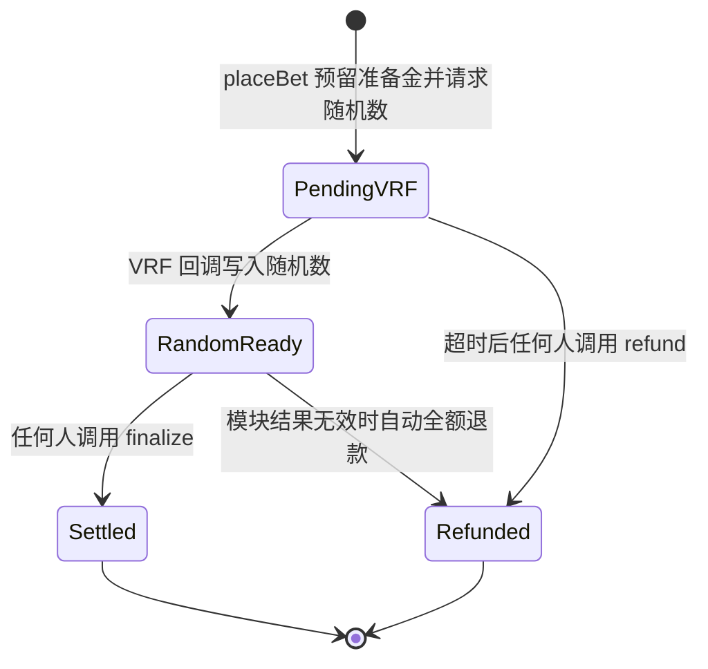

# ArbiGameFi 技术白皮书

> AGF-WP-TECH-2026.09-r1 · 2026-09-29 · 中文，附英文摘要 · 内部审阅稿，尚未对外发布
>
> **首要读者**：协议研究者、技术尽调与审计人员、集成方、专业 LP 的技术顾问
>
> **适用范围**：v1.6 合约候选源码，含 [ADR-0034](adr/0034-async-lp-redemption-continuous-betting.md) 与 [ADR-0035](adr/0035-recovery-rights-without-exit-blocking.md) 的 LP 异步赎回。**项目尚未上线**：源码与本地测试不代表已经部署或已通过外部审计。候选源码与验证记录见[审计范围](audit/v1.6-audit-scope.md)，规范文本以 [SSOT v1.6](constitution/SSOT.v1.6.md) 与[可执行规范](constitution/ExecutableSSOT.v1.6.md)为准。

## 摘要

ArbiGameFi 是钱包原生的 casino 与 sportsbook 项目。每个资金池（Bank）为一种资产的投注提供赔付资本，资本来自 LP。本文回答技术尽调关心的五个问题：资金与权利归谁，规则如何冻结，结果与支付如何核对，外部依赖失败时责任怎样限定，以及治理能做什么、不能做什么。

主要结论如下：

- **每笔投注在接受时锁定规则与最大赔付。** 结算只能在这笔准备金以内完成，所有负债在形成时就从资金池净值中扣除。
- **LP 固定获得每笔流水 house edge 的一半。** 份额是合约常量，推荐奖励与协议费用只能从另一半里支付，由结算路由器独立限额。
- **LP 退出不会暂停下注。** 退出在激活时只隔离申请者对应的旧风险和回收权，留存份额继续承保，结算同笔恢复可用资本。一笔永远无法结算的旧投注只锁住它自己的准备金，不阻塞后续退出。
- **合约不可升级。** 治理可以暂停新风险、准入玩法与资金池，并在合约上限内调参，但不能提取 LP 资金，已接受投注的模块、有效 edge 与推荐比例版本固定；退款超时使用治理当前配置，上限为 1 天。

## 1. 设计问题与目标

LP 共同承保的链上 casino 同时面对四个相互牵连的问题。

1. **偿付**：每笔已接受的投注在最坏结果下都必须付得出。协议费用、推荐奖励、LP 退出款和支付失败的玩家款项都是负债，不能重复计算，也不能被用来承保新的风险。
2. **投注进行中的公平进出**：资金池的现金里包含尚未结算投注的本金。如果份额价格忽略这些投注可能的赔付，LP 就能抢先退出。例如开奖结果已上链、但结算尚未完成时，看到大额中奖的 LP 可以先退出。又如 LP 本人下注后按包含自己本金的价格退出。这正是早期安全扫描发现的问题。
3. **持续运营**：LP 退出不能打断玩家下注，这是项目所有者的硬性要求。一笔有缺陷的投注也不能冻结整个资金池。
4. **可核对**：每个结果、费用与支付都必须能够仅凭链上数据重算。

| 目标                  | 设计                                           | 章节   |
| --------------------- | ---------------------------------------------- | ------ |
| G1 偿付               | 接受时预留最大赔付；单一的活跃净值扣除全部负债 | §3、§6 |
| G2 LP 份额固定        | 50% 为合约常量，路由器按开仓记录独立限额       | §4     |
| G3 退出公平           | 激活仅隔离退出者风险；留存资本结算同笔恢复     | §5     |
| G4 下注与退出互不阻塞 | 按期隔离，旧期永远不阻塞新期                   | §5     |
| G5 支付不能阻断结算   | 转账失败转为玩家应付款，仓位照常终结           | §6     |
| G6 可核对             | 事件与视图足以重算结果、分配、净值与现金流     | §10    |

本设计明确不提供：合约升级；跨资金池互相赔付；LP 在确定期限内全额取回现金的保证；当前阶段的体育资金池准入。

## 2. 系统结构

| 组件                                | 职责                                                                              | 信任性质                                     |
| ----------------------------------- | --------------------------------------------------------------------------------- | -------------------------------------------- |
| Bank                                | 单一资产托管；LP 份额；准备金；协议、推荐、退出与玩家负债；历史回收池             | 只接受结算路由器的下注与结算调用             |
| SettlementRouter                    | 把头寸绑定到原始 hub、资金池、Bank 与玩家；校验终态身份、次数与金额；执行分配上限 | 无治理函数，装配后不可更改                   |
| PoolRegistry                        | 定义资金池与业务域，授予 hub 使用指定资金池的准入                                 | 治理控制                                     |
| GameHub                             | 固定投注输入，请求随机数，调用游戏模块计算结果，按规则分配 house edge             | 治理可登记游戏模块、调整参数（有上限与延迟） |
| VRFHub 与 Chainlink VRF v2.5 适配器 | 请求并保存随机数；多付的随机数费用作为可领取的退款额度                            | 依赖 Chainlink VRF                           |
| 游戏模块（8 种）                    | 确定性规则：Dice、Coin Toss、Roulette、Keno、Plinko、Sic Bo、Slots、Baccarat      | 模块正确性属于安全假设                       |
| ReferralRegistry 与分配引擎         | 首次绑定的推荐关系；把运营预算分配给返水、推荐与协议                              | 推荐关系在接受投注时固定                     |
| SportsHub 与 SportsRiskEngine       | 体育固定赔率票据、敞口、结果证据与争议                                            | **当前不准入异步 Bank**                      |
| Keeper（链下）                      | 推进结算与退款、激活到期赎回、监控回收池、代玩家领取应付款                        | 所调用的函数任何人都能调用；不托管资金       |

合约没有代理、`delegatecall` 或升级机制，部署后的规则即为最终规则。Bank 不判断开奖结果：已准入的 hub 与模块可以在每笔投注的准备金范围内提交任意结果。因此随机数链路、模块代码和准入流程都是资金安全模型的一部分（§8）。不同资产、casino 与体育分别承保，互不赔付。

Casino 投注的状态流转如下：


```mermaid
stateDiagram-v2
    [*] --> PendingVRF: placeBet 预留准备金并请求随机数
    PendingVRF --> RandomReady: VRF 回调写入随机数
    PendingVRF --> Refunded: 超时后任何人调用 refund
    RandomReady --> Settled: 任何人调用 finalize
    RandomReady --> Refunded: 模块结果无效时自动全额退款
    Settled --> [*]
    Refunded --> [*]
```

## 3. 账本与偿付

同一链上状态下定义：B 为 Bank 的实际资产余额，PF 为协议应付款，XP 为全部推荐奖励负债（可领、锁定与 holdback 三部分），X 为已定价但未领取的 LP 退出款，PP 为玩家应付款，P 为历史回收池备付金，Ra 为所有未结投注中由活跃份额承担的准备金。

```text
活跃 NAV       = B − PF − XP − X − PP − P
偿付不变量     B ≥ PF + XP + X + PP + P + Ra，且 活跃 NAV ≥ Ra
全部准备金     totalReserved = Ra + 已隔离的退出者及协议剩余准备金
```

份额价格、`totalAssets()`、`getSSOT()`、新风险检查与协议出金检查都使用同一个活跃 NAV。P 同时覆盖历史期尚未终结的风险，以及已经释放但尚未领取的回收款，因此不能用历史准备金代替它，也不能再重复扣除其中的准备金。

负债在形成时入账，此后对外支付时，现金与负债等额减少，活跃 NAV 不变。例外是授权方把款项领取给 Bank 自身，这属于明确标识的捐赠，会增加活跃 NAV。

两个缓冲参数分别约束两类流出：`riskReserveBps` 限制新增承保；`withdrawalBufferBps` 限制协议费用与推荐奖励这两类可选出金。LP 已定价的退出款、回收款和玩家应付款都是既定负债，不受缓冲比例缩减，但紧急暂停仍可阻止 LP 款项的支付。

**份额与虚拟偏移。** 设 T 为真实份额总量，V 为虚拟偏移：

```text
V = 10^(decimals − 3)            资产小数位不足 3 位时 V = 1
存入份额 = floor(assets × (T + V) / (NAV + V))
铸造成本 = ceil(shares × (NAV + V) / (T + V))
```

V 相当于千分之一个代币，同时作用于资产与份额，使初始价格为 1:1。攻击者要让受害者的存款四舍五入到零份额，需要捐出约千倍于该存款的资产，而且捐赠几乎全部被虚拟头寸吸收，攻击无利可图；存款若只能铸出零份额，合约会拒绝，而不会吞掉资金。V 不取一整个代币，是因为退出与回收时，虚拟头寸对应的那部分价值要划归协议资本（§5.5）：若 V 为一个代币，6 USDC 的小池每次回收约有 14% 划走；取千分之一时可以忽略。

**资产准入假设**：转账金额精确、余额不会自动变动（rebase），失败的转账不能先改动余额再返回失败。发行方冻结或暂停代币仍可能使支付暂时不可用（§7）。

## 4. House edge 与分配

金额按资产最小单位整数计算。设 S 为投注本金，Q 为未使用本金的退款，G 为按规则计算的毛派彩，h 为接受投注时固定的有效 edge（bps）：

```text
U = S − Q                       实际使用的流水
F = floor(G × h / 10000)        派彩手续费，留在本局游戏损益中
N = G − F                       玩家净派彩
E = floor(U × h / 10000)        流水 edge
O = floor(E / 2)                运营预算
LP 保留 = E − O
PF_new + XP_new ≤ O
```

- **LP 的一半是常量。** `LP_SHARE_BPS = 5000`，治理不能修改；整数余数也留给 LP。
- **运营预算的用途。** 运营方用 O 支付玩家返水（L0）、两级推荐奖励（L1、L2）与推广加价奖励，剩余部分计为协议费用。L0、L1、L2 合计不超过基础 edge 的 35%。玩家没有推荐人时 L0 不发放，这部分与舍入余数都归协议。
- **路由器独立限额。** 结算路由器按开仓时记录的 edge 独立计算上限，不依赖 hub 自报的预算，并检查 `N ≤ G`、`Q ≤ S`、`G + Q ≤ 准备金`。
- **Bank 的第二道检查。** 玩家净派彩、退款、PF 与全部 XP 之和不得超过该笔准备金。由于准备金不低于本金、手续费按毛派彩计收，这条对 casino 的每一种结果都成立。
- **F 与 E 是两个计量基数。** 即使一局没有派彩，也会按 E 计提运营预算。纯退款不产生任何分配。

**演算（示例参数，非上线配置）。** 流水 1,000 USDC，有效 edge 2%，推荐比例按基础 edge 的 10% / 20% / 5% 计：

| 项目              | 有两级推荐人 | 无推荐人 |
| ----------------- | -----------: | -------: |
| 流水 edge E       |        20.00 |    20.00 |
| LP 保留 E − O     |        10.00 |    10.00 |
| 运营预算 O        |        10.00 |    10.00 |
| 其中 L0 / L1 / L2 |    2 / 4 / 1 |        0 |
| 其中协议费用      |         3.00 |    10.00 |

单局的资本变化为 `U − G + F − PF_new − XP_new`（未计出入金与虚拟残值）。在规则公平、毛派彩期望等于流水的假设下，LP 的理论期望约为流水 edge 的一半，即上例的 10 USDC。这不是本金收益率：有限样本可以亏损，停止条件会改变实际分布，不能据此推算年化收益。

**参数边界。** 有效 edge 不超过 5%。基础 edge 调整与加价上限的提高要等待 7 天才生效，任何人都可在到期后激活；加价上限的降低立即生效。推荐关系、推荐比例版本和有效 edge 在接受投注时固定，之后的配置变化不追溯已接受的投注。详见 [ADR-0032](adr/0032-fixed-lp-share-operator-funded-referrals.md)。

## 5. LP 进出：持续下注下的公平退出

### 5.1 存入

`deposit` / `mint` 按活跃池账面价即时执行（ERC-4626）。新 LP 参与当前期尚未结算的风险，但不取得已经隔离的历史期的回收权。账面价值不等于随时可提取的现金。

### 5.2 请求、取消与授权

- **提交请求。** `requestRedeem(shares, controller, owner)` 托管 owner 的份额，并把这笔请求的权利交给 controller（ERC-7540）。owner 本人、owner 授权的 operator，或持有 ERC-20 授权额度的 spender 都可以提交；有限额度会被扣减，operator 不消耗额度。
- **请求 ID。** 所有请求的 ID 都是 0，同一 controller 的请求合并计算。
- **取消。** 在实际激活之前都可以取消，即使最早可激活时间已过；份额退回 controller。
- **领取与授权。** 付款只能由 controller 或它当前授权的 operator 发起，并由其选择收款地址。owner 以前给出的 ERC-20 授权不能用来领取或取消。
- **托管限制。** Bank 自身不能成为 controller，普通转账和铸造也不能把份额直接转给 Bank。`rescueToken` 拒绝移动资产与 Bank 份额。
- **网站与 keeper。** 网站从不请求为 keeper 授予 operator 权限，用户自己领取。

### 5.3 激活：只隔离退出者的风险

请求在批次周期边界后可由任何人激活。周期初始为一天，治理可在一小时至七天内调整。实际激活前仍可取消。

1. 读取活跃 NAV N、真实份额 S、申请份额 Q 和活跃准备金 R。
2. 按同一虚拟偏移报价及真实权益上限，算出申请者权益 E。
3. 为申请者固定液态现金，同时只把各仓位中对应 E 的准备金单位隔离为申请 controller 的历史权利。
4. 烧毁 Q，进入下一批。留存份额继续承担其余旧风险和新投注；后续存入按完整账面价买入这部分风险。

激活不停止下注，也不等待旧仓清零。每池最多允许 128 个仍由活跃资本承担风险的未结仓位，以限制批次操作的 gas。全部风险已隔离的旧仓不占此名额。资本不足、此并发容量上限或紧急暂停仍可能拒绝新下注，不能承诺无限容量。

### 5.4 原始准备金单位与回收

虚拟偏移 V 不变；以下均向下取整，N 为零时分配为零：

```text
G = min(floor(S × (N + V) / (S + V)), N)
E = floor(Q × G / S)
批次现金 = floor(E × (N − R) / N)
各仓位划给本批的单位 u = floor(该仓位活跃单位 × E / N)
```

每个单位始终使用该投注最初的准备金 T 作分母，后续退出不重设分母。该投注终结成本 C 包括玩家净派彩、退款、PF、所有 XP 和转账失败形成的玩家欠款，且 C 不得超过 T。本批从这笔投注回收 `floor(u × (T − C) / T)`。每位 controller 按其申请份额占 Q 的比例分配批次累计回收，减去已领金额。

留存准备金在投注终结的同笔交易里释放，直接恢复承保，不需领取、再次存入或 keeper 复投。退出者的回收仍在活跃 NAV 之外。同一批有一笔卡住，不妨碍领取其他已终结投注释放的金额。原始单位与负债守恒规则详见 ADR-0035。

### 5.5 演算：留存资本自动继续承保

忽略虚拟偏移和整数尾差的简化示例：Alice、Bob 各存入 1,000 USDC；一笔投注本金 100、准备金 200，故 N 为 2,100。Alice 全部退出时，约 950 记为可领现金、100 作为旧风险保留；Bob 的活跃 NAV 约为 1,050，其中 100 仍预留给旧投注。

| 投注终结成本 | Alice 现金加回收 | Bob 活跃 NAV | Bob 剩余旧准备金 |
| ------------ | ---------------: | -----------: | ---------------: |
| 200          |              950 |          950 |                0 |
| 0            |            1,050 |        1,050 |                0 |
| 100          |            1,000 |        1,000 |                0 |

实际费用计入终结成本，精确金额按合约整数公式计算。Bob 在这笔交易结束时即可用已释放资本继续承保。若期间有新 LP 存入，他们买入 Bob 所在活跃池的剩余旧风险，而不取得 Alice 已隔离的回收权。

### 5.6 残值与尾差

部分退出的风险分配向下取整，余数留给活跃资本。全部真实份额退出时，剩余风险单位与液态残值归协议，排除在后续新 LP 的 NAV 外。每笔仓位的整批取整尾差，要等所有退出单位分配完才转协议；每批按 controller 分配的尾差，要等所有申请份额完成最终同步才转协议。已分配未领取的款项持续有备付，不会过期或被没收。

普通现金领取的批次尾差：部分退出时回到活跃 NAV，全额退出时归协议，即使中途已有新 LP 存入。协议资本残值单独记录，不计入玩法手续费或流水 edge。取整可能导致与双重取整的整体报价相差一个最小单位；不承诺任意小额路径下的价格完全相同。

### 5.7 两类领取

`withdraw` / `redeem` 领取已定价的批次现金；标准的 `maxWithdraw` / `maxRedeem` 只反映这部分，暂停期间返回 0。历史回收通过 `claimRecovery(epoch, receiver, controller)` 按期领取，是独立的权利，即使钱包份额为零也继续存在。领取现金时向下取整；部分 `withdraw` 若会耗尽可领份额却留下资产，将被拒绝，因此领取顺序不影响总额。`syncRedeem` 与 `syncRecovery` 任何人都可调用，只整理账目，不转账、不改变受益人，暂停期间也可执行。

### 5.8 一笔投注永远无法结算时

这种情况只可能由结算链路上的合约缺陷引起（§7）。按本设计：

- **Bank**：该笔未结风险继续由留存份额和已退出 controller 各自的准备金单位承担；退出者对应回收暂不能释放，后续退出可继续分离剩余活跃风险。下注、新存入、后续批次的退出与其他期的回收全部照常。可领现金没有全额到账期限；若全部资金都在承担未终结风险，可领现金可能为零，但回收权不会被折价抹去。
- **玩家**：合约不能把合法的赢家改成退款来释放准备金，因为那会让输家可以故意制造结算失败以取回本金，所以该玩家在链上无法得到支付。运营政策是由运营方按用户条款以协议收入在链下补偿。这一承诺须在上线前写入条款，链上规则不因此改变。

## 6. 投注结算与支付

- **接受**：规则参数最多 64 字节，最多 100 局。准备金取模块给出的最大赔付，且不低于本金；新风险须通过活跃资本检查。
- **随机数**：通过 Chainlink VRF v2.5 wrapper 请求。玩家以链的原生资产预付随机数费用，多付部分记为可领取的退款额度。这是独立于 Bank 的原生资产账本。回调只写入随机数，不结算资金。
- **结算**：`finalize` 任何人都可调用。模块计算失败或结果超出准备金时，自动全额退款。随后依次计算派彩手续费、按 §4 分配，再由路由器与 Bank 校验。
- **超时退款**：等待随机数超过超时时间（治理可调，合约上限 1 天）后，任何人都可为玩家退回本金。
- **支付与玩家应付款**：Bank 先尝试直接转账给玩家。若代币拒绝转账（例如地址被发行方冻结），或转账因调用方给的 gas 不足而失败，全额记为该玩家的应付款，释放准备金，仓位照常终结。`claimPlayerPayable` 任何人都能触发，暂停期间也可执行，但总是支付给玩家本人；领取失败时债务保留。Keeper 会在下一轮自动代领，遇到仍被冻结的地址则退避重试。成功支付与新增应付款互斥，终结时计入的成本不会在领取时重复扣账。
- **暂停**：阻止新风险、存入、批次激活、LP 现金与回收领取，以及协议费用与推荐奖励的领取。不阻止结算、退款、玩家应付款领取、取消请求与账目同步。
- **收据**：分别证明终态金额与支付方式（已转账、已记应付款或证据不足）。终结时记下的应付款是历史事实，不能据此推断当前是否仍未领取。

## 7. 失败模式与责任边界

| 事件                           | 直接影响                               | 设计处理                                                                 | 残余风险                               |
| ------------------------------ | -------------------------------------- | ------------------------------------------------------------------------ | -------------------------------------- |
| VRF 长时间不回调               | 投注停在等待随机数                     | 超时（≤ 1 天）后任何人可退本金                                           | 等待时间                               |
| Keeper 停机                    | 结算、退款、激活与代领延迟             | 所有推进函数都无需许可，任何人都可调用                                   | 需要有人支付 gas                       |
| 玩家地址被发行方冻结           | 直接转账失败                           | 转为玩家应付款，仓位照常终结；keeper 退避重试代领                        | 解冻前无法到账                         |
| 代币全局暂停                   | 所有转账失败                           | 结算记为应付款；各类领取失败但权利保留                                   | 取决于发行方                           |
| 结算链路缺陷，某笔永远无法结算 | 该笔准备金锁定                         | 只影响所属历史期的回收；下注与后续退出照常（§5.8）                       | 该期 LP 失去对应回收；该玩家需链下补偿 |
| 开奖后、结算前抢先退出         | 可能转嫁未入账的赔付                   | 只隔离退出者的风险，留存份额继续承担其余风险                             | 无                                     |
| LP 集中退出                    | 活跃资本减少                           | 按期定价，下注继续                                                       | 单笔可接受的最大投注下降               |
| 错误或恶意的模块、hub 被准入   | 可在准备金内给出错误结果               | 多签准入；路由器限额；Bank 准备金上限                                    | LP 需信任准入流程与模块代码            |
| 治理密钥失陷                   | 可暂停、准入新模块与 hub、在上限内调参 | 多签；参数上限与延迟；已登记游戏的模块不可更换；治理无法直接提取 LP 资金 | 经由新准入恶意模块的间接损失           |
| RPC 或索引故障                 | 页面与收据暂时不可用                   | 以链上状态为准，索引可从发布区块重放                                     | 展示延迟                               |

## 8. 治理与信任假设

| 合约           | 治理可以                                                                                        | 限制                                                                                          |
| -------------- | ----------------------------------------------------------------------------------------------- | --------------------------------------------------------------------------------------------- |
| Bank           | 暂停／恢复新风险；设置风险与出金缓冲、holdback 周期、解锁门槛、批次周期、guardian；领取协议费用 | 缓冲不超过 100%；批次周期 1 小时至 7 天；不能动用资产与份额                                   |
| GameHub        | 登记游戏模块；排队或取消 edge 调整；切换推荐比例版本；设置超时退款时间                          | 每个游戏 ID 只能登记一次，不能更换或注销；edge ≤ 5%，调整 7 天后生效；超时 ≤ 1 天；推荐 ≤ 35% |
| PoolRegistry   | 登记资金池；启停资金池；登记 hub 并授予资金池准入                                               | 停用不影响已有投注的结算                                                                      |
| VRFHub／适配器 | 设置适配器与请求 gas 价格                                                                       | 回调不能修改已结算的投注                                                                      |

- **guardian**：可以触发 Bank 暂停（包括新风险、存入、批次激活及 LP 领取，具体见 §6），不能恢复，也不能移动资金或修改其他参数；恢复只能由治理执行。
- **治理不能做的事**：升级合约、提取 LP 资金、修改 LP 的 50% 份额、改写已接受投注的模块、有效 edge 与推荐比例版本、没收或转移回收权。
- **退款超时即时生效**：`GameHub.setRefundTimeout` 修改全局超时，已有未终结投注也使用当前值，并非开仓时固定；上限为 1 天。
- **准入即时生效**：登记游戏模块、hub 与资金池没有时间锁。这是 LP 需要信任的核心治理权限，上线前应评估为准入增加延迟。
- **外部依赖**：代币发行方、Chainlink VRF、链与 RPC 的可用性，以及有人愿意支付推进交易的 gas。
- **Keeper**：只推进公开状态，不决定结果，不持有用户授权，也不托管资金。

## 9. 体育的边界

体育规划为赛前固定赔率单关，使用独立资本。票据固定赔率、市场版本、期限、nonce 与风险参数；签名只证明报价来源，不证明现实结果。数据来源、报告门槛、挑战、裁决与作废规则都需要独立验证。体育投注在缺少结果或长期争议时的终结期限尚未完成，在此之前不准入这些 Bank，也不能把 VRF 的恢复规则直接套用到体育。详见[体育路线](strategy/sportsbook-production-roadmap.md)。

## 10. 实现状态与核对方法

**状态**：合约、SDK、keeper、索引与网站已实现，并通过合约单元、差分、不变量与变异测试，以及前端与本地链集成测试（见[审计范围](audit/v1.6-audit-scope.md)的候选证据）。尚未进行网络部署、Safe 接管验收与外部审计。

**独立核对**：

1. 固定链、区块、发布身份、Bank、hub 与资产，读取 B、全部负债、准备金与份额，核对活跃 NAV 与偿付不变量。
2. 用投注记录、随机数、规则输入与分配事件重算每笔结果与分配。以实际转账或应付款事件核对收据。
3. LP 现金流水以 `Deposit`、`Withdraw` 与 `RecoveryClaimed` 为准。请求、同步、隔离与批次烧毁都不是现金流动；领取给 Bank 自身的记为捐赠。
4. 验证须覆盖权限、跨批次舍入、零资产、取消边界、链重组与重启、转账失败、最大准入工作量和未终结状态。测试结论只适用于实际测试过的场景与配置；具体实例能否开放，要看部署身份、参数与运行证据是否衔接。

## 11. 术语

| 术语                 | 含义                                                   |
| -------------------- | ------------------------------------------------------ |
| 活跃 NAV             | 扣除全部负债与历史回收备付金后，当前 LP 份额对应的净值 |
| 准备金               | 接受投注时为最大赔付预留的资金                         |
| 期（epoch）          | 两次赎回激活之间的区间；每次激活封存上一期的未结风险   |
| 回收池               | 某一期被隔离的准备金及其释放的回收款                   |
| controller／operator | 赎回请求权利的持有者／其授权的代理人                   |
| 玩家应付款           | 转账失败时记下的、只能付给该玩家本人的债务             |
| 虚拟偏移 V           | 份额定价中的虚拟资产与虚拟份额，相当于千分之一个代币   |
| 协议资本             | 虚拟残值与分配尾差，记入协议应付款但与玩法费用分开核算 |

## English abstract

ArbiGameFi is an unlaunched, wallet-native casino and sportsbook. Each Bank underwrites one asset's bets with LP capital, and its contracts are immutable.

**Bets and payouts.** Every accepted bet fixes its module, effective edge and referral version and reserves its maximum payout. Terminal obligations cannot exceed that reserve. Refund eligibility uses the current global timeout, which governance can change within the one-day ceiling. One active NAV subtracts all liabilities: protocol fees, referral rewards, priced LP exits, player payables and historical recovery backing.

**LP economics.** LPs keep a constant half of each casino bet's turnover house edge. Referral rewards and protocol fees come from the other half, capped independently by the settlement router.

**LP exits.**

- Deposits are immediate (ERC-4626). Exits are ERC-7540 requests.
- Activation, callable by anyone after the batch-period boundary, prices the requester's liquid cash. Only exiting controllers' old risk and recovery rights are segregated. Staying shares continue underwriting; settlement frees their reserve in that same transaction. New deposits buy the remaining active book risk.
- LP operations impose no betting pause. A stuck position does not block later batches. Available capital, emergency pause and a 128 active-risk-position capacity still constrain new betting.
- A virtual offset of one thousandth of a token protects first deposits while keeping the virtual position's residual, which goes to protocol capital, negligible.

**Payments.** A refused or gas-starved payout becomes a payable that anyone may trigger but only the player can receive; the keeper claims it on the player's behalf.

**Governance and trust.** Governance can pause, admit modules, hubs and pools, and tune bounded parameters, but cannot upgrade contracts, move LP funds or rewrite the module, effective edge or referral version of accepted bets. The global refund timeout can affect existing bets. Guardian pause also blocks deposits, batch activation and LP claims; settlement, refunds and player-payable claims remain live. Admission has no timelock and is the key trust assumption.

**Status.** Sports pools are not admitted. The implementation is tested locally but not yet deployed or externally audited.
