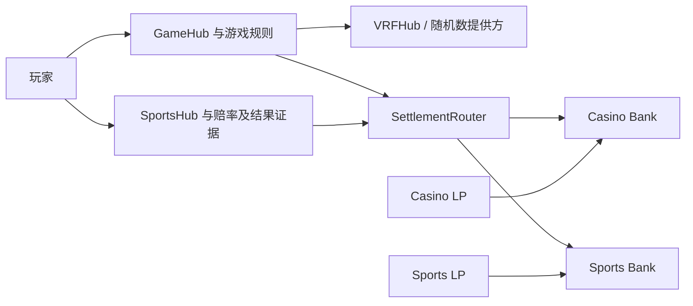

# ArbiGameFi 技术白皮书

> 文档编号：AGF-WP-TECH-2026.09-r4 · 文档状态：External Review Draft（外部审阅稿）
>
> 设计方向日期：2026-09-26，第 3 节于 2026-09-27 按 SSOT v1.6 重写 · 语言：zh-CN，附英文摘要 · 架构：Single Source of Truth（SSOT）
>
> 读者：协议研究者、技术尽调与审计人员、集成开发者、专业 LP 的技术顾问
>
> 版本口径：本文描述下一经济版本 v1.6 的技术设计，源码已实现、尚未完成外部审计；部署事实以独立的 v1.5 发布事实表为准。本稿不表示 v1.6 已经批准在主网上线。

本文解释 ArbiGameFi 的资金机制、经济约束、结算协议和信任假设，供外部读者判断设计是否自洽、实现应满足哪些条件、哪些风险无法仅由合约消除。商业定位见[项目与商业白皮书](WHITEPAPER.product.zh-CN.md)，简要介绍见[项目简介](ARBIGAMEFI-EXECUTIVE-BRIEF.zh-CN.md)。[产品架构](strategy/fullstack-product-architecture.md)保留整体设计背景；实施状态、历史问题和演进顺序分别由[发布事实表](release/STATUS-v1.5.zh-CN.md)、[系统复盘](audit/RepositoryReview-2026-09-25.zh-CN.md)和[路线图](roadmap.md)承载。

## 摘要

ArbiGameFi 采用按资产与业务域划分的资金池。每个 Bank 是相应资产、LP 份额、应付款和未结算预留的唯一资金账本；SettlementRouter 将每个头寸绑定到固定的资金池及结算主体；GameHub 与 SportsHub 分别处理随机游戏和现实体育事件的业务规则。统一结算内核约束资金如何移动，业务 hub 负责证明某次结算为什么成立。两者缺一不可。

下一经济版本 v1.6 让 LP 固定保留每笔 casino 投注按流水计算的 house edge 的一半；推荐奖励与协议费只能来自另一半，由结算路由按其对头寸的自有记录执行上限。只要每笔投注的预留不低于本金，支付玩家并计提应付款后对 LP 净值的消耗，仍被接受投注时的预留覆盖。

Casino 的结果依赖规则模块、随机数提供方和链上执行；sportsbook 的结果依赖赔率授权、赛事证据、结果报告与争议裁决。两类业务默认使用独立资本，不将随机数可验证性当作现实赛事真实性的证明，也不将账面偿付能力等同于随时退出或长期盈利。

## Abstract (EN)

ArbiGameFi separates asset accounting, settlement authorization and business-specific outcome determination. Each Bank accounts for one pool's assets, LP shares, external payables and open-position reserves. A settlement router binds positions to their originating hubs, while casino and sportsbook use distinct evidence and capital domains.

The next economic version, v1.6, lets LPs keep a fixed half of every casino bet's turnover house edge. Referral rewards and protocol fees come only from the other half, and the settlement router enforces that cap from its own record of each position. As long as each bet's reserve is at least its stake, the reserve taken when the bet is accepted still covers what its settlement pays out and accrues. This paper derives that bound, describes share accounting and settlement finality, and identifies the governance, oracle and asset assumptions on which those properties depend. Sports uses independently signed odds and an evidence-based result process. v1.6 is implemented in source and not yet audited; deployed v1.5 behavior and implementation gaps are identified separately.

## 1. 设计问题与架构选择

投注协议需要同时回答三个问题：接受投注时，池子是否承担得起最坏结果；结算时，谁有权声明结果以及如何验证；资金支付与奖励记账完成后，剩余 LP 权益是否仍能覆盖其他头寸。只展示资产余额不能回答这些问题。余额中可能已经包含待领取费用和奖励，也包含为未结算投注承担风险的资金。

因此，ArbiGameFi 选择将资金账本与业务判断分离，但不把它们割裂：

| 层                   | 主要职责                                                             | 不承担的证明                           |
| -------------------- | -------------------------------------------------------------------- | -------------------------------------- |
| Bank                 | 托管单一资产；维护 LP 份额、协议与奖励应付款、头寸预留；执行资金收付 | 不独立判断随机结果或赛事事实是否正确   |
| SettlementRouter     | 固定头寸的 hub、Bank、资产和玩家；限制结算身份、次数及金额           | 不替代游戏规则、赔率授权和结果裁决     |
| PoolRegistry         | 定义资金池及业务域；授予 hub 使用指定池的权限                        | 注册本身不证明被授权代码与经济规则安全 |
| GameHub 与规则模块   | 接受 casino 投注、固定规则输入、请求随机数、计算赔付与费用           | 不将随机数服务的可用性视为必然         |
| SportsHub 与风险引擎 | 接受固定赔率票据、限制赛事敞口、处理结果和争议                       | 不将签名等同于现实事件的真实性         |


```mermaid
flowchart LR
  Player[玩家] --> Game[GameHub 与游戏规则]
  Player --> Sports[SportsHub 与赔率及结果证据]
  Game --> VRF[VRFHub / 随机数提供方]
  Game --> Router[SettlementRouter]
  Sports --> Router
  Router --> CasinoBank[Casino Bank]
  Router --> SportsBank[Sports Bank]
  CasinoLP[Casino LP] --> CasinoBank
  SportsLP[Sports LP] --> SportsBank
```

统一内核允许复用授权、记账和结算约束，纵向 hub 则保留不同业务的接受条件和证据。默认部署边界是 casino 与 sports 使用不同 Bank 和风险预算；不同资产也分别记账。不存在由该架构自动产生的跨池赔付承诺。共享治理、代码或基础设施仍可能造成相关故障，资本隔离不代表所有风险相互独立。

参考实现：[Bank](../src/core/Bank.sol)、[SettlementRouter](../src/core/SettlementRouter.sol)、[PoolRegistry](../src/core/PoolRegistry.sol)、[GameHub](../src/core/GameHub.sol)、[SportsHub](../src/core/SportsHub.sol)。

## 2. 资金模型与 LP 份额

### 2.1 余额、负债和预留

对某个 Bank，在同一链上状态下定义：

| 符号  | 含义                                                             |
| ----- | ---------------------------------------------------------------- |
| `B`   | Bank 持有的该资产实际余额                                        |
| `PF`  | 已计提、尚未领取的协议费用                                       |
| `XP`  | 已计提、尚未支付的全部推广与奖励应付款，包括锁定和 holdback 部分 |
| `NAV` | LP 净资产：`B − PF − XP`                                         |
| `R`   | 所有未结束头寸的赔付预留之和                                     |
| `T`   | 已发行 LP 份额总量                                               |

基础偿付条件为：

```text
B ≥ PF + XP
NAV = B − PF − XP
NAV ≥ R
```

`R` 是对 LP 资产用途的约束，不是再次从 `NAV` 扣除的外部应付款。玩家押注进入 Bank 后成为池内余额的一部分，同时建立对应预留；资金并非逐笔物理隔离的托管账户。不能先将预留从净值中扣除，再在结算时重复确认同一笔损失。

协议费用和奖励在计提时就减少 LP 权益，不能等到领取时才作为成本处理。向 Bank 外部领取 `c` 单位已计提费用时，`B` 与对应应付款均减少 `c`，因此 `NAV` 不变。如果资金被转回 Bank 或领取接收方就是 Bank，则需要按实际余额变化区分费用返还与普通外部支付；返还可能增加 LP 净值。

同样，直接转入 Bank 的资产增加余额和净值，但不是博彩业务收入。净值变动分析必须区分投注损益、外部资金流和费用返还。[AccountingLib](../src/libs/AccountingLib.sol)与 Bank 的 `totalAssets()`、`externalPayablesTotal()`、`getSSOT()`提供核对入口。

### 2.2 Virtual shares 与转换方向

LP 份额表示对剩余净资产的比例性权益。转换采用虚拟资产与虚拟份额偏移 `V`，避免空池或极低流动性时直接使用 `NAV / T` 的不稳定分母：

```text
assets → shares: assets × (T + V) / (NAV + V)
shares → assets: shares × (NAV + V) / (T + V)
V = 10^assetDecimals
```

| 操作                         | 取整方向     |
| ---------------------------- | ------------ |
| deposit：按投入资产获得份额  | 份额向下取整 |
| mint：按目标份额支付资产     | 资产向上取整 |
| withdraw：按取出资产销毁份额 | 份额向上取整 |
| redeem：按销毁份额取出资产   | 资产向下取整 |

该取整方向避免转换误差持续由现有 LP 承担；零份额存入应拒绝。虚拟偏移降低低流动性下通过捐赠和取整操纵份额价格的空间，但不意味着任意资产、任意规模下的捐赠行为都没有经济影响。LP 估值应使用实际转换函数，并将流动性规模和取整误差纳入分析。

模型假设资产按请求数量精确转移，且余额不会因 rebase 或转账税自行变化。校验代币 decimals 只保证单位配置一致，不能替代对代币转账语义、冻结权限和发行方风险的判断。

## 3. v1.6：LP 固定保留一半 house edge

> 版本口径（2026-09-27）：本节描述 v1.6 发布单元，规范见 [SSOT v1.6](constitution/SSOT.v1.6.md)，决策见 [ADR-0032](adr/0032-fixed-lp-share-operator-funded-referrals.md)。源码已实现，[审计范围](audit/v1.6-audit-scope.md)已冻结，外部审计尚未完成。Base 主网仍运行 v1.5。

### 3.1 v1.5 的问题

对公平的游戏模块，从中奖毛派彩中扣留的费用 `F` 的期望，等于按实际流水计算的 house edge `E`。v1.5 在结算时把 `E` 全部计为协议费（PF）和推荐奖励（XP）应付款，这两项相互抵消：LP 承担游戏结果的方差，house edge 的期望份额却为零（[系统复盘](audit/RepositoryReview-2026-09-25.zh-CN.md) R01）。推荐预算和层级参数只能在 PF 与 XP 之间转移价值，无法通过配置改变这一点。

### 3.2 计提基数与分配

金额以资产最小单位计，费率以 basis points 计，`floor` 为整数除法。

| 符号                                            | 含义                                                                        |
| ----------------------------------------------- | --------------------------------------------------------------------------- |
| `S`                                             | 投注托管的本金                                                              |
| `Q`                                             | 结算时退回的未使用本金，`0 ≤ Q ≤ S`                                         |
| `U = S − Q`                                     | 实际流水                                                                    |
| `h_b`、`h_e`                                    | 接受投注时快照的基础 edge 与有效 edge，`h_e = h_b + Δ`，`Δ` 为推广加价      |
| `E = floor(U × h_e / 10000)`                    | 流水 edge                                                                   |
| `E_b = floor(U × h_b / 10000)`、`E_Δ = E − E_b` | 基础部分与加价部分                                                          |
| `O`                                             | 运营份额；LP 保留 `E − O`                                                   |
| `R0`、`R1`、`R2`                                | L0 玩家返水、L1 推荐人与 L2 推荐人的奖励                                    |
| `M`                                             | 加价部分付给推广方的份额                                                    |
| `PF_new`、`XP_new`                              | 本次结算新增的协议费与全部推荐应付款                                        |
| `G`、`F`、`N`                                   | 规则毛派彩、从毛派彩扣留的费用 `floor(G × h_e / 10000)`、玩家净派彩 `G − F` |

结算时依次计算：

```text
E、E_b、E_Δ   由 U 与快照的 h_b、h_e 得出
O      = floor(E × (10000 − LP_SHARE_BPS) / 10000)       LP_SHARE_BPS = 5000
R0     = floor(E_b × l0 / 10000)    仅当玩家接受投注时已绑定推荐人，付给玩家
R1     = floor(E_b × l1 / 10000)    仅当 L1 推荐人存在
R2     = floor(E_b × l2 / 10000)    仅当 L2 推荐人存在
M      ≤ floor(E_Δ × 5000 / 10000)  按增量比例付给快照中的推广方，加价关闭时为 0
PF_new = O − R0 − R1 − R2 − M
LP 保留 = E − O
```

`LP_SHARE_BPS = 5000`、`MAX_REFERRAL_BPS = 3500`（`l0 + l1 + l2` 的上限）、`MAX_HOUSE_EDGE_BPS = 500` 和 `EDGE_CHANGE_DELAY = 7 天` 是发布单元的常量，没有设置函数。`E − O` 不计为任何应付款，留在 `NAV = B − PF − XP` 中。由于 `R0 + R1 + R2 ≤ floor(E_b × 3500 / 10000)` 且 `M ≤ floor(E_Δ / 2)`，`PF_new` 不会为负。缺失的推荐人和全部取整余数计为协议费，不转给其他接收人，也不增加 LP 的份额。纯退款（包括 VRF 超时退款）不计提任何金额。

从中奖毛派彩扣留的 `F` 仍照旧适用于玩家。它留在 Bank 中，是 LP 承担的游戏结果的一部分，不再作为第二个分配基数。

计提以流水 edge `E` 为基数而不是 `F`，因为 `F` 只在中奖回合出现：以 `F` 为基数，推荐人和协议的收入随每回合结果起落；以 `E` 为基数，每笔投注按其理论 edge 计提，LP 的份额是发布单元的常量。代价是未中奖回合 `F = 0` 时仍计提 `O`，3.3 节说明这不破坏偿付条件。

示例：押注 100 USDC、无退款、`h_b = h_e = 200`、推荐比例 `(l0, l1, l2) = (1000, 2000, 500)`。此时 `E = E_b = 2.00`，`O = 1.00`，LP 保留 1.00。

| 情形     |   R0 |   R1 |   R2 | PF_new | LP 保留 |
| -------- | ---: | ---: | ---: | -----: | ------: |
| 无推荐人 |    0 |    0 |    0 |   1.00 |    1.00 |
| 仅 L1    | 0.20 | 0.40 |    0 |   0.40 |    1.00 |
| L1 与 L2 | 0.20 | 0.40 | 0.10 |   0.30 |    1.00 |

链上无法阻止玩家用自己的其他地址充当推荐人。这样做最多取回 `E_b` 的 35%：以 2% 基础 edge 计，有效 edge 最低约 1.3%。ADR-0032 将其作为可接受的最大折扣，它不影响 LP 保留的份额。

### 3.3 结算边界与偿付

SettlementRouter 在开仓时记录每个头寸的 edge：casino 为 `h_e`，体育为 0，且不得超过 `MAX_HOUSE_EDGE_BPS`。结算时它只按自己的记录计算上限：

```text
cap = floor(floor((S − Q) × edge / 10000) × 5000 / 10000)
PF_new + XP_new ≤ cap
```

超过上限的结算会被拒绝；hub 可以少计提，差额留给 LP。这个上限不依赖 hub 的算术，因此任何已授权的 hub 都不能取走超过运营份额的 edge。它不能验证游戏结果或 `G` 是否正确，这些仍依赖模块审阅、随机数和 hub 准入。

偿付关系需要重新推导。一笔结算对 NAV 的消耗为：

```text
C = N + Q + PF_new + XP_new ≤ (G − F) + Q + O
```

Router 还要求 `G + Q ≤ r`，`r` 为开仓预留。分两种情况：

- `O ≤ F`：`C ≤ G + Q ≤ r`。
- `O > F`：由 `O ≤ U × h_e / 20000` 与 `F > G × h_e / 10000 − 1` 得 `G < U / 2`，于是 `C < U / 2 + Q + U / 40 < S`（`h_e ≤ 500`）。

因此只要每笔投注的预留 `r ≥ S`，每条有效路径都有 `C ≤ r`。允许全额退款的投注本来就要求 `r ≥ S`；最大毛派彩不低于本金的赌场玩法也满足它，但这须由模块审阅保证。

由此得到偿付条件的归纳证明。设开仓后净值为 `NAVhold`，其他头寸预留为 `Rold`，开仓检查已保证 `NAVhold ≥ Rold + r`。该笔结算最多消耗 `r` 的 NAV，并释放相同预留，故：

```text
NAVafter ≥ NAVhold − r ≥ Rold = Rafter
```

证明依赖三个前提：预留覆盖全部有效结算与退款路径且不低于本金；实际转账与负债记账符合定义；每笔头寸只结算一次。实现以不变量测试检查 `B ≥ PF + XP` 与 `NAV ≥ R`（ExecutableSSOT v1.6 的 B2）。

### 3.4 期望收益不是盈利保证

在没有其他外部资金流的完整回合内，按全部运营份额计提时：

```text
ΔNAV = S − N − Q − PF_new − XP_new = U − G + F − O
```

对公平模块，`E[G] = U`，`E[F] = E`，故 `E[ΔNAV] = E − O ≈ E / 2`：LP 的期望损益约为流水的 `h_e / 2`，推荐奖励与协议费合计约为另一半。v1.5 中这一期望约为 0。

一个仅用于说明单位的例子：押注 1 USDC，等概率毛派彩为 2 USDC 或 0，`h = 2%`，无推荐人。每回合 `E = 0.02`、`O = 0.01` USDC。中奖回合 `F = 0.04`、`N = 1.96`，LP 损益为 `−0.97` USDC；未中奖回合 LP 损益为 `+0.99` USDC。LP 的单回合期望为 `+0.01` USDC，协议费每回合为 `0.01` USDC。这不是对现有某个玩法或实际费率的承诺。

当提前停止使 `U` 与结果相关时，应计算联合期望 `E[U − G + F − O]`，不能直接套用固定押注公式。正期望也不保证有限样本盈利：方差、连续高赔付、资本集中、合约缺陷、资产风险和运营成本都会影响实际结果。随机数费用与交易 gas 若由玩家另付，应计入玩家总成本；若由协议补贴，应计入相应经营成本，不能因为它们不在 Bank 的本轮损益式中就忽略。

### 3.5 治理与不溯及既往

- 每笔投注在接受时快照 `h_b`、`h_e`、推荐比例版本及推荐人；之后的任何变更都不改变已接受投注的分配。
- 基础 edge 的变更和加价上限的提高须先排队，满 7 天后任何人都可以激活；Safe 可在激活前取消。加价上限的降低立即生效，并取消排队中的提高。
- 推荐比例不能修改，只能创建新版本并由 Safe 激活，且只作用于此后接受的投注。
- guardian 只能暂停，不能改动任何分配参数。
- 退款等待时间仍是全局参数，治理变更会影响等待中的投注，但其上限为一天。

## 4. 预留、可选出金与退出边界

Casino 接受投注时，先计算规则最大赔付，再将押注转入 Bank 并建立预留。除 `NAV ≥ R` 外，可配置风险缓冲进一步限制新增敞口：

```text
NAVhold − Rafter ≥ floor(NAVhold × riskReserveBps / 10000)
```

风险缓冲是接受条件，不是为 LP 保证的最低利润。它减少可用于承接新投注的资本，也不能修复错误的最大赔付函数。

LP 提款需要在出金后继续覆盖未结束头寸，并保留按出金前净值计算的提款缓冲。对普通 LP 资产提款，可理解的上界为：

```text
withdrawalBuffer = floor(NAVbefore × withdrawalBufferBps / 10000)
LP 资产提款上界 = max(NAVbefore − R − withdrawalBuffer, 0)
```

实际操作仍受 LP 份额、授权和可用余额限制。协议或 XP 领取会同时减少余额与相应应付款，其 NAV 影响不同，不能机械套用同一个 LP 提款金额上界；Bank 对此检查出金后的余额、负债与预留关系。

暂停进一步说明了偿付与可用性的区别。Bank 的风险暂停阻止新投注占用资金，也阻止存入、铸造份额、LP 提款、协议费用领取和 XP 领取；已经接受的头寸仍可通过授权结算或退款完成 Debt-Out。这样的权限分离保护已承担的义务，但暂停期间 LP 并没有无条件即时退出权。

未结束头寸、提款缓冲和治理暂停都可能限制退出。评估 LP 权益时，必须同时分析资产是否足够，以及谁能在什么条件下延迟其取回。资金充足本身不保证服务持续可用、结果及时到达或治理及时解除暂停。

## 5. Casino：从固定输入到一次性结算

### 5.1 规则身份与参数

游戏模块提供参数校验、最大赔付计算和确定性结果计算。接受投注时，GameHub 记录玩家、押注规格、参数、资产和 Bank，并绑定游戏及费用配置。模块的 `maxPayout` 与 `resolve` 必须对同一输入使用一致单位和边界；只检查单个常见结果不足以证明最大赔付成立。

现有 `registerGame` 拒绝为已经存在的 `gameId` 再注册模块，模块地址也参与快照哈希。因此治理不能通过覆盖同一映射，直接将旧投注改为另一个模块。新的规则身份应单独注册。地址绑定仍需要结合实际字节码及其可变性检查：如果被注册模块本身具有可升级或外部可变依赖，单纯固定地址并不自动固定全部行为。

快照的意义是建立接受条款与结算输入之间的可核对关系。它覆盖了什么，只能由编码字段、持久化参数以及结算时的读取路径决定，不能由“有一个 snapshotHash”推导为所有治理参数都已冻结。

参考：[IGameModule](../src/core/interfaces/IGameModule.sol)与 [GameHub](../src/core/GameHub.sol) 的 `registerGame`、`placeBet` 和 `finalize`。

### 5.2 随机数与状态转换

Casino 的主要状态路径是：

```text
接受投注并建立预留 → PendingVRF → RandomReady → Settled
                              └─ 满足超时条件 → Refunded
```

规则计算在随机数已经记录后执行。VRFHub 只接受配置的协调器回调，并将请求绑定到发起的业务 hub；GameHub 校验回调来源及请求对应关系。随机数记录与资金结算分开，使回调不必完成整笔复杂支付，也让有有效随机数的投注可由任何调用者推进 `finalize`，无需信任某个 keeper 选择结果。

可验证随机数证明解决的是指定请求与输出之间的来源和生成约束。它不保证提供方、适配器、链或调用预算始终可用。请求、回调、detach 与退款必须共同避免同一投注既退款又支付；晚到或重复回调不应重新打开终态。合约调用失败、gas 不足和资产转账失败也需要按实际状态判断，不能把“有退款函数”解释为任何状态下都可立即退款。

当前状态机只允许仍在等待随机数的投注进入超时退款；进入 `RandomReady` 后走规则计算与结算路径。规则计算抛错或返回特定越界结果时存在异常退款处理，但这不等于所有资源耗尽或外部执行故障都能自动恢复。退款期限的现有治理边界见第 8 节。

随机数请求使用的原生币费用，与 Bank 中的投注资产分开核算。VRFHub 的 `refundCredit` 是调用者名下的原生币退款信用，不等同于投注本金或 LP 份额；合约调用者还须具备接收原生币的能力。

参考：[VRFHub](../src/core/VRFHub.sol)及 GameHub 的 `onRandomWords`、`finalize`、`refund`。

### 5.3 Router 与 Bank 的防线

Router 在开仓时固定 `ownerHub`、池、资产、Bank、玩家、押注和预留。只有该头寸的原始 hub 可以对处于 Held 状态的头寸结算或退款；注册权限后来发生变化，不会将旧头寸的结算主体变成另一 hub。

结算检查包括 `N ≤ G`、`Q ≤ S` 和 `G + Q ≤ r`。终态与 Bank 转账位于同一原子调用中，失败应整体回滚；成功后不能重复支付。目标费用预算校验进一步限制新增 `P`、`X`，从而把第 3 节的经济关系落实为资金边界。

这些限制减少错误金额和重复支付的风险，却不能证明结果本身公平。一个被授权但恶意的 hub 仍可能在合法预留内声称错误结果。因此 hub 准入、模块审阅、随机数适配器选择和治理控制属于安全模型本身，而不是账本之外可以忽略的运营细节。

## 6. Sportsbook：独立资本与现实事件证据

### 6.1 范围与固定赔率票据

体育模型采用赛前固定赔率单关，以足球 1X2、单链、单个批准资产及独立 Sports Bank 为首个边界。滚球、串关、更多衍生盘口和跨 casino 共享资本不属于该模型的默认外推。范围依据[体育业务设计](strategy/sportsbook-production-roadmap.md)。

票据接受时固定玩家、押注、赛事与市场标识、结果选项、市场版本、规则书哈希、赔率、下注与赔付上限、到期时间、nonce 和风险参数。赔率授权使用 EIP-712 域与签名绑定，池标识进一步关联资产和 Bank，防止报价被搬到另一个调用域或改变其适用对象。签名验证只证明获得相应密钥授权，还需要防重放、时间窗口、版本及敞口检查。

若赔率 `o` 使用 WAD 单位，则毛赔付为：

```text
payout = floor(stake × o / 10^18)
```

SportsRiskEngine 在接受时检查单票据、市场、结果选项与赛事的限额。累计预留采用保守口径，不默认将看似相反的票据互相抵销。相关事件、市场规则差异和作废条件都可能使简单净额化低估风险。

体育收入取决于接受的赔率组合、真实结果和资产成本。本稿没有在体育票据上增加 casino 的 `h`、`F`、PF/XP 分配，也不能用 casino 的随机分布公式证明体育池盈利。未来任何体育费用或分配规则，都必须进入自己的报价、负债和预留模型。

参考：[SportsHub](../src/core/SportsHub.sol)与 [SportsRiskEngine](../src/core/SportsRiskEngine.sol)。

### 6.2 结果报告、争议与终态

体育事实通过结果报告者的授权与签名门槛进入协议，再经历挑战窗口和必要的裁决。结果记录应关联规则书、证据或理由哈希；同一市场的正常结束、改判、取消和作废应由已声明的规则解释，而不是由资金池自行猜测。

现有实现采用有权限的挑战角色与裁决角色，不能将其描述为所有玩家都能自由发起链上挑战。未被挑战的提案在窗口结束后可被推进为最终结果；受挑战提案依裁决维持、重新提案或作废。已确认结果用于结算原票据，作废市场用于退回押注，原始赔率不会因最终结果而重新报价。

这条证据链的信任假设明显强于“签名有效”：报告者可能共享同一错误数据源，足够多密钥可能被同一主体控制，裁决可能延迟或失当，链外证据也可能不可访问。证据哈希保证内容一致性，不保证证据真实或持续可获得。专业审阅应将签名人、门槛、数据来源、规则书和裁决权作为一个整体，而非将签名数量直接等同于独立性。

长期没有结果或争议长期未决会锁定对应资本。该风险不能借用 casino 的 VRF 超时语义消除；具体赛事终止和异常退款权利需要以体育规则与发布配置为依据，不能假定存在适用于所有未结束市场的自动超时退款。

## 7. 治理权限与信任假设

资金安全由代码约束与授权边界共同构成。Governance 可以配置关键参数和业务授权；Bank guardian 可以启用暂停，但不能解除暂停。只有治理可以解除。治理权限不因使用 Safe 就消失，Safe 主要改变授权签署方式与单密钥风险。

当治理地址是 Safe 时，Bank 的有效调用者应是 Safe 合约；外层交易的 `tx.from` 可能只是执行者，不能据此认定其拥有治理权或独立完成授权。尽调需要核对 Safe owners、threshold、可能的模块及实际内部调用。多个签名设备如果仍由同一人控制，也不代表独立治理主体。

| 依赖或权限          | 设计所依赖的条件                                     | 条件失效的主要后果                             |
| ------------------- | ---------------------------------------------------- | ---------------------------------------------- |
| Bank 资产           | 精确转账；可用余额可观测；代币权限风险已识别         | 余额与公式失配，转账或退出受阻                 |
| 规则模块与 hub 准入 | 最大预留正确；确定性计算符合已接受规则；授权代码可信 | 错误结果可在金额上界内消耗池资产，或无法结算   |
| 随机数链路          | 协调器、适配器与请求绑定正确；服务具备必要可用性     | 输出来源不成立或等待退款，服务停止             |
| 体育赔率与结果授权  | 密钥权限和门槛有效；证据与裁决符合规则               | 错价、错误结果或资本长期锁定                   |
| 治理与 guardian     | 授权主体、变更范围和应急权限可核查                   | 准入或参数被滥用，暂停和退出限制长期持续       |
| 链、RPC 与自动化    | 链能够推进；读取可信状态；有人提交可执行交易         | 观察延迟和结算延迟，即使合约状态仍满足偿付条件 |

Keeper 是推进工具，不是结果真值或资金授权来源。公开可执行的终态函数降低单个 keeper 的持续可用性要求，但仍需要有人支付 gas、获得状态并提交交易。前端和索引也不能修改链上负债；它们若展示错误链、合约或余额，仍可能误导用户形成错误授权。因此集成方需要验证部署身份，并将事件索引与合约读取相互核对。

参数治理应区分新投注的未来条款与已经接受的债务。新费率和新玩法不应被解释为可以重写旧头寸结果；是否已经固定某项参数，应沿其存储和读取路径判断。时间锁与退出保护可以约束治理变化的速度，但不能在不存在相关机制时依靠治理流程文字提供同等保证。

## 8. 目标设计与已部署版本的边界

上述资金架构沿用现有 SSOT 方向，v1.6 的 house edge 分配是其中的经济规则变化。以下差异集中列示，以免将源码、目标模型和某次部署混为一谈：

| 项目               | 版本边界                                                                                                                                                                                                          |
| ------------------ | ----------------------------------------------------------------------------------------------------------------------------------------------------------------------------------------------------------------- |
| Casino PF/XP 预算  | v1.5 把按流水计算的 edge 全部计为 PF 与 XP，LP 不保留份额；v1.6 让 LP 固定保留一半，并由 Router 上限执行。v1.6 的性质不能反向当作 v1.5 已具有的性质                                                               |
| 分配比例与玩法参数 | v1.6 的常量（LP 50%、推荐上限 35%、edge 上限 500 bps、7 天延迟）已固定；Base Sepolia 初始参数为基础 edge 200 bps、推荐比例 `(1000, 2000, 500)`、holdback 3000。主网参数、各玩法毛回报及资本限额仍需校准和独立审阅 |
| 退款期限           | casino 超时判断读取全局 `refundTimeoutSeconds`，并非为每笔投注快照固定退款截止时间，治理变化可能影响等待中的投注；v1.6 将其上限定为一天                                                                           |
| 治理约束           | v1.6 对基础 edge 的变更和加价上限的提高设 7 天延迟；除此之外，不能由 Safe 地址或设计原则推断已有通用 timelock 或不受暂停影响的 LP 退出机制                                                                        |
| 体育业务           | 存在独立合约与设计材料，不代表生产体育赔率、报告者、裁决与市场生命周期已经运行；v1.5 发布事实表将体育列为未部署                                                                                                   |

为让 LP 份额在资金边界独立执行，v1.6 是新的 Bank／Router／Hub 发布单元。旧头寸及旧 PF/XP 仍由 v1.5 处理；LP 在清楚新条款后自行选择是否进入新池。辅助组件复用须保持旧请求和回调的正确归属。仅更换 Hub 而沿用缺少独立校验的旧资金组合，不具备本稿定义的完整性质。

源码中的机制、历史测试和历史交易各自证明不同范围。本文引用源码用于解释实现接口与差异；只有将部署地址、字节码、配置和相应链上状态连接起来，才能判断某个具体实例具有哪些性质。当前实例的资产、网络和开放状态见[发布事实表](release/STATUS-v1.5.zh-CN.md)，实现风险及历史证据见[系统复盘](audit/RepositoryReview-2026-09-25.zh-CN.md)。

## 9. 外部可验证路径

外部审阅可以沿一笔头寸与一个资金池建立完整证据链，而不必信任网站上的完成状态。

首先确定部署身份：固定网络、区块高度、Bank 与 hub 地址，核对代码版本、Router 绑定、池资产、业务域及治理主体。源码仓库的当前版本并不自动等于该地址的运行代码；如存在代理或可变依赖，还需要一并解析。

随后重建资金池账本：在相同区块读取实际资产余额、协议应付款、全部 XP 应付款、LP 总份额和未结束预留，复算 `NAV` 与可选出金条件。事件用于解释变化，状态读取用于确定该区块的实际余额与负债；汇总全部资金流时，还应识别直接转入、费用返还和 LP 存取。

对 casino，沿投注输入、模块身份、已存参数、快照的 edge 与推荐版本、随机数请求及输出复算 `G`、`Q`、`F`、`N`，以及 `E`、`O`、`R0`–`R2`、`M` 与 `PF_new`。v1.6 的每笔结算都发出 `HouseEdgeAllocated` 事件，应核对 LP 保留、`PF_new` 与 `XP_new` 之和等于 `E`，`PF_new + XP_new` 不超过 Router 上限，以及完整回合的 `ΔNAV` 等式；终态只能出现一次，并应与 Router、Bank 和实际转账一致。对一组投注做抽样可以发现不一致，却不能代替对 `maxPayout` 全部参数域的证明。

对 sports，沿原始赔率签名和域、票据接受时的版本与风险参数、结果提案、挑战或裁决记录，复算最终赔付或退款。应取得哈希对应的规则和证据内容，并核查签名权属于哪些主体。仅看到已结算交易不足以证明赛事结论正确。

LP 技术评估最后应将三个问题分别回答：账本当前是否偿付充足；在极端结果和故障条件下是否仍能履约；持有人何时可以退出。前两个问题需要机制、资本和信任假设成立，第三个还受未结束头寸、暂停及治理控制影响。对这三者分别提供可复算的证据，才足以支持对协议实例的技术判断。
