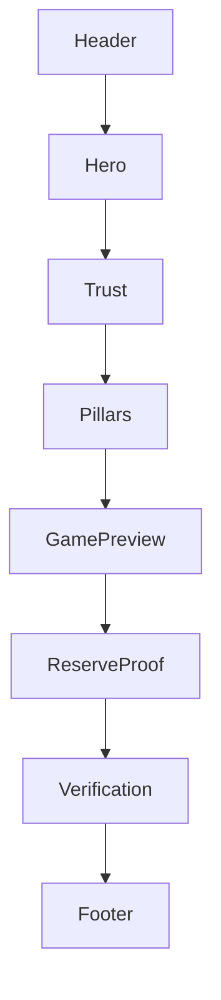
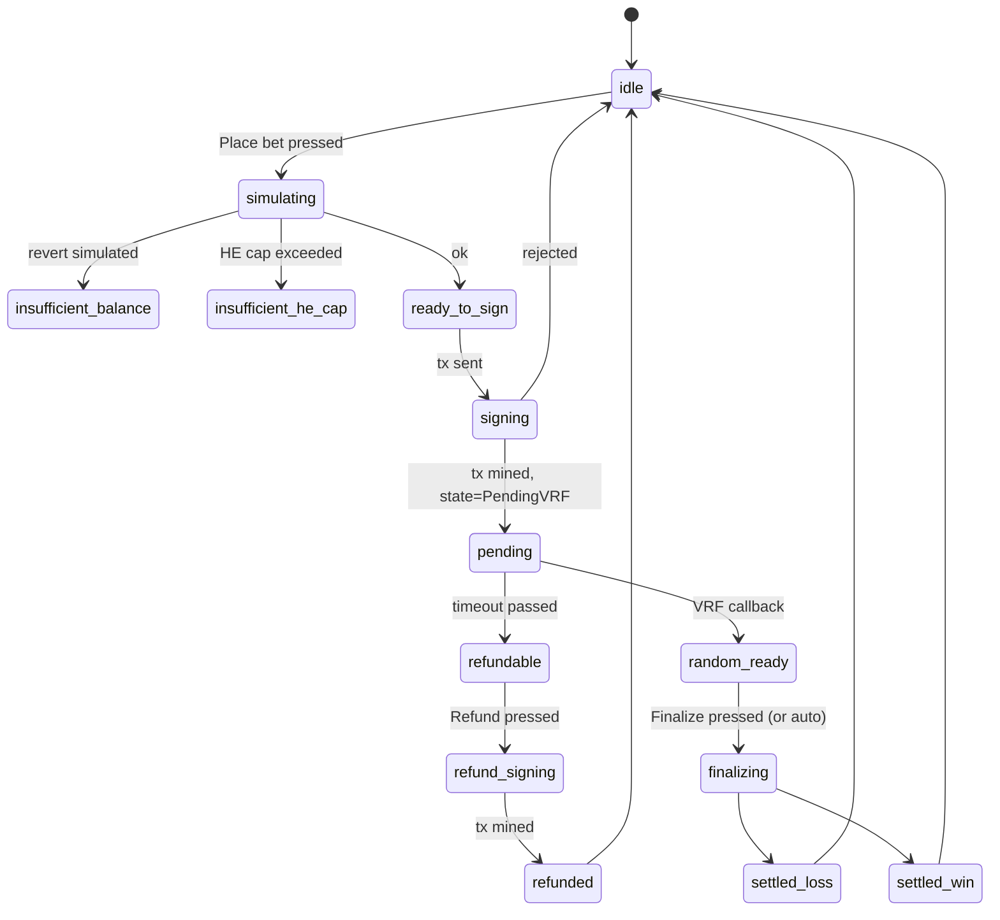

# 04 · Page Blueprints

| Owner | Design Lead |
| Status | Draft v1 |
| Last Updated | 2026-05-14 |
| Depends on | `00-charter.md`, `01-brand.md`, `02-voice-and-copy.md`, `03-information-architecture.md` |
| Supersedes | — |

This document defines, for every primary route, the **slots**, **states**, and
**data dependencies** that a page must have. It is the bridge between the IA
(`03-`) and the implementation (`11-component-library.md`,
`features/*` folders).

Each page has the same eight subsections:

1. **Personas served**
2. **Primary CTA**
3. **Secondary actions**
4. **Slots** (regions to compose)
5. **Wireframe** (mermaid grid)
6. **State matrix** (the 7 cells from `03-`)
7. **Data sources**
8. **Failure paths**

No code begins on a page until its blueprint has `Status: Accepted`.

---

## 1 · `/` (Marketing Home)

### 1.1 Personas

P-AUD (verifies seriousness), P-PLY (first touch), P-LP (curious).

### 1.2 Primary CTA

`Enter casino` → `/casino`.

### 1.3 Secondary actions

- `View bankroll` → `/earn`.
- `Read audit report` → external PDF / GitHub release link.

### 1.4 Slots

```
+----------------------------------------------------+
| AppShell (variant=marketing)                       |
|   Header (transparent, wordmark + wallet + theme)  |
|----------------------------------------------------|
|                                                    |
|  Slot:HERO          (display-xl + sub + CTA cluster|
|                      + release pill)               |
|                                                    |
|  Slot:TRUST_TICKER  (3-up: bankroll / bets / paid) |
|                                                    |
|  Slot:PRINCIPLES    (3-up cards, brand-tinted only)|
|                                                    |
|  Slot:GAME_PREVIEW  (4-up casino cards, no brand   |
|                      color per game)               |
|                                                    |
|  Slot:RESERVE_PROOF (real Bank NAV ticker + LP CTA)|
|                                                    |
|  Slot:VERIFICATION  (release digest + tx flow code |
|                      sample)                       |
|                                                    |
|  Footer                                            |
+----------------------------------------------------+
```

### 1.5 Wireframe



### 1.6 State matrix

| State     | Definition                                                                      |
| --------- | ------------------------------------------------------------------------------- |
| idle      | Default render                                                                  |
| loading   | Hero + skeleton tickers                                                         |
| empty     | Never — marketing copy is static; tickers fall back to placeholder labels (`—`) |
| error     | Tickers can fail → show `—`, do not block render                                |
| disabled  | N/A                                                                             |
| gated     | N/A (marketing is public)                                                       |
| connected | Wallet pill shows account; CTAs deep-link to relevant product route             |

### 1.7 Data sources

- `useReleaseSnapshot()` for the release pill and verification block.
- `useBankSnapshot(primaryAsset)` for the reserve-proof ticker (RSC fetch).
- `useRecentBets(limit=8)` for the live-feed (Client island, optional).

### 1.8 Failure paths

- `release` undefined → render `release pending` pill, do not break the page.
- `bank snapshot` errored → show last cached value with a `(stale)` caption.
- `recent bets` errored or zero → hide the live feed slot entirely.

---

## 2 · `/casino` (Directory)

### 2.1 Personas

P-PLY.

### 2.2 Primary CTA

Pick a game card.

### 2.3 Secondary actions

Filter by category (table / dice / slots).

### 2.4 Slots

```
+----------------------------------------------------+
| AppShell (variant=default)                         |
|----------------------------------------------------|
| Slot:PAGE_HEADER  (title + filter chips)           |
| Slot:GAME_GRID    (8 game cards, single brand hue) |
| Slot:LEDGER_TEASER (5 most recent settlements)     |
+----------------------------------------------------+
```

### 2.5 State matrix

| State     | Behavior                                                                                                     |
| --------- | ------------------------------------------------------------------------------------------------------------ |
| idle      | All games visible                                                                                            |
| loading   | Skeleton grid (8 cards)                                                                                      |
| empty     | Impossible (catalog is static)                                                                               |
| error     | Catalog fetch fails → fallback to hardcoded slug list with disabled CTAs and a banner                        |
| disabled  | Game module not registered on current chain → card grayed, CTA disabled, tooltip "Not available on \<chain>" |
| gated     | N/A — game directory is public                                                                               |
| connected | Cards show "Open" CTA; "Connect" gate appears only inside `/casino/[slug]`                                   |

### 2.6 Data sources

- `useGameCatalog()` (from release manifest — RSC).
- `useRecentBets(limit=5)` (Client island).

### 2.7 Failure paths

- Chain mismatch → games still listed; clicking shows the chain-switch gate on
  the room page, not here.

---

## 3 · `/casino/[slug]` (Game Room)

The most complex production route. **Single** room shell hosting one game
module from the registry.

### 3.1 Personas

P-PLY.

### 3.2 Primary CTA

`Place bet` (inside `<BetSlip>`).

### 3.3 Secondary actions

- `Approve <asset>`.
- `Switch asset`.
- `Refund` (visible only when stuck in `PendingVRF` past timeout).
- `Open release proof`.

### 3.4 Slots

```
+----------------------------------------------------+
| AppShell (variant=game)                            |
|----------------------------------------------------|
| Slot:GAME_HEADER    (slug, label, house edge,      |
|                      max payout, fairness link)    |
|                                                    |
| ┌─────── 2-col grid (lg+) / stack (sm) ─────┐       |
| │ Slot:GAME_STAGE   │ Slot:BET_SLIP        │       |
| │ (per-module view, │ (shared: asset,      │       |
| │  result feedback) │  stake, max-HE,      │       |
| │                   │  affiliate, place)   │       |
| └───────────────────┴──────────────────────┘       |
|                                                    |
| Slot:RESULT_FEED  (this game's last 20 bets, tabs: |
|                    mine | all)                     |
|                                                    |
| Slot:RISK_CARD    (Bank NAV / R / free liquidity)  |
+----------------------------------------------------+
```

### 3.5 State matrix

| State     | Behavior                                                                           |
| --------- | ---------------------------------------------------------------------------------- |
| idle      | Stage shows default game visualization (e.g., dice at 50/50); slip ready           |
| loading   | Stage skeleton; slip disabled with skeleton inputs                                 |
| empty     | No previous bets → result feed shows empty-state copy                              |
| error     | Module fetch / encode error → slip disabled with banner + retry                    |
| disabled  | Module not registered → entire page is a "Not available on \<chain>" empty state   |
| gated     | Wallet not connected / wrong chain / Bank paused → slip replaced by `<WalletGate>` |
| connected | Place flow fully active                                                            |

### 3.6 Per-state failure path (state machine)



### 3.7 Data sources

- `useGameModule(slug)` — module registry lookup (RSC default + Client for
  interaction).
- `useBankSnapshot(asset)` — NAV/R/free liquidity.
- `useVRFFeeQuote(betCount)`.
- `usePlaceBet(slug)` — encapsulates sim → sign → mine → settle.
- `useBetsByGame(slug, limit=20)`.

### 3.8 Failure paths

See `13-web3-ux.md §6` for full taxonomy. Every error code → one mapped UI
state and message.

---

## 4 · `/sportsbook` and `/sportsbook/[marketId]`

### 4.1 Personas

P-PLY, P-AUD.

### 4.2 Primary CTA

`Place ticket` (only when ops-gated allowed).

### 4.3 Slots (list page)

```
+----------------------------------------------------+
| AppShell (variant=default)                         |
|----------------------------------------------------|
| Slot:PAGE_HEADER  (title + status banner)          |
| Slot:RISK_BANNER  (current exposure caps + gating) |
| Slot:MARKET_LIST  (event group → markets)          |
| Slot:RECENT_TICKETS (player-scoped or empty)       |
+----------------------------------------------------+
```

### 4.4 Slots (detail page)

```
+----------------------------------------------------+
| AppShell (variant=default)                         |
|----------------------------------------------------|
| Slot:MARKET_HEADER  (event, market, status)        |
| Slot:ODDS_PANEL     (outcomes, signed odds, expiry)|
| Slot:TICKET_SLIP    (stake input, simulation, sign)|
| Slot:RESULT_PANEL   (proposed / challenged / final)|
| Slot:RISK_PANEL     (event / market / outcome caps)|
+----------------------------------------------------+
```

### 4.5 State matrix (detail page)

| State     | Definition                                                                                                                                               |
| --------- | -------------------------------------------------------------------------------------------------------------------------------------------------------- |
| idle      | Market `Open`, odds fresh, slip ready                                                                                                                    |
| loading   | Odds snapshot fetching                                                                                                                                   |
| empty     | No tickets yet → ticket panel CTA visible                                                                                                                |
| error     | Odds expired / signature invalid → re-fetch CTA + banner                                                                                                 |
| disabled  | Market `Suspended` → odds shown read-only, slip hidden                                                                                                   |
| gated     | Market `Locked` / `ResultProposed` / `Challenged` / `Resolved` / `Voided` → settle / refund / void buttons appear based on ticket state; place is hidden |
| connected | Place flow fully active                                                                                                                                  |

### 4.6 Data sources

- `useSportsbookMarket(marketId)`.
- `useSignedOdds(marketId, outcomeId)` (off-chain provider, EIP-712).
- `useRiskCaps(marketId)`.
- `useTicketsByMarket(marketId)`.

### 4.7 Failure paths

- `Result` state Challenged → present challenge details prominently; tickets
  remain `Held`.
- Arbitration timeout (per audit finding NEW-H1): if no resolution in
  configured window, show `Stuck market — operator escalation in progress`
  banner pointing to `/ops`.
- Odds expired between fetch and submit → automatic refetch + re-sign.

---

## 5 · `/portfolio` (Overview)

### 5.1 Personas

P-PLY, P-LP.

### 5.2 Primary CTA

None. The page is a dashboard.

### 5.3 Slots

```
+----------------------------------------------------+
| AppShell (variant=default)                         |
|----------------------------------------------------|
| Slot:WALLET_SUMMARY  (address, total balance,      |
|                       chain, release pill)         |
| Slot:OPEN_POSITIONS  (open bets + open tickets)    |
| Slot:LP_HOLDINGS     (shares per Bank, NAV equiv)  |
| Slot:CLAIMABLES_TEASER (XP buckets snapshot)       |
| Slot:RECENT_ACTIVITY (10 most recent rows)         |
+----------------------------------------------------+
```

### 5.4 State matrix

| State     | Behavior                                                                                  |
| --------- | ----------------------------------------------------------------------------------------- |
| idle      | All slots rendered                                                                        |
| loading   | Skeletons for each slot                                                                   |
| empty     | First-time wallet → empty-state per slot with "Place bet" / "Deposit" CTAs                |
| error     | Any slot's data may fail independently; siblings keep rendering (error boundary per slot) |
| disabled  | N/A                                                                                       |
| gated     | Wallet not connected → entire page replaced by `<WalletGate>`                             |
| connected | Default                                                                                   |

### 5.5 Data sources

- `useAccount()` (wagmi).
- `usePortfolioOverview()` (composed read-model).
- `useTxJournal(limit=10)`.

### 5.6 Failure paths

- Indexer lag > 60s → show `last synced N ago` chip beside `RECENT_ACTIVITY`.
- LP shares fetch fails → slot shows `—` with retry.

---

## 6 · `/portfolio/activity`

Full ledger. Same shell as `/portfolio`, single slot:

```
Slot:LEDGER_TABLE  (filters: type/range/asset; pagination cursor-based)
```

States: idle, loading, empty (no rows), error (with retry), gated.

Cursor pagination only — no offset pagination. See
`14-data-and-state.md §4`.

---

## 7 · `/portfolio/claims`

```
+----------------------------------------------------+
| Slot:PAGE_HEADER                                   |
| Slot:XP_BUCKETS  (3-up: accrued / locked / holdback|
|   with claim button per bucket, vesting bar)       |
| Slot:REFUND_CREDIT (VRFHub credit + claim)         |
| Slot:RECENT_CLAIMS (10 rows)                       |
+----------------------------------------------------+
```

Claim button per bucket follows the destructive-action confirmation pattern
even though it is not destructive — it's signature-required.

---

## 8 · `/earn`

### 8.1 Personas

P-LP.

### 8.2 Primary CTA

`Deposit` (one per Bank).

### 8.3 Slots

```
+----------------------------------------------------+
| AppShell (variant=default)                         |
|----------------------------------------------------|
| Slot:PAGE_HEADER  (title + risk-disclosure link)   |
| Slot:BANK_GRID    (1 card per Bank: asset, NAV,    |
|                    R, free, MinLiq bar, APY est)   |
| Slot:DEPOSIT_FLOW (modal: amount, simulate,        |
|                    approve, deposit)               |
| Slot:WITHDRAW_FLOW (modal: shares|assets, A4 check)|
| Slot:HISTORY      (deposit / withdraw / yield rows)|
+----------------------------------------------------+
```

### 8.4 Failure paths

- A4 violation (NAV − R − new outflow < MinLiq): cap the slider and show
  `Limited by free liquidity: <amount>`.
- Bank paused: deposit disabled with banner; withdraw allowed.
- LP share rounding: preview the actual share count before signing.

---

## 9 · `/ops`

### 9.1 Personas

P-OPS, P-AUD.

### 9.2 Layout philosophy

Dense. No hero typography, no decorative cards. Tables, stat strips, severity
banners.

### 9.3 Slots

```
+----------------------------------------------------+
| AppShell (variant=compact)                         |
|----------------------------------------------------|
| Slot:RELEASE_STRIP   (digest, chain, RPC, build)   |
| Slot:INDEXER_STATUS  (last block, lag, error rate) |
| Slot:CONTRACT_TABLE  (every deployed contract +    |
|                       address + verification link) |
| Slot:EXPOSURE_TABLE  (per-pool reserved vs caps)   |
| Slot:RECENT_EVENTS   (event log tail, filterable)  |
| Slot:GOVERNANCE_LINKS (pause toggles read-only;    |
|                        runbook links)              |
+----------------------------------------------------+
```

Pause toggles never live in the UI. They are runbook links.

### 9.4 Severity colors

Only `--success`, `--warn`, `--danger` are used here. No brand or accent
color decoration.

---

## 10 · `/legal/*`

Three static documents:

```
+----------------------------------------------------+
| AppShell (variant=compact)                         |
|----------------------------------------------------|
| Slot:TABLE_OF_CONTENTS (sticky sidebar on lg+)     |
| Slot:CONTENT  (long-form prose; max-width 64ch)    |
| Slot:JURISDICTION_DISCLAIMER (footer pinned)       |
+----------------------------------------------------+
```

Owned by Legal. Frontend renders MDX from `apps/web/content/legal/*.mdx`.

---

## 11 · Cross-Page Patterns (slot-level)

Re-used across multiple pages — each ships as one `@ssot/ui` pattern (see
`11-component-library.md`):

| Pattern                       | Pages                                              |
| ----------------------------- | -------------------------------------------------- |
| `<PageHeader>`                | every product route                                |
| `<WalletGate>`                | every gated state                                  |
| `<ReleaseProof>`              | header drawer, `/`, `/ops`                         |
| `<StatBlock>` / `<StatStrip>` | `/`, `/portfolio`, `/earn`, `/ops`                 |
| `<LedgerTable>`               | `/portfolio/activity`, `/portfolio/claims`, `/ops` |
| `<BetSlip>`                   | `/casino/[slug]`                                   |
| `<TicketSlip>`                | `/sportsbook/[marketId]`                           |
| `<RiskPanel>`                 | `/sportsbook/*`, `/earn`, `/ops`                   |
| `<EmptyState>`                | every page                                         |
| `<SkeletonGrid>`              | every loading state                                |

## 12 · Approval Checklist

Before a page enters Status: Accepted:

- [ ] Personas listed.
- [ ] Primary + secondary CTAs listed.
- [ ] Slots enumerated.
- [ ] Wireframe (mermaid or PNG attached to PR).
- [ ] State matrix (all 7 cells).
- [ ] Data sources mapped to existing hooks (or new hook RFC linked).
- [ ] Failure paths reference `13-web3-ux.md` codes.
- [ ] Tracking events reference `../frontend/25-observability.md` schema.
- [ ] Storybook story slot for each state (7 stories).

## 13 · Don'ts

- No page may invent a new shell variant.
- No page may inline its own header / footer.
- No page may declare a new color outside `10-design-tokens.md`.
- No page may import wagmi / viem / RainbowKit directly — only via the
  feature data layer.
- No page may include a CTA whose destination is not in `03-information-architecture.md §3`.

## 14 · How To Enforce

```bash
# Every route in 03 must have a section here
node scripts/check-route-blueprints.mjs

# Every page must have a Storybook story per state (7 stories)
node scripts/check-state-stories.mjs

# Slots cited in this doc must resolve to a pattern in 11-component-library
node scripts/check-slot-coverage.mjs
```

All three scripts are implementation tasks owned by `../frontend/24-testing.md`.
