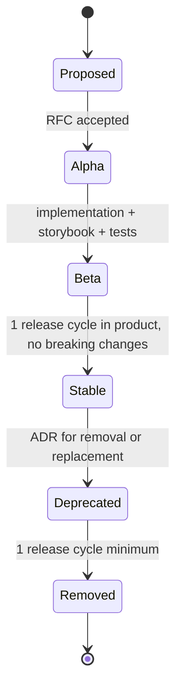

# 11 · Component Library

| Owner | Frontend Lead |
| Status | Draft v1 |
| Last Updated | 2026-05-14 |
| Depends on | `00-charter.md`, `10-design-tokens.md`, `02-voice-and-copy.md` |
| Supersedes | every duplicate `cyber-*` primitive and any page-local UI component that duplicates an existing primitive |

`@ssot/ui` exports three tiers:

1. **Primitives** — generic, product-agnostic building blocks.
2. **Patterns** — product-aware composites built from primitives.
3. **Motion / Icons / Utilities** — shared support modules.

This document defines the catalog, API contract, and lifecycle.

## 1. Tier Definitions

| Tier                       | Examples                                                  | Knows about ArbiGameFi? |
| -------------------------- | --------------------------------------------------------- | ----------------------- |
| Primitive                  | Button, Input, Tabs, Table, Dialog                        | no                      |
| Pattern                    | AppShell, BetSlip, WalletGate, ReleaseProof               | yes                     |
| Motion / Icons / Utilities | `motion/presets`, `icons`, `shortAddress`, `formatAmount` | partial                 |

Pages are **never** allowed to import the raw primitives without going through
at least one product pattern when wrapping is appropriate. Pages compose
patterns and feature modules.

## 2. Folder Layout

```
packages/ui/src/
├── tokens/                # 10-design-tokens.md realization
│   ├── arbi-dark.css
│   ├── arbi-light.css
│   ├── tailwind-preset.ts
│   └── VERSION.md
├── primitives/
│   ├── button.tsx
│   ├── icon-button.tsx
│   ├── input.tsx
│   ├── number-input.tsx
│   ├── select.tsx
│   ├── checkbox.tsx
│   ├── radio.tsx
│   ├── switch.tsx
│   ├── slider.tsx
│   ├── tabs.tsx
│   ├── dialog.tsx
│   ├── drawer.tsx
│   ├── popover.tsx
│   ├── tooltip.tsx
│   ├── table.tsx
│   ├── skeleton.tsx
│   ├── toast.tsx
│   ├── badge.tsx
│   ├── status-dot.tsx
│   ├── progress.tsx
│   ├── alert.tsx
│   └── separator.tsx
├── patterns/
│   ├── app-shell.tsx
│   ├── page-header.tsx
│   ├── empty-state.tsx
│   ├── error-state.tsx
│   ├── wallet-gate.tsx
│   ├── release-proof.tsx
│   ├── stat-block.tsx
│   ├── stat-strip.tsx
│   ├── ledger-table.tsx
│   ├── filter-bar.tsx
│   ├── copy-button.tsx
│   ├── address-display.tsx
│   ├── amount-display.tsx
│   ├── tx-status-chip.tsx
│   ├── tx-stepper.tsx
│   ├── bet-slip.tsx
│   ├── ticket-slip.tsx
│   ├── risk-panel.tsx
│   └── animated-number.tsx
├── motion/
│   ├── presets.ts
│   └── primitives.ts
├── icons/
│   └── index.ts            # Heroicons re-export with size tokens
├── utils/
│   ├── short-address.ts
│   ├── format-amount.ts
│   ├── format-time.ts
│   ├── format-percent.ts
│   └── cn.ts               # clsx + tailwind-merge
├── styles/
│   └── globals.css         # imports tokens
└── index.ts                # surface-narrow public exports
```

Subpath exports allow tree-shaking:

```json
// packages/ui/package.json
"exports": {
  ".": "./src/index.ts",
  "./primitives": "./src/primitives/index.ts",
  "./patterns": "./src/patterns/index.ts",
  "./motion": "./src/motion/index.ts",
  "./icons": "./src/icons/index.ts",
  "./utils": "./src/utils/index.ts",
  "./styles/globals.css": "./src/styles/globals.css",
  "./tailwind-preset": "./src/tokens/tailwind-preset.ts"
}
```

App code imports the narrowest possible path.

## 3. Primitives — API Contracts

Every primitive follows the **headless + slot** model. Behavior + a11y come
from Radix or our own hooks; styling is opinionated and consumes tokens.

### 3.1 `<Button>`

```tsx
type ButtonVariant = "primary" | "secondary" | "ghost" | "danger";
type ButtonSize = "sm" | "md" | "lg";
type ButtonProps = {
  variant?: ButtonVariant; // default 'primary'
  size?: ButtonSize; // default 'md'
  loading?: boolean; // shows spinner + disables
  loadingLabel?: string; // accessible name during loading
  leadingIcon?: React.ReactNode;
  trailingIcon?: React.ReactNode;
  asChild?: boolean; // Radix slot pattern
  fullWidth?: boolean;
} & React.ButtonHTMLAttributes<HTMLButtonElement>;
```

Required states: default · hover · active · focus-visible · disabled · loading.

Tokens consumed:

- background: `bg-brand`/`bg-surface-3` etc.
- focus ring: `--ring`
- elevation: `shadow-e1` (md), `shadow-glow` (primary, focused)
- radius: `rounded-md`

Don't: extend with a fifth variant. Open ADR if a true new semantic is needed.

### 3.2 `<Input>`

```tsx
type InputProps = {
  label?: string;
  hint?: string;
  error?: string;
  leadingIcon?: React.ReactNode;
  trailingNode?: React.ReactNode; // e.g., "Max" button
  size?: "sm" | "md";
} & Omit<React.InputHTMLAttributes<HTMLInputElement>, "size">;
```

Errors:

- `aria-invalid` set when `error` is truthy.
- `aria-describedby` wires to hint + error.

### 3.3 `<NumberInput>`

Subclass of `<Input>` for bigint amounts:

```tsx
type NumberInputProps = {
  value: bigint | null; // null = empty
  onChange: (v: bigint | null) => void;
  decimals: number; // token decimals
  max?: bigint;
  min?: bigint;
  displayPrecision?: number; // 02-voice §5
  step?: bigint;
} & Omit<InputProps, "value" | "onChange">;
```

Implementation details:

- Internal string buffer to allow trailing decimal point.
- Trims locale-aware grouping on focus, restores on blur.
- Emits `null` while user typing partial input; never `0n`.
- Pasted scientific notation is rejected with a `aria-live` polite hint.

### 3.4 `<Select>` / `<Combobox>`

Radix `Select` for static lists; custom Combobox for searchable lists. Both
must support keyboard navigation, type-ahead, and `aria-activedescendant`.

### 3.5 `<Tabs>`

- Underline indicator using `--brand`.
- `aria-current="page"` for nav-style tabs; `role="tab"` + Radix for inline.
- Mobile: horizontal scroll with momentum + edge fade.

### 3.6 `<Dialog>` / `<Drawer>`

- Single open instance per layer (no nested modals).
- Trap focus, restore focus on close.
- `Esc` always closes; outside click closes (overridable for destructive).
- Drawer slides from right on `≥ md`, bottom on `< md`.

### 3.7 `<Popover>` / `<Tooltip>`

- Tooltip = hint only, no interactive content.
- Popover = small panel with optional inputs.
- Both must position via Floating UI (avoid manual transforms).

### 3.8 `<Table>`

Composable: `Table.Root`, `Table.Head`, `Table.Body`, `Table.Row`, `Table.Cell`.

- Required props on `Root`: `caption` (a11y) and `density` (compact/comfortable).
- Column definitions sit in pattern layer (`<LedgerTable>`), not primitive.

### 3.9 `<Skeleton>`

```tsx
type SkeletonProps = {
  width?: number | string;
  height?: number | string;
  rounded?: boolean;
};
```

Must reserve the exact dimensions of its target. No `aria-busy` overuse.

### 3.10 `<Toast>`

- Variants: info, success, warn, danger.
- Required props: `title`, optional `description`, `action`, `dismissible`.
- Position: top-right desktop, top-center mobile.
- Auto-dismiss: info/success 5 s, warn 8 s, danger sticky until user action.
- Maximum 3 visible at once; older ones queue.

### 3.11 Other primitives

All follow the same contract: declarative props, no DOM-leaking class
overrides except via `className` merged with `cn()`, full a11y, full state
matrix (default / hover / focus / disabled / error / loading where
applicable).

## 4. Patterns — Product-aware Composites

### 4.1 `<AppShell>`

```tsx
type AppShellVariant = "marketing" | "default" | "game" | "compact";
type AppShellProps = {
  variant?: AppShellVariant;
  showRelease?: boolean;
  children: React.ReactNode;
};
```

Owns:

- header (wordmark, nav, wallet, release-proof, theme toggle)
- background layer (per variant; see `01-brand.md §7`)
- container width
- footer (except `variant='game'`)
- focus management (skip link, route-change focus reset)

**There is only one AppShell.** Page-specific shells are rejected.

### 4.2 `<WalletGate>`

```tsx
type WalletGateProps = {
  action: string; // "place a bet", "claim rewards"
  required?: "connected" | "chain" | "unpaused";
  poolId?: bigint; // for 'unpaused'
  children?: React.ReactNode; // optional override of CTA
};
```

Owns the three states from `03-IA §7.2`. Renders nothing when satisfied.

### 4.3 `<BetSlip>` (Casino)

```tsx
type BetSlipProps = {
  slug: CasinoSlug;
  assets: AssetMeta[];
  module: CasinoGameModule; // from registry
  onPlaced?: (result: PlaceResult) => void;
};
```

Sub-slots:

- `BetSlip.AssetSelect`
- `BetSlip.AmountInput`
- `BetSlip.MaxButton`
- `BetSlip.AffiliateInput`
- `BetSlip.MaxHouseEdgeInput`
- `BetSlip.Simulation` (preview)
- `BetSlip.Action` (Place / Approve / Sign / Confirm depending on state machine)

State machine matches `04-page-blueprints §3.6`.

### 4.4 `<TicketSlip>` (Sportsbook)

Mirrors `<BetSlip>` but for sports. Owns signed-odds refresh logic.

### 4.5 `<ReleaseProof>`

Drawer pattern. Slots:

- digest header
- chain + RPC
- contract address table
- indexer status
- audit-report link

Available globally; mounted by `AppShell`.

### 4.6 `<LedgerTable>`

Generic ledger pattern. Columns are passed as a `LedgerColumn[]` config:

```tsx
type LedgerColumn<T> = {
  id: string;
  header: string;
  cell: (row: T) => React.ReactNode;
  align?: "left" | "right" | "center";
  width?: string;
  visibility?: { sm?: boolean; md?: boolean; lg?: boolean };
};
```

Owns:

- cursor pagination
- empty / loading / error states
- column visibility per breakpoint
- mobile fallback to a stacked card list

### 4.7 `<StatBlock>` / `<StatStrip>`

```tsx
type StatBlockProps = {
  label: string;
  value: React.ReactNode;
  hint?: string;
  trend?: "up" | "down" | "flat";
  severity?: "default" | "success" | "warn" | "danger";
  tooltip?: string;
};
```

`<StatStrip>` lays out N `<StatBlock>` items horizontally with consistent
dividers.

### 4.8 `<EmptyState>` / `<ErrorState>`

```tsx
type EmptyStateProps = {
  title: string;
  description: string;
  action?: { label: string; onClick: () => void; href?: string };
  illustration?: React.ReactNode; // restricted to geometric primitive icons
};
```

`<ErrorState>` adds `retry?: () => void` and `errorCode?: string`.

### 4.9 `<TxStatusChip>` / `<TxStepper>`

Status mapping owned by `13-web3-ux.md §5`:

```tsx
type TxStatus =
  | "idle"
  | "simulating"
  | "preview"
  | "signing"
  | "pending"
  | "mining"
  | "mined"
  | "failed"
  | "timeout"
  | "rejected";
```

Stepper renders the relevant subset for the current flow.

### 4.10 `<AnimatedNumber>`

```tsx
type AnimatedNumberProps = {
  value: bigint;
  decimals: number;
  symbol?: string;
  precision?: number; // overrides 02-voice rule
  duration?: number; // ms
  format?: "amount" | "percent" | "multiplier";
};
```

Uses `framer-motion`'s `useMotionValue` + custom tween. Respects
`prefers-reduced-motion`.

## 5. Component Lifecycle

Every entry follows a stable lifecycle:



Status declared in each file via a TSDoc header:

```ts
/**
 * @stage stable
 * @since 0.4.0
 * @owner frontend-lead
 */
export function Button(...) {}
```

`@stage` values: `alpha`, `beta`, `stable`, `deprecated`.

A `@deprecated` symbol must:

- have `@see` pointing to its replacement
- emit a console warning in dev
- live for ≥ 1 release cycle before removal

## 6. Public Exports

`packages/ui/src/index.ts` exports **only stable** primitives and patterns.
Alpha/beta items must be imported via subpath (`@ssot/ui/primitives/...`).

Storybook is the discovery surface. Every stable item has at least:

- a default story
- a state-matrix story (idle/hover/active/disabled/error)
- a kitchen-sink story
- docs (`*.mdx`) with usage and don'ts

## 7. Component RFC Template

Saved at `docs/design/adr/0000-template.md`. Sections:

1. Context
2. Proposal (API + sketch)
3. Use cases
4. Alternatives considered
5. Token / a11y / i18n implications
6. Rollout plan
7. Rejection criteria (when this component should NOT exist)

## 8. Don'ts

- No new primitive without an ADR.
- No "let me just copy this from product into the lib" without a name and
  RFC.
- No two primitives with overlapping responsibilities (one Button, not three).
- No primitive importing from `apps/web/*`. The dependency arrow goes
  app → ui, never ui → app.
- No primitive that takes raw color tokens as props (`color="indigo"`).
  Variants only.
- No primitive that imports wagmi / viem / RainbowKit.

## 9. How To Enforce

```bash
# Forbidden imports from primitive layer into app layer
rg -nE "@ssot/ui/cyber-" frontend/

# Forbidden cyber-* primitive existence
test ! -e frontend/packages/ui/src/primitives/cyber-button.tsx
test ! -e frontend/packages/ui/src/primitives/cyber-input.tsx

# Every primitive has a Storybook story
node scripts/check-storybook-coverage.mjs   # see 24-testing.md

# Subpath exports declared
node scripts/check-package-exports.mjs

# No app → primitive subpath bypass
rg -nE "from \\\"@ssot/ui/src/" frontend/apps/web/src
```

## 10. Versioning

`@ssot/ui` ships as a workspace package with semver. Tokens (10-design-tokens)
and primitives are versioned together. Patterns may add new patterns under
minor versions; breaking changes require ADR + major bump.

The release-digest of the contract layer is independent. Frontend major
versions are not tied to contract versions, but the release-proof drawer
shows both.
