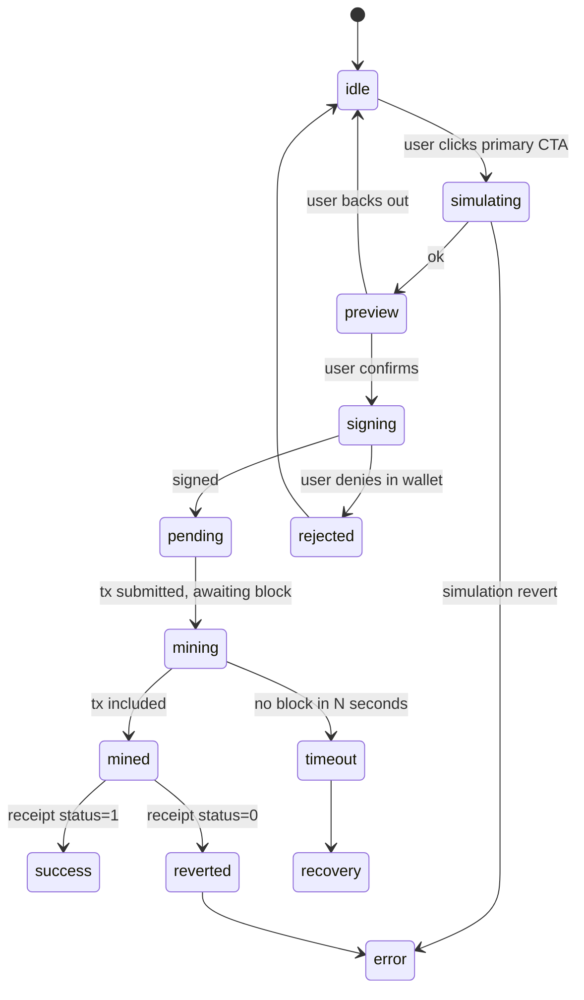

# 13 · Web3 UX

| Owner | Frontend Lead |
| Status | Draft v1 |
| Last Updated | 2026-05-14 |
| Depends on | `00-charter.md`, `02-voice-and-copy.md`, `11-component-library.md` |
| Supersedes | every per-page wallet handler in `apps/web/src/app/**` |

This document defines the **complete wallet, signing, and transaction UX**.
Every product surface that touches a wallet must follow these rules so the
behavior is identical across casino, sportsbook, earn, portfolio, and ops.

## 1. Allowed Surfaces

The web3 layer is allowed only in:

- `apps/web/src/app-shell/WalletProviderIsland.tsx` (the provider island).
- `apps/web/src/features/<vertical>/data/*` (read-models built on wagmi or
  the SSOT SDK).
- `apps/web/src/features/<vertical>/actions/*` (write-flows built on the SDK).
- `@ssot/ui/patterns/wallet-gate.tsx`, `release-proof.tsx`, `tx-status-chip.tsx`,
  `tx-stepper.tsx`.

Pages **must not** import wagmi, viem, RainbowKit, or @reown/appkit directly.

## 2. Wallet Connection

### 2.1 Connect entry

- One entry: header pill in `<AppShell>`. No "Connect" CTA on individual
  cards or empty states (those use `<WalletGate>` which links to the header).
- Modal: RainbowKit's `<ConnectButton.Custom>` themed via tokens. No legacy
  RainbowKit branding survives.
- Wallet list: gates by allowlist (no random injected providers labeled
  "Wallet"). Curated list: MetaMask, Coinbase Wallet, Rabby, WalletConnect,
  Safe.

### 2.2 Connected state

The header pill shows:

- Account label: ENS if available, else `shortAddress(address)`.
- Network indicator: chain icon (small geometric primitive) + chain name on
  hover.
- Click opens the connected panel: address, balance, chain switch, copy,
  disconnect.

### 2.3 Disallowed

- Multi-account switching in the UI (a wallet may expose this).
- Re-prompting the connect modal on every visit (persist session in wagmi
  storage).
- Auto-connecting to an unknown wallet without prior session.

## 3. Chain Awareness

### 3.1 Supported chains

Declared in the release manifest. The frontend reads the manifest at build
time and exposes a `useSupportedChains()` hook. **Hard-coding a chain ID in
a page is a CI failure.**

### 3.2 Wrong-chain handling

- Detect chain mismatch globally in `WalletProviderIsland`.
- Set a `wrongChain: true` flag in app context.
- Every product page renders the `<WalletGate required="chain">` pattern
  when this flag is true. No page logic continues until the user switches.

### 3.3 Chain switch UX

- Use wagmi's `switchChain`. Show a stepper:
  1. **Requested** — waiting for wallet response.
  2. **Pending** — chain switch RPC sent.
  3. **Confirmed** — chain matches expected.
- If wallet does not support `wallet_switchEthereumChain`, fall back to a
  copy-and-paste RPC instructions panel with a deep-link to MetaMask docs.

### 3.4 Disallowed

- Silent chain switch.
- Auto-adding a chain without user confirmation.
- Sending a tx that targets a chain other than the one the wallet is on
  (must always be blocked client-side with a friendly error).

## 4. Approvals (ERC-20 allowance)

### 4.1 Strategy

Permit2-first. ArbiGameFi adopts **Permit2** for all stake assets where
supported. Approval flow becomes:

1. Check `permit2.allowance(owner, token, spender)`.
2. If insufficient, ask user to sign a Permit2 typed message (no on-chain tx).
3. Submit the bet tx using `permitTransferFrom` semantics.

When the token does not support Permit2 (legacy ERC-20 missing
`permit`), fall back to classic two-step:

1. `approve(spender, amount)` — show `Approve <SYMBOL>` button.
2. `placeBet(...)` — show `Place bet` button after allowance lands.

### 4.2 Allowance amount

Two options presented to the user:

- **Exact amount** (default) — `Approve 100 USDC` for this bet.
- **Custom** — slider/input to set the allowance value, with an explicit
  upper cap of 10x current stake or "max".

`approve(MAX_UINT256)` is **only available behind an "Advanced" toggle** that
warns about indefinite allowance risk.

### 4.3 Revocation

`/portfolio` includes an "Allowances" section showing current ERC-20
allowances. One-click revoke per row. Each revocation is a separate tx with
its own status chip.

### 4.4 Disallowed

- Bundled `approve(MAX_UINT256)` + `placeBet` without an Advanced toggle.
- Hiding allowance information from the user.
- Showing only "Approved" without specifying the amount.

## 5. Transaction State Machine

The canonical states for every write flow:



Each node has a UI:

| State            | UI                                                                            |
| ---------------- | ----------------------------------------------------------------------------- |
| idle             | `<Button>` enabled                                                            |
| simulating       | `<TxStatusChip status="simulating">` + button disabled                        |
| preview          | inline summary; CTA changes to `Confirm`                                      |
| signing          | wallet popup; button shows `Signing…`                                         |
| pending          | toast + `<TxStatusChip status="pending">`                                     |
| mining           | same toast updates to `Mining…` with block ETA                                |
| mined / success  | success toast + chip; relevant data refetched (see `14-data-and-state.md §5`) |
| mined / reverted | danger toast + retry CTA + revert reason mapping                              |
| timeout          | warn toast + retry / refund options                                           |
| rejected         | quiet revert to idle, no toast (avoid spam)                                   |
| error            | `<ErrorState>` if blocking, else danger toast                                 |

`<TxStepper>` renders the relevant subset in `<BetSlip>`, `<TicketSlip>`,
deposit / withdraw flows, claim flows.

## 6. Error Taxonomy

Every error must map to one of these codes. Mapping is implemented in
`packages/ssot/src/sdk/errors.ts`.

| Code                          | Trigger                                 | UI                                               |
| ----------------------------- | --------------------------------------- | ------------------------------------------------ |
| `WALLET_NOT_CONNECTED`        | no signer                               | `<WalletGate required="connected">`              |
| `WRONG_CHAIN`                 | chain mismatch                          | `<WalletGate required="chain">`                  |
| `BANK_PAUSED`                 | risk-in paused                          | `<WalletGate required="unpaused">`               |
| `INSUFFICIENT_BALANCE`        | balance < stake                         | inline error in `<BetSlip>`                      |
| `INSUFFICIENT_ALLOWANCE`      | allowance < stake                       | switch button to `Approve`                       |
| `INSUFFICIENT_NATIVE_FOR_FEE` | ETH < VRF fee                           | inline error + Buy ETH link                      |
| `SIMULATION_REVERT_UNKNOWN`   | `eth_call` reverted with unknown reason | toast with raw reason + Retry                    |
| `SIMULATION_REVERT_KNOWN_X`   | mapped revert reason                    | toast with mapped copy                           |
| `USER_REJECTED`               | wallet declined                         | silent return to idle                            |
| `TX_REVERTED`                 | receipt status 0                        | danger toast + retry                             |
| `TX_REPLACED`                 | tx replaced by another                  | info toast + tracking continues for the new hash |
| `TX_TIMEOUT`                  | no block in N seconds                   | warn toast + manual options                      |
| `VRF_TIMEOUT`                 | `PendingVRF` past timeout               | room shows `Refund` button                       |
| `ARBITRATION_PENDING`         | sportsbook stuck                        | banner pointing to `/ops`                        |
| `ORACLE_PROVIDER_DOWN`        | indexer / oracle outage                 | banner with last known good time                 |
| `MARKET_LOCKED`               | sportsbook market state                 | inline error in `<TicketSlip>`                   |
| `RATE_LIMIT_RPC`              | RPC throttle                            | warn + automatic retry with exponential backoff  |

Every error has:

- a code
- a user-facing message (in `messages.ts`)
- a recovery action (or explicit "no recovery available")
- a Sentry event mapping (see `../frontend/25-observability.md`)

## 7. Simulation Before Signing

**Non-negotiable.** Every transaction is simulated via `eth_call` before
sign:

- Show the simulated result to the user (return value, asset delta, gas).
- Block the sign step if simulation reverts (unless user explicitly bypasses
  via Advanced — never the default).
- Cache simulation result for 30 s; refresh on any input change.
- If the chain has gas estimation, show estimated gas in native + fiat-free
  USD-equivalent if a price feed is available.

Pages that skip simulation are rejected in review.

## 8. Pending Transaction UI

Three placement options. **Each flow uses exactly one** of these placements:

### 8.1 Inline progress (default for fast flows)

- BetSlip / TicketSlip embed the `<TxStepper>` inline.
- The CTA button morphs through `Place bet → Placing… → Mining… → Settled`.
- Toast layer fires once on terminal state only.

### 8.2 Toast (default for short flows: claim, approve)

- Toast appears with `<TxStatusChip>` and tx-hash link.
- Auto-dismisses on success after 5 s. Sticky on danger.

### 8.3 Drawer (for long flows: LP withdraw with multi-step)

- Slide-in drawer shows step list, current state, log, and the option to
  copy tx hash.
- Drawer is dismissible but the flow continues in background.

The state machine in §5 runs once per flow. A wallet-connected page must
never show more than one pending flow drawer at a time.

## 9. Wallet UX Edge Cases

### 9.1 User opens the wallet popup and closes it without action

→ State machine returns to `idle`. No toast. No re-prompt.

### 9.2 User signs but the tx never reaches the mempool

→ After 30 s in `pending` state with no `transactionHash` resolved, surface a
warn toast: `We didn't receive a transaction hash from your wallet.` with a
manual `Open wallet` deep link.

### 9.3 Tx replaced by another tx (same nonce, higher gas)

→ Use viem's `waitForTransactionReceipt` `onReplaced` handler. Track the
replacement hash. Toast: `Transaction sped up · tracking <newHash>`.

### 9.4 Multiple bets in parallel

→ Allowed. Each bet has its own state machine and tx-hash mapping. The
header pill shows an aggregated badge: `2 pending`. Click opens the drawer.

### 9.5 Reorg

→ Indexer reports the reorg via context. UI re-fetches affected data. Toast:
`Network reorg detected · refreshing your view.` No automatic retries of
user actions.

### 9.6 RPC failure

→ Retry once with exponential backoff (250 / 500 / 1000 ms). If still
failing, switch to backup RPC if release manifest provides one. Else show
banner: `Network connection unstable.`.

## 10. Signature UX (off-chain)

For EIP-712 typed-data signing (sportsbook odds, optionally Permit2):

- Use a dedicated `<SignaturePreview>` panel showing each field with its
  type and value, not the raw JSON.
- Names use plain English: `Expires at`, `Maximum stake`, `Outcome`.
- Sportsbook ticket: show signed-odds expiry as a countdown; auto-refresh
  when ≤ 10 s remain.
- The button changes from `Sign odds` to `Sign expiring in 5s` near expiry.

## 11. Wallet Privacy

- Don't expose the user's address in URLs unless the user is the current
  signer.
- Don't log address strings to analytics (use a hashed surrogate). See
  `../frontend/25-observability.md §3`.
- Don't preload OG images for the user's portfolio.

## 12. Anti-phishing

- Header shows the **domain pill** in production (`arbigamefi.com`) bound
  to the release-proof drawer. If the domain reachable in the URL differs
  from the expected one in release manifest, the pill turns red and a
  banner appears: `Verify that you are on arbigamefi.com.`
- Banner is dismissable but its event fires a Sentry alert.
- The wallet connect button cannot be focus-jacked: clicking opens through
  a hardened `WalletGate` pattern that asserts `document.referrer` matches
  the same origin.

## 13. Don'ts

- No "Maximum approve" as the default.
- No tx send without prior simulation.
- No silent chain switch.
- No raw RPC error strings shown to the user.
- No hard-coded chain ID in page code.
- No address shown in plaintext URL unless owned by current signer.
- No "advanced" feature that reduces safety without an explicit toggle and
  warning.
- No retry without exponential backoff.
- No re-prompt of wallet connect on every page navigation.

## 14. How To Enforce

```bash
# wagmi / viem / RainbowKit only in approved paths
rg -nE "from .wagmi|from .viem|from .@rainbow" frontend/apps/web/src \
  | rg -v "app-shell/WalletProviderIsland|features/.*/data|features/.*/actions|@ssot/ui"

# Hard-coded chain ID
rg -nE "(chainId|chain):\\s*[0-9]+" frontend/apps/web/src \
  | rg -v "useSupportedChains|fixture|test"

# Simulation contract
grep -lE "writeContract|sendTransaction" -r frontend/apps/web/src/features \
  | xargs -I{} grep -L "simulateContract\\|eth_call" {}    # files without simulation = fail
```

## 15. Glossary

| Term            | Meaning                                                                          |
| --------------- | -------------------------------------------------------------------------------- |
| Permit2         | Uniswap's universal token-allowance contract                                     |
| `eth_call`      | Simulating a transaction without sending it                                      |
| EIP-712         | Typed structured data signing standard                                           |
| VRF             | Verifiable Random Function — Chainlink VRF v2.5 in our case                      |
| Provider island | Client Component subtree that mounts wagmi/RainbowKit                            |
| Replacement tx  | A new tx with the same nonce and higher gas, sent to bump or cancel the original |
| Reorg           | A chain reorganization changing block ordering                                   |
