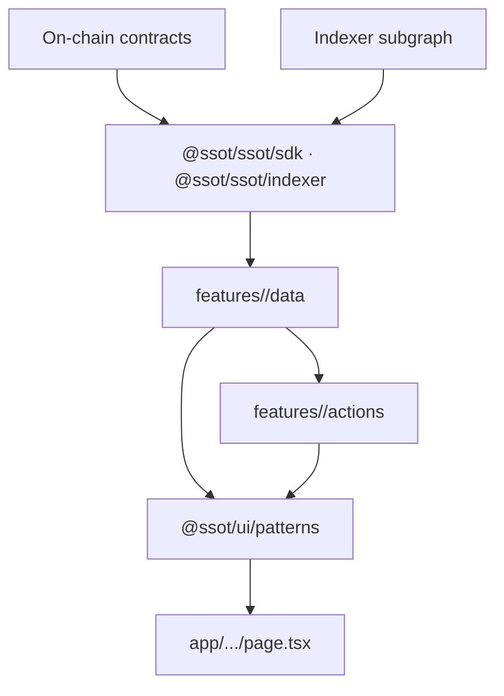
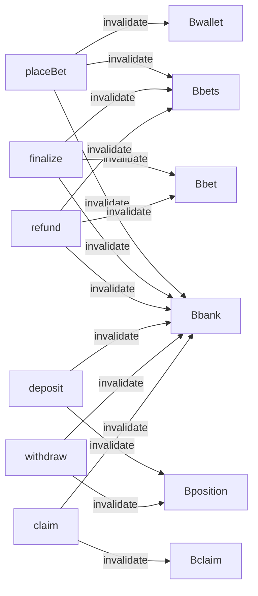

# 14 · Data & State Architecture

| Owner | Frontend Lead |
| Status | Draft v1 |
| Last Updated | 2026-05-14 |
| Depends on | `00-charter.md`, `11-component-library.md`, `13-web3-ux.md` |
| Supersedes | every ad-hoc `useQuery` declaration across `apps/web/src/app/**` |

This document defines the **data flow architecture** of the frontend:
how data is fetched, cached, invalidated, mutated, and shared across server
and client. The goal is to make the system predictable: any future engineer
should be able to add a new query/mutation by following the rules below
without reading any other code.

## 1. Architecture Layers



Layers (read top-down):

| Layer                               | Responsibility                                        | Owner package      |
| ----------------------------------- | ----------------------------------------------------- | ------------------ |
| Source                              | Chain RPC + indexer subgraph                          | external           |
| SDK                                 | typed reads, calldata builders, action calls          | `@ssot/ssot`       |
| Data hooks (`features/*/data`)      | query keys, cache config, view-model mapping          | `apps/web`         |
| Action hooks (`features/*/actions`) | the tx state machine wrappers from `13-web3-ux.md §5` | `apps/web`         |
| Patterns                            | render data + actions                                 | `@ssot/ui`         |
| Pages                               | compose patterns                                      | `apps/web/src/app` |

Pages don't talk to layers above the patterns layer. Patterns don't talk to
layers above the data/actions layer. SDK doesn't know about React.

## 2. RSC vs Client

### 2.1 Default: Server Components

Server Components are the default render mode. They:

- Read release manifest at request time.
- Pre-fetch top-of-page data through SDK server entry (`@ssot/ssot/sdk-node`).
- Stream layout and skeletons.
- Embed the initial query cache via React Query's `Hydrate` for handoff.

### 2.2 Client only when needed

A Client Component (`'use client'`) is required for:

- wallet / signer / wagmi
- IndexedDB / localStorage reads
- charts using browser canvas APIs
- bet-parameter forms with bigint inputs
- live indexer subscriptions (WebSocket / SSE)
- interactive bet stage (animation)

A Client Component must:

- be the smallest subtree possible
- not import server-only code (SDK Node)
- be named `<X.client>` only when the same module also has a server export

## 3. Query Layer (TanStack Query)

### 3.1 Singleton client

One QueryClient per request on server, one per browser tab on client. The
client is created in `apps/web/src/app-shell/QueryProvider.tsx`.

Defaults:

```ts
new QueryClient({
  defaultOptions: {
    queries: {
      staleTime: 30_000,
      gcTime: 5 * 60_000,
      retry: (failureCount, error) => isRetriable(error) && failureCount < 2,
      retryDelay: (n) => Math.min(1000 * 2 ** n, 8_000),
      refetchOnWindowFocus: false,
      refetchOnReconnect: true,
    },
    mutations: {
      retry: false,
    },
  },
});
```

### 3.2 Query keys (canonical)

Every query key follows the pattern:

```ts
['ssot', <domain>, <subject>, ...<scope>]
```

Examples:

```ts
["ssot", "release"][("ssot", "bank", "snapshot", assetAddress)][
  ("ssot", "bank", "position", assetAddress, account)
][("ssot", "bet", betId)][("ssot", "bets", { player, slug, limit, cursor })][
  ("ssot", "sportsbook", "market", marketId)
][("ssot", "sportsbook", "tickets", { player, marketId, status })][
  ("ssot", "tx-journal", { limit, cursor })
];
```

Rules:

- First segment is always `'ssot'`.
- Domain is one of `release | bank | bet | bets | sportsbook | tx-journal |
ops`.
- Subject is the noun being read.
- Scope is an object (alphabetized) or the immutable id.
- **No** `[v]` or version segment — that's encoded in the release digest if
  needed.
- **No** strings concatenated as keys — always tuples.

Centralized in `apps/web/src/features/*/data/keys.ts`. Pages do not write
keys inline.

### 3.3 staleTime / gcTime defaults

| Concept           | staleTime                                 | gcTime   |
| ----------------- | ----------------------------------------- | -------- |
| release manifest  | Infinity                                  | Infinity |
| bank snapshot     | 15s                                       | 5min     |
| bet detail        | 15s if not terminal, Infinity if terminal | 30min    |
| bets list         | 30s                                       | 5min     |
| sportsbook market | 15s                                       | 5min     |
| signed odds       | (expiry - now - 5s)                       | 1min     |
| tx journal        | 60s                                       | 30min    |
| account balance   | 30s                                       | 5min     |
| allowance         | 30s                                       | 5min     |

Overrides require an inline comment justifying the deviation.

### 3.4 Invalidation Topology



The invalidation map is one source-of-truth file:
`features/_shared/data/invalidation-map.ts`.

After a tx is mined, the SDK action returns a list of keys to invalidate;
the hook calling the action passes them to `queryClient.invalidateQueries`.
Pages do not write `invalidateQueries` calls by hand.

### 3.5 Optimistic updates

Used sparingly. **Default is no optimism.** A bet is not "placed" until the
tx is mined. Optimistic updates are allowed only when:

- the change is local (no consensus involvement), e.g., dismissing a toast
- the change is reversible without user confusion, e.g., a UI sort order

Forbidden optimisms:

- showing a bet as `Held` before the tx is mined
- displaying a deposit-completed state during `pending`
- moving a row to "won" before the receipt is in

## 4. Pagination

**Cursor-based only.** Indexer exposes `cursor` for every paginated source.
No offset/limit calls in product UI — they break under reorgs and indexer
lag.

Pattern: `useInfiniteQuery` with `getNextPageParam: (last) => last.nextCursor`.

UI affordance: a single `Load more` button below the list. Infinite scroll
is only used when:

- the list represents a feed (live bets ticker)
- the user explicitly enables it via a setting

Default everywhere else is the button.

## 5. Real-time

### 5.1 Strategy

Three tiers, in order of preference:

1. **WebSocket** from the indexer for subscriptions of low-volume,
   high-priority events (bet settled, tx mined, market state change).
2. **SSE** if WS isn't available and the source supports SSE.
3. **Polling** as fallback, on the visibility-aware schedule:
   - 5s when tab visible and user is in a bet-relevant page
   - 15s when tab visible but page is dashboard
   - 60s when tab visible and page is marketing
   - paused when tab hidden

`useEffect` for `document.visibilitychange` rotates the schedule.

### 5.2 Connection state

Available globally as `useIndexerStatus()`:

```ts
type IndexerStatus =
  | { kind: "live"; lastBlock: bigint; lagSeconds: number }
  | { kind: "lagging"; lastBlock: bigint; lagSeconds: number }
  | { kind: "down"; lastSeenAt: Date };
```

Status drives the `<ReleaseProof>` indicator and global toast banner on
extended outages.

### 5.3 Stale data guard

If `lagSeconds > 60`, every data hook returns a `stale: true` flag.
Patterns surface this via a `(stale)` caption next to the value. Pages do
not implement this — patterns do.

## 6. Error Strategy

### 6.1 Error boundaries

`react-error-boundary` mounted at three levels:

1. App-shell boundary — last resort; shows a global error page.
2. Route-segment boundary — every `app/.../error.tsx` file.
3. Pattern boundary — `<LedgerTable>`, `<BetSlip>`, `<RiskPanel>`, etc.
   wrap their internals so one failure doesn't tank the page.

### 6.2 Error UI

- Boundary fallback uses `<ErrorState>` pattern (`11-`).
- Retries refetch all queries within the boundary, not the whole app.
- Sentry captures the error with breadcrumbs (`../frontend/25-observability.md`).

### 6.3 Mutation errors

Toast pattern from `13-web3-ux.md §8`. The mutation hook decides whether
the error blocks UI (in-place) or is dismissable (toast).

## 7. Server / Client Boundary Rules

### 7.1 Server-only modules

Files importing `server-only` package:

- `@ssot/ssot/sdk-node`
- any `featuresvertical/data/server-*.ts` file
- the page-level `generateMetadata` and RSC `loader`

### 7.2 Client-only modules

Files marked `'use client'`:

- providers (`QueryProvider`, `WalletProviderIsland`, `ThemeProvider`)
- patterns that need DOM or browser APIs (most of them)
- charts
- bet stages with animation
- form inputs

### 7.3 Hydration handoff

Server pre-fetches relevant queries:

```ts
// app/(product)/casino/[slug]/page.tsx
export default async function Page({ params }: { params: Promise<{ slug: string }> }) {
  const { slug } = await params;
  const qc = makeServerQueryClient();
  await qc.prefetchQuery({
    queryKey: ['ssot', 'casino', 'catalog'],
    queryFn: () => sdkServer.casino.catalog(),
  });
  await qc.prefetchQuery({
    queryKey: ['ssot', 'casino', 'recent', slug, { limit: 20 }],
    queryFn: () => sdkServer.casino.recentBets(slug, 20),
  });
  return (
    <Hydrate state={dehydrate(qc)}>
      <CasinoRoomClient slug={slug} />
    </Hydrate>
  );
}
```

The Client Component uses `useQuery` with the same key and finds the
hydrated cache. No double fetch.

## 8. Local State

### 8.1 React state

For UI-only ephemeral state (open modal, hover index, form draft). Lives in
the component that owns it.

### 8.2 URL state

For state that should be shareable or back-button safe:

- list filters
- pagination cursor (when bookmarkable)
- selected outcome in a sportsbook market

Use `nuqs` (or equivalent typed URL state library) — never `useSearchParams`
manually.

### 8.3 Global client state

For wallet, theme, query cache, indexer status, feature flags. Lives in:

- `WalletProviderIsland` (wagmi config)
- `QueryProvider` (cache)
- `ThemeProvider` (cookie-backed)
- `FlagsProvider` (cookie-backed)
- `IndexerStatusProvider` (subscribed to WS)

No Redux. No Zustand for cross-cutting state. If a Zustand store is
proposed, write an ADR explaining why React Query + context is insufficient.

### 8.4 Persistent client state

For user preferences (theme, density, columns visible in tables):

- store in `localStorage` under `arbi:<feature>:<key>` prefix
- read once at mount, write on change
- export through a typed `usePreference(key)` hook

For data persistence between sessions (recent transactions, draft bets):

- store in IndexedDB via `idb-keyval` or `dexie`
- module wrapper in `apps/web/src/lib/storage/`

Never store secrets, signatures, or private keys.

## 9. Mutation Contracts

Every mutation hook signature:

```ts
type UseXMutation = {
  status:
    | "idle"
    | "simulating"
    | "preview"
    | "signing"
    | "pending"
    | "mining"
    | "success"
    | "error"
    | "rejected"
    | "timeout";
  error?: TypedError;
  preview?: PreviewResult;
  txHash?: `0x${string}`;
  receipt?: TransactionReceipt;
  reset: () => void;
  simulate: (input: Input) => Promise<PreviewResult>;
  submit: (input: Input) => Promise<SubmitResult>;
};
```

The mutation hook:

- runs simulation first (`13-web3-ux.md §7`)
- waits for receipt
- invalidates the configured query keys
- emits observability events (`../frontend/25-observability.md`)

Pages call `submit` once and consume `status`, `error`, `preview`, etc.

## 10. SSOT Indexer Reducers

The indexer turns raw event logs into denormalized rows. Reducers live in
`@ssot/ssot/indexer` and emit:

- `BetRow`
- `PositionRow`
- `SettlementRow`
- `XPAccrualRow`
- `BankSnapshotRow`
- `SportsMarketRow`
- `SportsTicketRow`

Each row is **versioned**; schema bumps require ADR.

When the indexer schema changes:

- bump indexer version
- clear IndexedDB cache for affected stores (forward migration)
- pre-deploy a `STATE_SCHEMA_BUMP` banner for 24h

## 11. Don'ts

- No `useQuery` calls in `page.tsx` files. Wrap in a feature hook.
- No `useEffect`-based fetching. Use TanStack Query.
- No global setInterval polling. Use `useQuery` with `refetchInterval`.
- No localStorage reads at module top level (SSR-breaking).
- No bigint values in URL state without explicit serialization.
- No `JSON.parse(localStorage.getItem(...))` without zod parsing.
- No silent fallbacks: a stale query must surface visible "(stale)"
  affordance.
- No mutations without prior simulation.
- No invalidation by string key — always reference `invalidation-map.ts`.

## 12. How To Enforce

```bash
# useQuery only inside feature hooks
rg -nE "useQuery|useInfiniteQuery|useMutation" frontend/apps/web/src/app \
  | rg -v "messages|metadata"

# Query keys are tuples; no strings
rg -nE "queryKey:\\s*\\[?\"" frontend/apps/web/src

# useEffect-based fetching ban
rg -nE "useEffect.*fetch\\(|useEffect.*axios|useEffect.*await" frontend/apps/web/src

# Offset pagination ban
rg -nE "offset:\\s*[0-9]+|limit.*offset" frontend/apps/web/src

# All mutation hooks import from features/*/actions
node scripts/check-mutation-paths.mjs

# bigint in URL state
rg -nE "useSearchParams\\(\\).get.*BigInt|nuqs\\.bigint" frontend/apps/web/src
```

## 13. Migration

- New rewrite uses the rules above from day one.
- The old `useBets`, `useTxJournal`, etc. hooks are rewritten into the new
  `features/*/data` layout.
- Old TanStack queries with string keys are normalized to tuple keys.

## 14. Glossary

| Term              | Meaning                                                       |
| ----------------- | ------------------------------------------------------------- |
| RSC               | React Server Component                                        |
| Hydration handoff | Server-prefetched query cache rehydrated on client            |
| Cursor pagination | Pagination via opaque cursor, robust to reorgs                |
| SSE               | Server-Sent Events                                            |
| Provider island   | Client-Component subtree wrapping global providers            |
| Invalidation map  | The central registry of (mutation → query keys to invalidate) |
