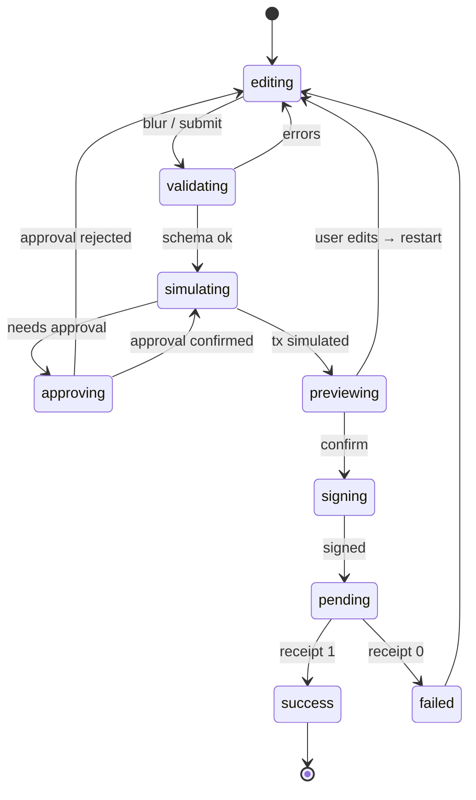

# 15 · Forms, Numbers & Validation

| Owner | Frontend Lead |
| Status | Draft v1 |
| Last Updated | 2026-05-14 |
| Depends on | `00-charter.md`, `02-voice-and-copy.md`, `11-component-library.md`, `13-web3-ux.md`, `14-data-and-state.md` |
| Supersedes | every ad-hoc input handler across `apps/web/src/app/**` |

This document specifies how every form in the product is built — single
inputs, multi-step flows, validation strategy, bigint numeric handling, and
form state machines.

## 1. Selection: `react-hook-form` + `zod`

Every form uses:

- **`react-hook-form`** (RHF) for form state and registration.
- **`zod`** for schema and inference.
- **`@hookform/resolvers/zod`** for bridging.

Forbidden: Formik, native `useState`-based forms, raw HTML form submit. RHF
is the only allowed form library.

## 2. Schema Authoring

### 2.1 Where schemas live

Per feature: `apps/web/src/features/<vertical>/forms/<name>.schema.ts`.

### 2.2 Inference

```ts
import { z } from "zod";
export const placeBetSchema = z.object({
  asset: zAddress,
  amount: zAmountBigint(),
  betCount: z.number().int().min(1).max(100),
  maxHouseEdgeBps: zHouseEdgeBps(),
  stopGain: z.bigint().nonnegative().optional(),
  stopLoss: z.bigint().nonnegative().optional(),
  affiliate: zAddress.optional(),
});
export type PlaceBetInput = z.infer<typeof placeBetSchema>;
```

### 2.3 Shared zod helpers

Centralized in `packages/ssot/src/encoding/zod-helpers.ts`:

```ts
export const zAddress = z.string().regex(/^0x[a-fA-F0-9]{40}$/);
export const zHash = z.string().regex(/^0x[a-fA-F0-9]{64}$/);
export const zBytes = z.string().regex(/^0x[a-fA-F0-9]+$/);

export const zAmountBigint = (opts?: { min?: bigint; max?: bigint }) =>
  z
    .bigint()
    .refine((v) => v > 0n, "Amount must be greater than zero")
    .refine((v) => opts?.min == null || v >= opts.min, "Amount below minimum")
    .refine((v) => opts?.max == null || v <= opts.max, "Amount above maximum");

export const zHouseEdgeBps = () => z.number().int().min(0).max(10_000);
```

No inline regex. No inline zod predicates that duplicate shared helpers.

## 3. `<NumberInput>` for Bigint

The canonical input for asset amounts is `<NumberInput>` (defined in
`11-component-library.md §3.3`):

```tsx
<NumberInput
  value={form.watch('amount')}
  onChange={(v) => form.setValue('amount', v, { shouldValidate: true })}
  decimals={asset.decimals}
  max={asset.balance}
  displayPrecision={undefined /* uses 02-voice §5 default */}
  trailingNode={<MaxButton onClick={...} />}
/>
```

### 3.1 Behavior

- Internal state is a **string** to allow trailing decimal point during
  typing (`1.`).
- On every keystroke, the string is parsed to bigint via
  `parseAmount(text, decimals)`. If parsing fails partially (`1.`), the
  field reports `null` until valid.
- `onChange` receives `bigint | null`. The form treats `null` as
  "incomplete, do not validate yet, do not submit".
- On focus, locale-aware grouping is removed (`1,234.5` → `1234.5`).
- On blur, grouping is reapplied for display.
- `Max` button sets value to `max`, fires `shouldValidate: true`.

### 3.2 Edge cases

- Paste of scientific notation (`1.5e6`) is rejected with an `aria-live`
  hint: `Use the standard number form.`
- Negative numbers blocked at keystroke level.
- More decimal places than the asset supports are truncated on blur with a
  hint: `Truncated to <decimals> decimal places.`
- Numbers exceeding `max` highlight `--danger` and show an inline error.

### 3.3 Forbidden

- Native `<input type="number">` for bigint values (loses precision).
- `parseFloat` / `Number(...)` on user amounts (precision loss).
- Using BigNumber.js or ethers.BigNumber. We use **native bigint** end-to-end.

## 4. Form State Machines

Every multi-step write flow (place bet, deposit, withdraw, claim) follows the
canonical state machine from `13-web3-ux.md §5`. The form layer adds:



State is owned by RHF + a thin orchestrator hook:

```ts
const form = useForm<PlaceBetInput>({ resolver, defaultValues });
const flow = usePlaceBetFlow(form);

flow.state; // 'editing' | 'validating' | 'simulating' | …
flow.simulationResult;
flow.error;
flow.submit();
flow.reset();
```

The form UI binds to `flow.state` to render the right CTA label and
disabled states.

## 5. Validation Layering

Three layers, in order:

1. **Type-level** — TypeScript prevents wrong shapes at compile time.
2. **Schema** — zod catches structural and value errors before simulation.
3. **Simulation** — `eth_call` catches contract-level reverts not visible to
   the schema (e.g., bank paused, insufficient allowance).

Schema validation triggers on:

- field blur (immediate feedback)
- form submit (full validation)
- value-changed-from-pristine + form-is-submitted (re-validate touched
  fields)

Schema **does not** trigger on every keystroke. Aggressive validation is a
known UX anti-pattern (constant error flicker while typing).

## 6. Error Surface

### 6.1 Where errors show

| Error class                          | UI                                                     |
| ------------------------------------ | ------------------------------------------------------ |
| Field-level (schema)                 | `aria-invalid` + inline message under field            |
| Cross-field (e.g., amount + balance) | banner at top of form                                  |
| Simulation revert                    | toast OR inline depending on `13-web3-ux §8` placement |
| Async (RPC down)                     | banner with retry                                      |

### 6.2 Wording

Per `02-voice-and-copy.md §4.2`. Field errors are short noun phrases:

- `Amount must be greater than zero.`
- `Amount above your balance.`
- `House edge cap below current effective edge.`

Never:

- `Please enter a valid amount.` (vague)
- `Amount > 0 required.` (math notation)
- `Invalid input.` (uninformative)

## 7. Accessibility for Forms

Every field has:

- a `<label>` (visible or `sr-only`).
- `aria-describedby` to hint + error nodes.
- `aria-invalid` when in error.
- `aria-required` when required.
- focus order that follows visual order.
- a stable `id` (`useId` from React) — no `Math.random()` ids.

Submit button:

- disabled state is announced via `aria-disabled` (not the HTML `disabled`
  attribute when keyboard focus is needed for tooltips).
- loading state replaces label per `02-voice-and-copy.md §4.1`.

## 8. Multi-step Flows

Multi-step flows (e.g., `Approve → Place bet`) use a single form with derived
"current step" state, not multiple forms. Reasons:

- shared field values persist across steps without prop drilling
- back navigation is one `setStep('approve')` call
- the validation schema is one zod object

Step transitions are driven by the flow state machine (§4), not user clicks.
Clicks dispatch events ("confirm", "back"), the machine decides the next
state.

## 9. Draft Persistence

For long-lived forms (e.g., a casino bet panel with custom stopGain/stopLoss
config), the draft persists to IndexedDB under
`arbi:<vertical>:<form>:draft:<slug>` after debounce 500ms.

Restored on mount. Cleared on success or explicit reset.

Don't persist:

- wallet addresses entered as text (auto-fill from `useAccount()`)
- signature payloads
- raw private inputs (none should exist)

## 10. Number / Percent / Time Display

Display formatters live in `@ssot/ui/utils`:

- `formatAmount(value, decimals, opts)` — implements `02-voice-and-copy.md §5.1`.
- `formatPercent(bps, opts)` — implements §5.2-3.
- `formatMultiplier(value)` — implements §5.4.
- `shortAddress(addr)` — implements §5.5.
- `shortDigest(hash)` — implements §5.6.
- `formatRelativeTime(ms)` — implements §5.7-8.

Forms never compute these locally. If a formatter is missing, add it to the
shared module and document.

## 11. Don'ts

- No native `<input type="number">` for asset amounts.
- No `parseFloat`/`Number` on user-entered amount strings.
- No form library other than RHF.
- No validation on every keystroke for currency inputs.
- No alert-style errors (`window.alert`).
- No "soft" validation that bypasses schema (e.g., a "force submit" toggle).
- No persisting drafts containing signatures or secrets.
- No `defaultValue` to bigint zero — null is the canonical "empty" value.
- No CTA enabled until at least one field is touched (avoid accidental
  submit on Enter).

## 12. How To Enforce

```bash
# Native number inputs banned
rg -nE 'type=\"number\"' frontend/apps/web/src

# parseFloat / Number on inputs banned
rg -nE "parseFloat\\(|Number\\(.*input|toFixed" frontend/apps/web/src/features

# Forbidden form libraries
rg -nE "from 'formik'|from 'final-form'" frontend

# Inline zod regex duplicates of shared helpers
rg -nE "regex\\(/\\^0x" frontend/apps/web/src

# Schema files exist where required
node scripts/check-form-schemas.mjs
```

## 13. Examples

### 13.1 Place bet form

```tsx
"use client";
import { useForm } from "react-hook-form";
import { zodResolver } from "@hookform/resolvers/zod";
import { NumberInput, Button, Tabs } from "@ssot/ui/primitives";
import { BetSlip } from "@ssot/ui/patterns";

export function DiceBetForm({ asset, module }: Props) {
  const form = useForm<PlaceBetInput>({
    resolver: zodResolver(placeBetSchema),
    defaultValues: {
      asset: asset.address,
      amount: null,
      betCount: 1,
      maxHouseEdgeBps: 200,
    },
    mode: "onBlur",
  });
  const flow = usePlaceBetFlow(form);
  return (
    <BetSlip flow={flow}>
      <BetSlip.AmountInput>
        <NumberInput
          value={form.watch("amount")}
          onChange={(v) => form.setValue("amount", v, { shouldValidate: true })}
          decimals={asset.decimals}
          max={asset.balance}
          aria-invalid={!!form.formState.errors.amount}
          aria-describedby="amount-hint amount-error"
        />
        {form.formState.errors.amount && (
          <p id="amount-error" className="text-danger t-caption">
            {form.formState.errors.amount.message}
          </p>
        )}
      </BetSlip.AmountInput>
      <BetSlip.Action />
    </BetSlip>
  );
}
```

### 13.2 LP withdraw form

```tsx
const form = useForm<WithdrawInput>({
  resolver: zodResolver(withdrawSchema),
  defaultValues: { asset, mode: "shares", amount: null },
});
const flow = useWithdrawFlow(form);
```

Both forms share the same orchestrator pattern with different schemas and
flows. No copy-pasted boilerplate.

## 14. Glossary

| Term               | Meaning                                                 |
| ------------------ | ------------------------------------------------------- |
| RHF                | react-hook-form                                         |
| zod resolver       | `@hookform/resolvers/zod` adapter                       |
| Form state machine | Wrapper hook coupling RHF state to the tx state machine |
| Draft persistence  | IndexedDB-backed restore of form values across sessions |
