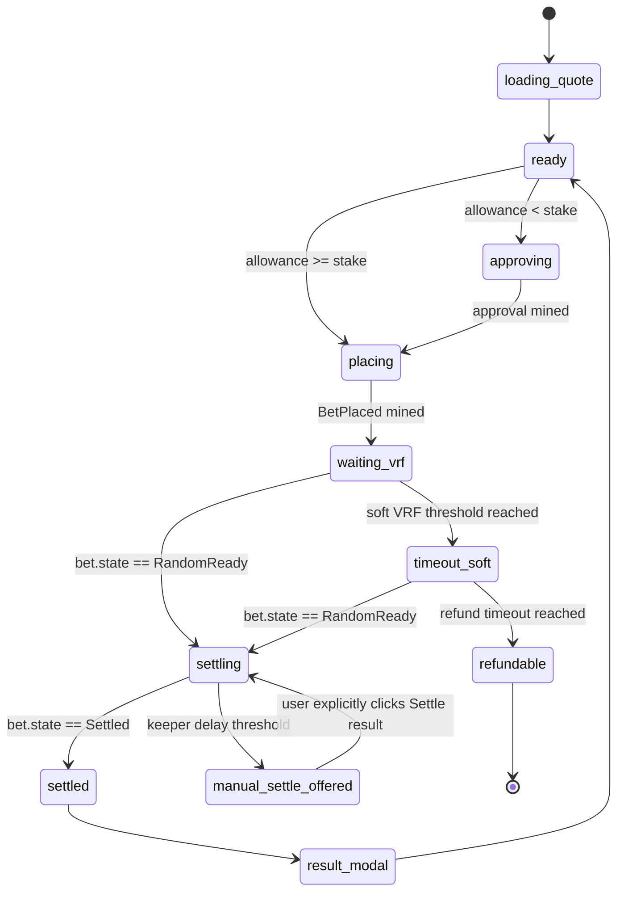

# Casino Place Bet UX & Keeper Settlement

| Owner | Frontend Lead + Protocol Lead |
| Status | Draft v1 |
| Last Updated | 2026-05-16 |
| Depends-on | `13-web3-ux.md`, `14-data-and-state.md`, `../frontend/25-observability.md`, `../constitution/SSOT.v1.3.md` |
| Supersedes | two-click casino `plan -> execute` UX and any user-default `finalize` flow |

This document defines the production casino round flow. The user-facing promise
is simple:

> A player signs at most two wallet prompts for a normal casino round: ERC20
> approval when needed, then `placeBet`. VRF delivery and settlement happen
> automatically through protocol infrastructure.

The frontend may expose manual settlement only as a delayed fallback when the
keeper path is late.

## 1. Architecture Decision

### 1.1 VRF callback remains lightweight

`GameHub.onRandomWords` must only persist the random payload, mark the bet
`RandomReady`, detach the VRF request, and emit `BetRandomReady`.

It must not call `SettlementRouter.settlePosition` from inside the VRF callback.
This preserves the v1.3 invariant that fulfillment must not be coupled to game
settlement complexity.

### 1.2 Settlement is keeper driven

`GameHub.finalize(betId)` remains permissionless. A protocol keeper watches for
`RandomReady` bets and calls `finalize`. The frontend watches the same chain
state and renders a continuous round, but it does not make normal players sign a
settlement transaction.

Manual settlement is only a fallback after a visible delay.

## 2. User Round State Machine



## 3. Timing Contract

| Elapsed state | UI copy | User action |
| --- | --- | --- |
| page load | `Estimating VRF fee` | none |
| `placeBet` signed/mined | `Rolling with verifiable randomness` | none |
| `PendingVRF` 8-30s | `Waiting for Chainlink VRF` | none |
| `RandomReady` < 30s | `Result ready. Settling automatically` | none |
| `RandomReady` >= 30s | `Keeper delay. You can manually settle` | optional `Settle result` |
| `PendingVRF` >= 60s | `VRF is taking longer than usual` | none |
| `PendingVRF` >= refund timeout | `VRF did not fulfill in time` | `Refund stake` |

The thresholds are product defaults. They may be tuned per chain by config, but
they must remain centralized.

## 4. Signing Rules

- Normal path: at most one ERC20 `approve` and one `placeBet`.
- `finalize` must not open a wallet prompt unless the player explicitly clicks
  `Settle result`.
- `refund` must not appear until the contract refund timeout is reached.
- The UI must not describe manual settlement as "claim winnings"; it is an
  operational fallback for delayed keeper settlement.

## 5. Keeper v1 Contract

### 5.1 Triggers

The keeper listens to:

- `GameHub.BetRandomReady(betId, requestId, randomHash)`
- `VRFHub.Fulfilled(requestId, hub, betId, randomHash)`
- periodic scan for `getBet(betId).state == RandomReady`

### 5.2 Redundancy

| Instance | Delay | Purpose |
| --- | --- | --- |
| primary | 0s | first finalize attempt |
| backup | 5s | separate region and RPC provider |
| public fallback | 30s | permissionless manual or future bounty-driven actors |

Duplicate finalization is harmless because `finalize` rejects non-`RandomReady`
state. Keepers must still avoid waste by reading `getBet` before broadcasting.

### 5.3 Failure Handling

| Failure | Response |
| --- | --- |
| `finalize` mined success | record `randomReady -> settled` latency |
| estimate gas fails because already settled | mark as raced success |
| estimate gas fails for other reason | retry once, then alert |
| tx reverted | classify revert, alert if still `RandomReady` |
| RPC timeout | switch RPC, backoff retry |
| nonce conflict | replace with bumped gas |

## 6. Frontend Implementation Contract

The casino room owns one hook: `useCasinoRound`.

Responsibilities:

- quote `sdk.gameHub.quoteVRFFee(betCount)` on page load and bet-count change
- build and preflight a `PlaceBetInput`
- execute approval and `placeBet` from a single user click
- parse/reconcile `betId`
- poll `sdk.gameHub.getBet(betId)` every 1.5-2s while active
- transition `PendingVRF -> soft timeout -> RandomReady -> Settled/Refunded`
- show manual `Settle result` only after the keeper delay threshold
- show `Refund stake` only after the protocol refund timeout

The indexer remains the ledger source for history and event proof. Direct chain
polling is the live round source because indexer latency is visible to players.

### 6.1 Timeout and refund ownership

`timeout_soft` is a user-facing status only. It must not stop polling, stop the
stage animation, or imply funds are lost. It simply changes the copy from
`Waiting for Chainlink VRF` to `VRF is taking longer than usual`.

`refundable` is a signing state. It appears only when the latest direct
`getBet` read is still `PendingVRF`/`placed` and
`now >= placedAt + refundTimeoutSeconds`. The button copy is `Refund stake`.
`Refund stake` sends `GameHub.refund(betId)` only after the user explicitly
clicks it. The frontend must never auto-refund a player round.

## 7. Result Modal Contract

The result modal must show only chain-derived facts:

- `betId`
- `requestId`
- `randomHash`
- `placeBet` transaction hash
- `BetFinalized` or `BetRefunded` transaction hash when indexed
- payout or refund amount when indexed
- explorer links

If the chain is already `Settled` but the indexer has not indexed payout fields,
the modal must say `Settlement confirmed. Indexing payout proof` instead of
showing a mocked amount.

## 8. Don'ts

- Do not settle inside `onRandomWords`.
- Do not make `finalize` part of the normal player signing path.
- Do not block the stage animation on the indexer.
- Do not fabricate win/loss or payout before `BetFinalized` is indexed.
- Do not surface VRF/provider terminology without a short user-facing label.

## 9. How To Enforce

- Unit tests must cover `ready -> approving -> placing`, `waiting_vrf`,
  `timeout_soft`, `settling`, manual settlement after delay, and refund
  fallback.
- Frontend checks:

```bash
rg -n "APPROVE TICKET|CONFIRM TICKET|WAITING FOR VRF" frontend/apps/web/src/features/casino
rg -n "finalize\\(" frontend/apps/web/src/features/casino
```

- Keeper checks:

```bash
rg -n "BetRandomReady|Fulfilled|finalize\\(" apps keeper script frontend script
```

Manual `finalize` calls in frontend are allowed only behind an explicit delayed
fallback control.
