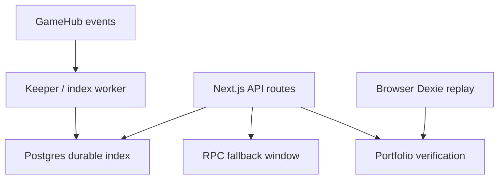

# Durable Bet Index

| Owner | Frontend Lead + SRE |
| Status | Accepted |
| Last Updated | 2026-05-17 |
| Depends-on | `indexing-strategy.md`, `adr/0005-postgres-durable-bet-index.md`, `../frontend/casino-keeper-v1.md` |
| Supersedes | Phase 3 placeholder in `indexing-strategy.md` |

This document defines the production durable index for casino bet feeds. The
index is a cache of public chain facts, not protocol truth.

## 1. Decision

Use Postgres as the primary durable store for `GameHub` bet indexing.

SQLite is allowed only for local development or one-machine canaries. Redis is
allowed only as a future acceleration layer. Neither is the production source
for indexed bet history.

## 2. Why Postgres

The data shape is a small append-only event ledger plus a folded current-state
table. The product queries by recent activity, player, game, and lifecycle
state. Those are relational indexes, not cache-key lookups.

Postgres gives:

- durable storage shared by keeper and web API instances;
- unique constraints for idempotent event ingestion;
- simple recovery from chain replay;
- backups, point-in-time restore, and observability support;
- a clean migration path to analytics without adopting a subgraph.

## 3. Runtime Topology



The keeper or a sibling worker owns writes. Web API routes own reads. Browser
Dexie replay remains the user-verifiable self-check layer.

## 3.1 Deployment Policy

Use Docker Compose for local development, staging canaries, and one-machine
trial deployments. The repository-provided Compose file runs only Postgres so
the web app and keeper can keep using the normal `pnpm` development loop.

For mainnet production, prefer a managed Postgres service with automated
backups, point-in-time restore, disk alerts, and version upgrades. Self-hosting
Postgres in Docker is acceptable only when the operator owns those controls:
scheduled backups, restore drills, persistent volumes, monitoring, and a tested
upgrade path. The keeper and web API connect through the same
`BET_INDEX_DATABASE_URL` in either model.

## 4. Tables

### `gamehub_events`

Raw, idempotent public event facts.

| Column         | Type        | Notes                                                        |
| -------------- | ----------- | ------------------------------------------------------------ |
| `chain_id`     | integer     | release chain id                                             |
| `game_hub`     | text        | source GameHub address                                       |
| `block_number` | bigint      | event block                                                  |
| `tx_hash`      | text        | transaction hash                                             |
| `log_index`    | integer     | log index inside tx                                          |
| `event_name`   | text        | `BetPlaced`, `BetRandomReady`, `BetFinalized`, `BetRefunded` |
| `args_json`    | jsonb       | normalized event args with bigint as strings                 |
| `created_at`   | timestamptz | ingestion time                                               |

Primary key: `(chain_id, tx_hash, log_index)`.

### `bets`

Folded current state, using the same reducer semantics as browser Dexie replay.

| Column            | Type        | Notes                                            |
| ----------------- | ----------- | ------------------------------------------------ |
| `chain_id`        | integer     | release chain id                                 |
| `bet_id`          | text        | bigint string                                    |
| `state`           | text        | `placed`, `randomReady`, `finalized`, `refunded` |
| `game_id`         | text        | nullable                                         |
| `asset`           | text        | nullable                                         |
| `player`          | text        | nullable wallet address                          |
| `stake`           | text        | nullable raw asset amount from `BetPlaced`       |
| `payout`          | text        | nullable raw net payout/refund for UI rows       |
| `payout_gross`    | text        | nullable raw gross payout from `BetFinalized`    |
| `refund_amount`   | text        | nullable raw refund amount from `BetRefunded`    |
| `request_id`      | text        | nullable VRF request id                          |
| `random_hash`     | text        | nullable VRF random hash                         |
| `terminal_tx_hash` | text       | nullable finalized/refunded tx hash              |
| `finalized_tx_hash` | text      | nullable `BetFinalized` tx hash                  |
| `refunded_tx_hash` | text       | nullable `BetRefunded` tx hash                   |
| `placed_block`    | bigint      | nullable                                         |
| `updated_block`   | bigint      | latest folded event block                        |
| `last_tx_hash`    | text        | latest folded event tx                           |
| `last_event_name` | text        | latest folded event name                         |
| `updated_at`      | timestamptz | latest fold time                                 |

Primary key: `(chain_id, bet_id)`.

Indexes:

- `(chain_id, updated_block desc, bet_id desc)`
- `(chain_id, player, updated_block desc)`
- `(chain_id, game_id, updated_block desc)`
- `(chain_id, state, updated_block desc)`

### `indexer_cursors`

Replay cursor per source.

| Column         | Type        | Notes                             |
| -------------- | ----------- | --------------------------------- |
| `chain_id`     | integer     | release chain id                  |
| `source`       | text        | `gamehub-events` initially        |
| `cursor_key`   | text        | contract address or logical shard |
| `block_number` | bigint      | last fully processed block        |
| `updated_at`   | timestamptz | write time                        |

Primary key: `(chain_id, source, cursor_key)`.

## 5. API Contract

The existing API contract stays stable:

- `/api/bets/recent`
- `/api/bets/player/[address]`

Read order:

1. query Postgres if `BET_INDEX_DATABASE_URL` is configured;
2. return rows if the store is reachable and sufficiently seeded;
3. fallback to current RPC-window aggregation on store error or cold start.

Critical settlement proof pages must continue to read direct chain logs or
`GameHub.getBet`; the durable index is not allowed to become proof authority.

## 6. Write Contract

Ingestion must be idempotent:

1. insert raw `gamehub_events` with `on conflict do nothing`;
2. fold the full batch into `bets`;
3. upsert `bets` idempotently:
   - lifecycle fields (`state`, `last_tx_hash`, `last_event_name`, `updated_block`)
     only advance when `excluded.updated_block >= bets.updated_block`;
   - metadata/economics fields (`stake`, `request_id`, `random_hash`, `payout`,
     terminal tx hashes) may be filled by older replayed events during backfill;
4. update `indexer_cursors` after the block range is fully written.

If Postgres is unavailable, keeper settlement must continue. Index writes are
best-effort operational telemetry and feed acceleration; they must never block
`GameHub.finalize`.

## 7. Environment

| Variable                      | Owner         | Meaning                                           |
| ----------------------------- | ------------- | ------------------------------------------------- |
| `BET_INDEX_DATABASE_URL`      | keeper + web  | Postgres connection string                        |
| `BET_INDEX_SSL`               | keeper + web  | optional `true` for managed Postgres SSL          |
| `BET_INDEX_WRITE_ENABLED`     | keeper        | defaults false until canary                       |
| `BET_INDEX_READ_ENABLED`      | web           | defaults true when database URL exists            |
| `BET_INDEX_FROM_BLOCK`        | backfill      | optional explicit backfill start block            |
| `BET_INDEX_TO_BLOCK`          | backfill      | optional explicit backfill end block              |
| `BET_INDEX_CONFIRMATIONS`     | backfill      | default `2`, caps end block below latest          |
| `BET_INDEX_SCAN_CHUNK_BLOCKS` | backfill      | default `10`, safe for Base Sepolia public RPC    |
| `BET_INDEX_DRY_RUN`           | backfill      | scan and fold into memory without Postgres writes |
| `BET_INDEX_POSTGRES_PORT`     | local Compose | host port, default `54329`                        |
| `BET_INDEX_POSTGRES_DB`       | local Compose | database name, default `arbigamefi`               |
| `BET_INDEX_POSTGRES_USER`     | local Compose | database user, default `arbigamefi`               |
| `BET_INDEX_POSTGRES_PASSWORD` | local Compose | local-only password                               |

Implementation lives in `frontend/packages/bet-index`. The package is Node-only;
client components must not import it.

Keeper startup must run migrations before scanning and then read the
`gamehub-events` cursor for the current `GameHub`. When the cursor is ahead of
`KEEPER_START_BLOCK`, the keeper resumes from the cursor to avoid replaying old
block windows after restarts. If Postgres is unavailable, connection attempts
must fail quickly and settlement must continue with the configured
`KEEPER_START_BLOCK`.

Backfill and canary use the same package contract through:

```bash
pnpm -C frontend keeper:backfill
```

The command reads the selected file in `frontend/deploy/casino-keeper/`
(`KEEPER_ENV_FILE=primary.env` by default), scans `GameHub` lifecycle events,
writes idempotent rows, advances the same `gamehub-events` cursor, and prints a
JSON summary. It does not require the keeper private key and must never call
`GameHub.finalize`.

Local Postgres can be started with:

```bash
pnpm -C frontend bet-index:db:up
BET_INDEX_FROM_BLOCK=1 BET_INDEX_TO_BLOCK=1 pnpm -C frontend bet-index:backfill:local
```

## 8. Don'ts

- Do not use Redis as the canonical indexed ledger.
- Do not require SQLite file sharing between keeper and web deployments.
- Do not block casino settlement when index writes fail.
- Do not expose `BET_INDEX_DATABASE_URL` to the browser.
- Do not use indexed rows as final settlement proof in the result modal.

## 9. How To Enforce

```bash
rg -n "BET_INDEX_DATABASE_URL|postgres" frontend/apps frontend/packages/bet-index
rg -n "redis|ioredis|better-sqlite3|sqlite3" frontend --glob package.json
rg -n "from ['\\\"]@ssot/bet-index" frontend/apps/web/src | rg -v "src/server|src/app/api"
```

The first command should show only server/keeper/package code. The second should
remain empty for direct workspace dependencies unless this document is
superseded; lockfiles may contain transitive optional Redis instrumentation from
observability packages and are not authoritative for this decision. The third
should not show client components importing the durable index.
