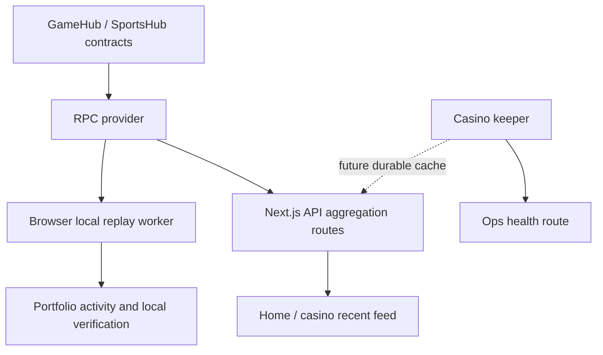

# Indexing Strategy

| Owner | Frontend Lead + Protocol Lead |
| Status | Accepted |
| Last Updated | 2026-05-17 |
| Depends-on | `14-data-and-state.md`, `../frontend/casino-keeper-v1.md`, `adr/0004-no-subgraph-for-mvp-indexing.md` |
| Supersedes | ad-hoc references to "indexer subgraph" as a required source |

This document defines the MVP indexing strategy for casino and sportsbook UI
surfaces. It exists to prevent the frontend from accidentally treating a third
party indexer as protocol truth.

## 1. Decision

Do not introduce a The Graph subgraph for the MVP indexing layer.

Use three layers instead:

1. Contract reads and event logs for canonical facts.
2. A lightweight server aggregation API for shared product feeds.
3. Browser-local Dexie replay for user-verifiable self history.

## 2. Current Facts

The repository currently has no subgraph implementation:

- no `subgraph.yaml`
- no `schema.graphql`
- no `@graphprotocol/*` dependency
- no GraphQL endpoint
- no mapping handlers

The existing indexer is `@ssot/ssot/indexer`. It runs in the browser through a
worker, replays `GameHub` events, and stores derived rows in Dexie/IndexedDB.

This local replay layer is useful because users can independently verify their
activity from chain logs. It is not sufficient for shared product surfaces such
as a global home page feed, because a browser only sees what it has replayed.

## 3. Source Ownership

| Surface | Source for MVP | Rationale |
| --- | --- | --- |
| Bet detail proof | direct GameHub logs + `getBet` | must be chain-verifiable |
| User portfolio activity | server player API merged with local Dexie replay | faster cold start while preserving local verification |
| Home live activity feed | server aggregation API | must represent global activity |
| Casino room recent bets | server aggregation API scoped by `gameId` | must not depend on one browser's local replay |
| Bank reserve snapshot | direct contract view | low-volume canonical read |
| Sports odds | server signer/API route | requires server-only provider secret |
| Ops keeper health | keeper health JSON route | operator status, not protocol truth |

## 4. MVP Architecture



The API layer may use short-lived in-memory cache for MVP. A production
deployment should move shared feed cache to Redis, Postgres, or SQLite if the
runtime is not long-lived.

## 5. Phase Plan

### Phase 1: Recent Bets API

- Add `/api/bets/recent`.
- Read recent `GameHub` events from the embedded release block window.
- Fold logs with the same reducer used by the browser indexer.
- Support optional `gameId` filtering.
- Use short cache TTL and conservative limits.
- Switch home and casino recent-feed UI to this API.

### Phase 2: Player Activity API

- Add `/api/bets/player/[address]`.
- Keep local Dexie as the verification layer.
- Use server cache as a cold-start accelerator only.
- Merge server rows with local replay rows client-side and prefer the freshest
  row per bet id.

### Phase 3: Durable Aggregation

- Extend the keeper or a small sibling worker to persist `BetPlaced`,
  `BetRandomReady`, `BetFinalized`, and `BetRefunded` rows.
- Store only derived public facts.
- Serve `/api/bets/*` from durable storage, with RPC replay as fallback.

## 6. When To Reconsider Subgraph

Reopen this decision only if at least one condition becomes true:

- third-party consumers need a public indexed API;
- product requires cross-chain historical analytics;
- query volume makes RPC-window aggregation uneconomic;
- leaderboard or affiliate analytics require complex multi-entity queries;
- event history reaches a scale where a managed indexing network is cheaper
  than operating the lightweight cache.

## 7. Don'ts

- Do not call local Dexie data "global" or "network-wide".
- Do not show marketing live feed data from browser-local replay only.
- Do not introduce GraphQL schema as a product dependency before the query
  shapes require it.
- Do not make the result modal depend on a third-party indexer. It must remain
  backed by chain logs or direct contract reads.
- Do not persist private keys, RPC secrets, or wallet addresses in observability
  payloads beyond what is already public on-chain.

## 8. How To Enforce

```bash
find . -name subgraph.yaml -o -name schema.graphql -o -name mappings.ts
rg -n "@graphprotocol|graphql-request|ApolloClient|urql" frontend package.json frontend/pnpm-lock.yaml
rg -n "useBets\\(" frontend/apps/web/src/app/\\(marketing\\) frontend/apps/web/src/app/\\(product\\)/casino
```

The first two commands should remain empty unless ADR-0004 is superseded. The
third command should not find product global-feed surfaces using local Dexie
hooks.
