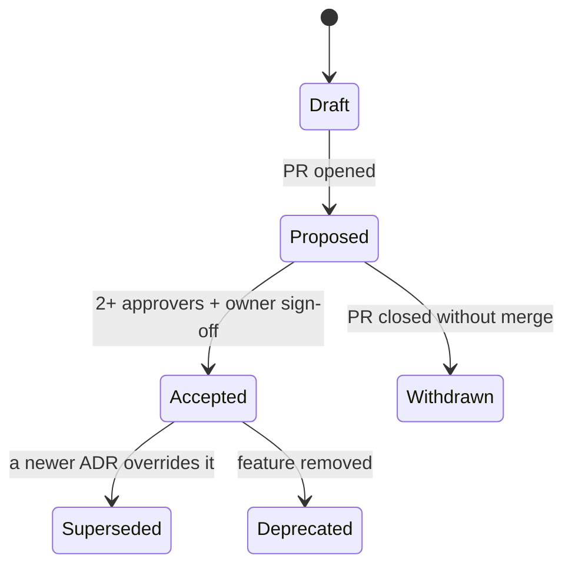

# 31 · Governance & Contribution

| Owner | Frontend Lead + Eng Manager |
| Status | Draft v1 |
| Last Updated | 2026-05-14 |
| Depends on | `../design/00-charter.md` |
| Supersedes | — |

This document defines **who owns what, how proposals become decisions, and
how the SSOT documents stay alive**. Without governance, design systems
decay back into chaos within 6 months.

## 1. Ownership Map

| Surface                                      | Owner                       | Reviewers (required)                            | Reviewers (suggested) |
| -------------------------------------------- | --------------------------- | ----------------------------------------------- | --------------------- |
| `docs/design/00-charter.md`                  | Frontend Lead               | Product Lead, Design Lead, Eng Manager          | —                     |
| `docs/design/01-brand.md`                    | Design Lead                 | Frontend Lead, Product Lead                     | —                     |
| `docs/design/02-voice-and-copy.md`           | Product Lead + Design Lead  | Legal, Frontend Lead                            | —                     |
| `docs/design/03-information-architecture.md` | Product Lead                | Frontend Lead, Design Lead                      | —                     |
| `docs/design/04-page-blueprints.md`          | Design Lead                 | Frontend Lead, Product Lead                     | feature leads         |
| `docs/design/10-design-tokens.md`            | Frontend Lead + Design Lead | Eng team                                        |
| `docs/design/11-component-library.md`        | Frontend Lead               | Design Lead                                     | feature leads         |
| `docs/design/12-motion.md`                   | Design Lead + Frontend Lead | Eng team                                        |
| `docs/design/13-web3-ux.md`                  | Frontend Lead               | Security, Wallet specialist                     |
| `docs/design/14-data-and-state.md`           | Frontend Lead               | SDK Lead                                        |
| `docs/design/15-forms.md`                    | Frontend Lead               | Design Lead                                     |
| `docs/design/16-mobile.md`                   | Frontend Lead + Design Lead | —                                               |
| `docs/frontend/20-accessibility.md`          | Frontend Lead               | Accessibility specialist (or contractor for v1) |
| `docs/frontend/21-i18n.md`                   | Frontend Lead               | Localization vendor                             |
| `docs/frontend/22-performance.md`            | Frontend Lead               | SRE                                             |
| `docs/frontend/23-security.md`               | Frontend Lead + Security    | SRE                                             |
| `docs/frontend/24-testing.md`                | Frontend Lead               | Eng team                                        |
| `docs/frontend/25-observability.md`          | Frontend Lead + SRE         | Product                                         |
| `docs/frontend/30-build-and-release.md`      | Frontend Lead + SRE         | Eng Manager                                     |
| `docs/frontend/31-governance.md` (this file) | Eng Manager                 | Frontend Lead, Product Lead                     |
| `docs/frontend/32-ai-pairing.md`             | Frontend Lead               | Eng Manager                                     |
| `frontend/CLAUDE.md`                         | Frontend Lead               | Eng Manager                                     |

If a role is unfilled, the Eng Manager temporarily holds it and must
delegate within 30 days.

## 2. Decision Records (ADRs)

### 2.1 When an ADR is required

Open an ADR for any of:

- Adding, renaming, or removing a design token.
- Adding a primitive or pattern to `@ssot/ui`.
- Deprecating a primitive or pattern.
- Adding or removing a route in `03-information-architecture.md`.
- Changing the route taxonomy (route group, layout, segment).
- Changing the data fetching architecture (`14-data-and-state.md`).
- Selecting a new direct npm dependency.
- Changing CI structure or required checks.
- Adopting a new tool (e.g., switching analytics vendor).
- Adopting or removing a feature flag default.
- Any policy update to `01-brand.md`, `02-voice-and-copy.md`,
  `23-security.md`, `25-observability.md`.

Trivial changes (typo fixes, link updates, clarifications) do not require
ADR. Use judgement and document the reasoning in the PR.

### 2.2 ADR location

`docs/design/adr/NNNN-<kebab-title>.md`. Numbering is monotonic across all
ADRs.

### 2.3 ADR template

See [`adr/0000-template.md`](../design/adr/0000-template.md).

### 2.4 ADR lifecycle



Accepted ADRs are never edited substantively. To revise, open a new ADR
that supersedes the old (`Supersedes: 0007`).

## 3. RFC Process (for component / pattern proposals)

For adding a new primitive or pattern to `@ssot/ui`, follow the RFC
process:

1. **Discuss** — informal pitch in a frontend-team channel. If consensus is
   "yes, worth a formal proposal", proceed.
2. **Author** — open a PR adding `docs/design/rfc/<short-name>.md` with:
   - context and motivation
   - API sketch (TypeScript)
   - tokens it consumes
   - a11y considerations
   - mobile considerations
   - testing requirements
   - rejection criteria ("when this component should NOT exist")
3. **Spike** — optional code prototype in a feat/\* branch.
4. **Land** — RFC accepted. Move file from `rfc/` to `accepted-rfc/`.
   Implementation PR references the RFC.

## 4. Deprecation Process

When a primitive, pattern, route, or API is deprecated:

1. Open an ADR (`Deprecates: <doc>`).
2. Mark the symbol/file with TSDoc `@deprecated <reason> Use <alternative>.`.
3. Console.warn in dev only.
4. Keep for ≥ 1 minor release cycle.
5. Removal PR cites the deprecation ADR.

CI tracks deprecated symbols in `docs/frontend/deprecations.md` (auto-generated).

## 5. Definition of Done

A change is "done" when:

- All required CI checks pass.
- Storybook stories cover any new UI state.
- Tests cover the change per `24-testing.md` coverage targets.
- Affected SSOT documents updated (or ADR explains deferral).
- Changelog entry added.
- Visual regression baseline accepted if applicable.
- a11y axe checks green.
- Observability events updated if interaction changes.
- PR description includes:
  - which SSOT phase / document this touches
  - which routes are affected
  - whether redirects or breaking changes are introduced
  - whether sourcemap upload is required for a release

## 6. PR Review Norms

### 6.1 Two-reviewer rule

UI-touching PRs need:

- 1 frontend reviewer
- 1 product/design reviewer if visual surfaces change

Doc-only PRs need 1 owner of the affected doc.

### 6.2 Review SLA

- Initial review: ≤ 1 business day.
- Re-review: ≤ 4 business hours after addressed.
- Stale PRs (no activity > 14 days) auto-close with note.

### 6.3 Review checklist

Available as a PR template (`.github/pull_request_template.md`):

```
- [ ] Linked SSOT documents updated
- [ ] Tests added / updated
- [ ] Changelog entry
- [ ] Storybook stories per state (if UI)
- [ ] axe checks green (if UI)
- [ ] Visual baseline accepted (if visual)
- [ ] Bundle budget not exceeded (if route bundle changes)
- [ ] Observability events updated (if interaction)
- [ ] i18n keys added / mirrored (if copy)
- [ ] No new direct dep without ADR (if deps changed)
```

### 6.4 Block criteria

A reviewer must block a PR that:

- introduces a hex literal or arbitrary radius (token violation).
- adds a prototype route to production.
- adds wagmi/viem outside permitted paths.
- introduces a per-game color family.
- bypasses simulation before sign.
- exceeds bundle budget without explanation.

## 7. Maintenance Cadence

Recurring tasks:

| Cadence     | Task                                     | Owner                                |
| ----------- | ---------------------------------------- | ------------------------------------ |
| Weekly      | Triage Sentry top issues                 | Frontend Lead                        |
| Weekly      | Dependency Dependabot review             | Frontend Lead                        |
| Bi-weekly   | Visual regression baseline sweep         | Design Lead                          |
| Monthly     | Performance budget review                | Frontend Lead                        |
| Monthly     | a11y exception expiry review             | Frontend Lead                        |
| Quarterly   | SSOT doc review (this list)              | All owners                           |
| Quarterly   | Architecture sync (frontend ↔ contracts) | Frontend Lead + Smart Contracts Lead |
| Per release | Changelog finalization                   | Frontend Lead                        |

A doc with `Last Updated` older than 6 months is flagged in CI as needing
review.

## 8. Onboarding (new frontend contributor)

Day 1:

1. Read `docs/design/README.md` and `docs/frontend/INDEX.md`.
2. Read `docs/design/00-charter.md` end-to-end.
3. Run `pnpm install && pnpm dev`.
4. Run Storybook: `pnpm storybook`.
5. Read `docs/frontend/32-ai-pairing.md`.

Day 2-3:

1. Read all Layer 1 (design / brand / voice / IA / blueprints).
2. Skim Layer 2-4.
3. Open a small "Hello, new contributor" PR (a typo fix or test
   improvement) to validate the CI loop.

Week 1:

- Pair with Frontend Lead on a feature PR.
- Submit first independent feature work.

## 9. Knowledge Base

In addition to SSOT docs:

- ADRs in `docs/design/adr/`.
- RFCs in `docs/design/rfc/` (active) and `accepted-rfc/` (landed).
- Storybook as the live component reference.
- This file as the meta-document.

If you can't find an answer in these, ask the owner of the relevant
section. If the owner doesn't have an answer either, the question becomes
an ADR.

## 10. AI Coding Assistants

Frontend contributors may use AI assistants subject to rules in
`32-ai-pairing.md`. Brief summary:

- AI may suggest code; humans approve.
- AI must not introduce non-tokenized values, prototype routes, or banned
  imports.
- The PR description mentions if substantial code originated from an AI
  assistant.
- Generated code is subject to the same governance as human-written code.

## 11. Don'ts

- Don't merge a PR that violates a Non-Negotiable (`00-charter.md §7`)
  without an amendment ADR.
- Don't skip writing an ADR because "it's only one component".
- Don't update an Accepted ADR substantively — supersede instead.
- Don't bypass the visual baseline approval for "obviously fine" diffs.
- Don't change ownership without a brief handover note in the doc header.
- Don't let stale PRs accumulate beyond 14 days.

## 12. How To Enforce

```bash
# Every doc has Owner + Status + Last Updated
node scripts/check-doc-header.mjs

# ADR numbering monotonic and unique
node scripts/check-adr-order.mjs

# Doc staleness: warn if Last Updated > 180 days
node scripts/check-doc-freshness.mjs

# PR template checklist syntactic check
node scripts/check-pr-template.mjs
```

## 13. Glossary

| Term                | Meaning                                    |
| ------------------- | ------------------------------------------ |
| ADR                 | Architecture Decision Record               |
| RFC                 | Request for Comments — proposal-stage spec |
| SSOT                | Single Source of Truth (these docs)        |
| Owner               | The role accountable for a doc's accuracy  |
| Reviewer (required) | Sign-off needed for status change          |
| Deprecate           | Mark for removal in ≥ 1 release cycle      |
| Supersede           | A newer ADR overriding an older one        |
