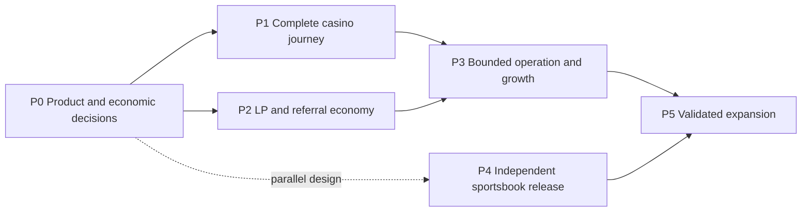

# ArbiGameFi Product and Protocol Roadmap

> Revision: 2026.09-r2 · Design status: Design Draft · Editorial status: Review Copy
>
> Updated: 2026-09-26 · Language: en, with Chinese orientation · Readers: product, protocol and operations teams
>
> 本路线图定义目标产品与实施顺序。P0–P5 是产品阶段，不是合约版本，也不是已完成工作的编号。

ArbiGameFi is a single-brand B2C casino and sportsbook built on a settlement
foundation that can support multiple isolated risk domains. This roadmap turns
that [product commitment](strategy/fullstack-product-architecture.md) into
user outcomes, design decisions and exit criteria. It complements the
[product whitepaper](WHITEPAPER.product.zh-CN.md) and
[technical whitepaper](WHITEPAPER.zh-CN.md).

Existing code is an implementation starting point. A stage may already have
evidence for some requirements; it is not complete merely because a contract,
screen or script exists. Release facts belong in the
[version status](release/STATUS-v1.5.zh-CN.md), and findings belong in the
[repository review](audit/RepositoryReview-2026-09-25.zh-CN.md).

## Direction and sequencing

The product must work for four participants together: players who understand
what they sign, LPs who receive a defined allocation for underwriting risk,
referrers whose rewards have a sustainable source, and operators who can fund
reliable service. Financial correctness and usable journeys are both necessary.

P1 usability work that does not depend on economic decisions can proceed while
P0 is being resolved. Sportsbook research, provider and rulebook work can run in
parallel with P1–P3; its launch has its own funding, risk and operations criteria.
The phase numbers express product priorities, not a requirement that every task
wait for all lower-numbered work.

This is a proposed staging of the existing product direction. Economics and LP
rights precede broad capital acquisition and channel growth because risk
compensation and service funding need a defined source. The original sportsbook
MVP priority continues in parallel; P4 is its independent release decision,
not an instruction to postpone all sports work until P3 is complete.

Keep the first product focused. Additional games, chains, live sports betting,
white-label portals and a protocol token are not prerequisites for a successful
casino and initial fixed-odds sportsbook.

## P0 — Product and economic decisions

**Outcome:** all participants can understand how the product creates and
distributes value, and implementers have a coherent target to build.

**Design work**

- Confirm the casino scope and the sportsbook scope: pre-match fixed-odds
  singles, football 1X2 first, one chain, one approved asset and a separate
  Sports Bank for its first public version.
- Give LP risk compensation an explicit allocation. Compare candidate B
  (distribute only part of actual payout deductions) with candidate A
  (retain an LP allocation before distributing a turnover-based budget).
  Candidate C (periodic net-revenue sharing) remains a later option because it
  introduces loss carryforward, timing and share-entry fairness questions.
- Specify the chosen fee basis, LP allocation, protocol/referral split,
  rounding, unassigned rewards and treatment of refunds. These are proposed
  changes, not an assertion that existing referral parameters implement them.
- Model each casino payout distribution, net payouts, external liabilities,
  capital utilisation, tail losses and service costs. Sports uses a separate
  model for pricing quality, correlated event exposure and result disputes.
- Define rights at bet acceptance: which terms are snapshotted, how changes
  affect pending obligations, and the notice or delay needed for high-impact
  governance changes. Separate emergency pause from ordinary policy changes.

**Exit criteria**

- The selected economic model and unresolved alternatives have a decision
  record; rates are selected from analysis rather than inferred from old code.
- Expected returns, variance, liquidity constraints and operating costs are
  presented separately. No LP allocation is described as a guaranteed APY.
- Reserve and liability bounds are derived for the proposed distribution,
  including losing bets, partial refunds, rounding and concurrent obligations.
- The product, technical paper and implementation plan agree on the model and
  on what remains proposed. Necessary contract changes and migrations are
  identified before money is accepted under the new terms.

## P1 — Complete casino journey

**Outcome:** a new or returning player can finish a round, understand its result
and recover progress after interruption.

**Product work**

- Let visitors inspect rules, stake limits, fees and example receipts before
  connecting a wallet. Keep eight existing game families consistent in their
  transaction and result experience.
- Make wallet entry prominent on mobile and support wallet-browser and
  external-wallet paths. Preserve the intended page and network across the
  connection flow.
- Distinguish approval, bet signature, chain confirmation, randomness,
  settlement and eligible refund. Reuse sufficient allowance and explain the
  next signature after approval.
- Preview net payout, total stake, per-round/batch semantics, request fees and
  wallet gas without conflating them. Require confirmation of material quote
  changes.
- Recover an uncertain submitted transaction before permitting a duplicate;
  restore pending rounds on reload. Provide useful responses to rejection,
  wrong network, insufficient funds, pauses and delayed reads.
- Make automatic settlement the normal path and a verifiable receipt the end
  of every completed round. Keep manual debt-out as a recovery path.

**Exit criteria**

- First-use and returning-user scenarios pass on desktop and actual iOS and
  Android wallet paths within a documented supported set; installation and
  rejection fallbacks are also understood.
- A successful approval followed by slow reads does not mislabel the bet as
  failed, and an unknown submission does not trigger an automatic second bet.
- Single rounds, multi-round stops and unused-stake refunds show the correct
  used stake, payout, refund and costs; UI calculations reconcile to receipts.
- Normal automatic settlement and defined recovery scenarios are exercised
  against the release being evaluated. Each evidence claim names its scope.
- Primary flows, important errors and help content are localized and usable
  with keyboard, screen reader and small-screen layouts.

## P2 — LP and referral economic loop

**Outcome:** capital providers and growth partners can understand their returns,
rights and costs using the same reconciled economy.

**Product and protocol work**

- Implement the P0 economic decision with accounting and worst-case exposure
  checks, an explicit deployment/migration plan and independent review.
- Explain each pool's asset, domain, exposure, fee allocation and governance
  before LP entry. Show deposit/redeem previews and the reason for withdrawal
  limits.
- Report pool NAV, reserved exposure, external liabilities and current
  withdrawal capacity separately. Calculate investor performance only with
  sufficient cash-flow and share-transfer history; label incomplete data.
- Keep game GGR, LP net-value changes, protocol revenue and referral accruals
  as distinct metrics. Do not chart cumulative game activity as pool equity.
- Make attribution, accrual, qualification, vesting and claims understandable.
  Define the source of each reward and its treatment when no referrer exists.
- Evaluate protocol cost coverage, referral contribution and LP compensation
  under volume and outcome scenarios; identify any subsidy separately.

**Exit criteria**

- The implemented fee and liability flows match the chosen model, including
  loss outcomes and integer rounding. Financial changes receive relevant
  invariant/differential coverage and independent review.
- LP entry, holding, transfer, exit and temporary withdrawal restrictions have
  reconciled examples. A limited history cannot produce an asserted full-life
  investor return.
- Referral examples reconcile from eligible activity through liabilities to
  payment, without spending the LP allocation twice.
- The launch budget names the initial capital, risk limits, operating costs
  and channel allocation. Broad LP acquisition and paid incentives wait for
  a functioning economic loop.

## P3 — Bounded operation and public growth

**Outcome:** the product serves real users within a capacity that the team can
fund, observe and support, then grows on measured results.

**Product and operations work**

- Select initial assets, pools, limits and audience from liquidity and service
  capacity. Align frontend availability with intended contract access; a web
  switch is not a contract permission boundary.
- Instrument the journey from discovery through wallet connection, approval,
  bet acceptance and settlement, respecting the user's consent choices.
- Define service targets and observation windows before the bounded run:
  transaction completion, settlement delay, recovery time, index freshness
  and incident response. Record results, not promises without measurements.
- Validate release identity, dependency health, fallback RPCs, keeper funding,
  recoverable indexing and backups. An HTTP response alone is not proof of a
  healthy settlement service.
- Publish concise onboarding, fees, rules, risks, status and proof guides.
  Make marketing calls to action match what a user can currently do.
- Implement responsible-use controls with an explicit enforcement scope;
  browser-only preferences must not imply an account-wide or on-chain block.

**Exit criteria for expanding the audience or limits**

- P1 and P2 requirements needed for the chosen scope are met; any narrower
  pilot boundary is explicit, with no broad-launch claims.
- The approved run stays within its funding and exposure limits, with observed
  completion and recovery performance evaluated against the chosen targets.
- Incident ownership and recovery procedures have relevant exercises, and
  unresolved failures have a disposition before scale increases.
- User feedback and funnel data identify actionable friction. Contribution,
  LP outcomes and service costs are measured alongside conversion; higher
  turnover alone is not success.

## P4 — Independent sportsbook product release

**Outcome:** users can place a pre-match fixed-odds ticket and follow it to a
well-defined event result, payment or permitted void/refund.

The scope and specialized controls continue in the
[sportsbook roadmap](strategy/sportsbook-production-roadmap.md). This phase
does not inherit casino randomness, economics or acceptance evidence.

**Product and protocol work**

- Complete market discovery, valid signed-odds preview, ticket placement,
  immediate ticket tracking and a readable final receipt.
- Finalize the initial football 1X2 rulebook, cancellation/postponement rules,
  odds provider, result evidence and challenge/arbitration responsibilities.
- Use the dedicated Sports Bank with approved exposure limits by market,
  outcome and event; model correlated tickets and delayed settlement.
- Establish the sportsbook's own revenue allocation and LP compensation;
  casino fee-on-payout assumptions cannot be silently reused for fixed odds.
- Operate automatic result and ticket terminalization with fallback operators,
  monitoring, key custody and retained result evidence.

**Exit criteria**

- Signed quotes bind market identity, rule version, outcome, odds and validity
  constraints; expired or changed quotes require the intended reconfirmation.
- Realistic winning, losing, disputed and voided market cases reconcile
  tickets, reserves, liabilities and payments.
- Provider/evidence, access, custody, bankroll and risk policies satisfy the
  existing sportsbook release requirements; no casino result substitutes for
  them.
- The target deployment completes an end-to-end bounded canary with its final
  parameters and automatic terminalization evidence.

Live betting, parlays, props, futures and shared casino/sports bankrolls remain
outside this first release. Their later consideration requires new pricing,
rulebook, risk and operational analysis.

## P5 — Validated expansion

**Outcome:** new scope serves demonstrated demand without weakening the product
already in use.

Potential work includes additional pre-match markets, a new asset or chain,
additional casino modules and selected integrations. White-label services or
new economic instruments require a separate business case rather than being
assumed from architectural extensibility.

**Entry and exit criteria for each expansion**

- Name the user need and evidence that the existing product does not meet it.
- Estimate capital, data, support and operating costs and how they are funded.
- Specify the new trust and risk boundaries, migration impact and effects on
  existing obligations.
- Complete the domain-specific design, implementation review and bounded
  acceptance before presenting the capability as available.

## How progress is measured

| Question                       | Metric or evidence                                                                      | Interpretation boundary                           |
| ------------------------------ | --------------------------------------------------------------------------------------- | ------------------------------------------------- |
| Can a player complete a round? | Accepted bets reaching a paid or eligible refunded terminal state; stage-level failures | Approval success is not bet or settlement success |
| Can the service recover?       | Pending age, settlement-delay distribution, recovery time and index freshness           | Report the chain, window and observed conditions  |
| Is capital compensated?        | LP value changes reconciled with cash flows, liabilities and capital utilisation        | GGR and protocol fees are not investor returns    |
| Is growth sustainable?         | Retained participants, channel cost, contribution and service cost                      | Subsidies and donations are reported separately   |
| Is sports risk controlled?     | Event/outcome exposure, quote age, disputed-result duration and payment reconciliation  | Casino data does not establish sports readiness   |

Thresholds and observation windows are set for the intended launch scope before
evaluation. The roadmap supplies the questions and evidence needed; it does not
invent customer counts, return rates or launch dates.

## Starting point and document roles

The [2026-09-25 release snapshot](release/STATUS-v1.5.zh-CN.md) records an
eight-game casino deployment foundation, a closed public mainnet web betting
entry and no sportsbook in that release. The
[accounting review](audit/RepositoryReview-2026-09-25.zh-CN.md) identifies why
the proposed LP compensation work cannot be reduced to a copy change. These
are dated implementation facts, not the project's long-term product boundary.

Immediate work is to settle P0 choices while continuing independent P1 fixes,
then implement and validate the chosen economics for P2. P3 expansion depends
on the complete loop. Sportsbook design and evidence preparation can proceed
in parallel without claiming a release before P4 criteria are met.

Earlier “Milestone 0–4” identifiers describe historical engineering plans and
remain meaningful in their original documents and Git history. They are not
renumbered into these product phases, and passing an old milestone does not
declare a new phase complete. For actual deployment instructions use the
[current release workflow](deploy/v15-release.md); this roadmap is a design and
sequencing document.
