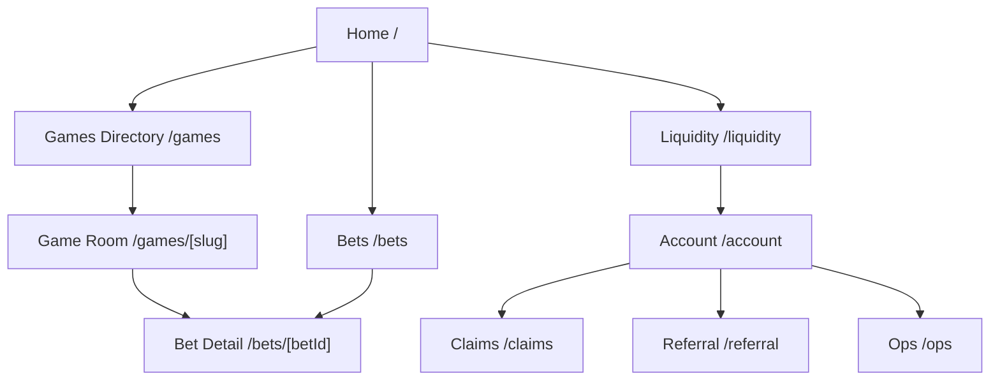
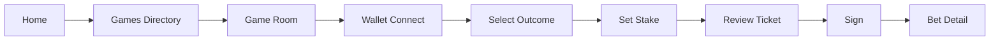
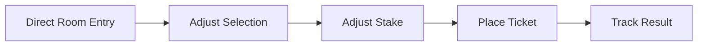
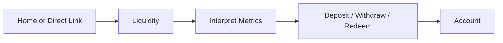
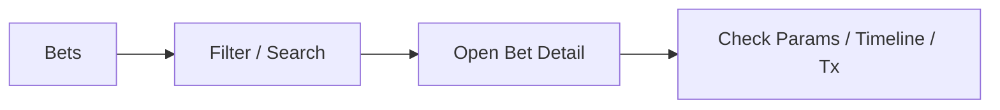

# UI/UX ARCHITECTURE PACK — ArbiGameFi

> Historical reference only. This document no longer drives formal implementation.
> Current layout truth lives in `V2-PROTOTYPE-BASELINE-2026-03-23.md` and the live `ui-ux-v2-*` prototypes.

**Status**: Historical reference

**Date**: 2026-03-09

**Scope**: `ArbiGameFi web product architecture`

**Related documents**

- `docs/frontend/UI-UX-DESIGN-BRIEF-2026-03.md`
- `docs/frontend/UI-UX-DIRECTION-BOARD-2026-03.md`
- `docs/frontend/UI-UX-WIREFRAME-PACK-2026-03.md`
- `docs/frontend/FRONTEND-ROUTE-REVIEW-2026-03.md`
- `docs/frontend/PRD.md`
- `docs/frontend/UI-CONSTITUTION.md`
- `docs/frontend/PAGE-SPECS/`
- `docs/ARBIGAMEFI-EXECUTIVE-BRIEF.zh-CN.md`
- `docs/release/ARBIGAMEFI-RELEASE-PACK.zh-CN.md`
- `docs/release/ARBIGAMEFI-LP-ONBOARDING.zh-CN.md`

---

## 1. Purpose

This document is the architectural bridge between:

- the design brief
- the later high-fidelity UI design
- the eventual frontend implementation

It freezes the following before visual polishing begins:

- product shells
- route hierarchy
- information architecture
- primary user flows
- first-fold priorities
- low-fidelity page structures

This is not the final visual design.
This is the structural blueprint the final visual design must follow.

---

## 2. Product Topology

ArbiGameFi should be treated as one brand with three interface modes.

### 2.1 Acquisition Mode

Routes:

- `/`
- `/games`

Objective:

- turn a visitor into a room entrant

Design tone:

- editorial
- premium
- persuasive
- trust-first without becoming technical

### 2.2 Gameplay Mode

Routes:

- `/games/[slug]`
- `/bets/[betId]` when reached from play

Objective:

- let a player enter, configure, place, and understand one bet

Design tone:

- immersive
- table-first
- minimal chrome
- clear action hierarchy

### 2.3 Trust / Audit Mode

Routes:

- `/bets`
- `/bets/[betId]`
- `/liquidity`
- `/account`
- `/claims`
- `/referral`
- `/ops`

Objective:

- explain facts, balances, liabilities, and eligibility with confidence

Design tone:

- clean
- precise
- institutional
- less atmospheric, more legible

---

## 3. Route Hierarchy

### 3.1 Primary Navigation

- Home
- Games
- Bets
- Liquidity
- Account

### 3.2 Secondary Navigation

- Claims
- Referral

### 3.3 Advanced Navigation

- Ops

### 3.4 Routing Rule

Navigation should reflect user priority, not feature count.

That means:

- gameplay and bankroll routes stay primary
- support and secondary monetization routes stay secondary
- diagnostics stay advanced

---

## 4. Shell System

The product should not use one shell for every route.

It should use four distinct shell types.

## 4.1 Landing Shell

Used by:

- `/`

Characteristics:

- minimal header
- strong brand expression
- no dense product navigation
- CTA-focused footer

Header contents:

- brand
- compact top-level links
- primary CTA
- wallet button only if it supports conversion and does not steal focus

## 4.2 Directory Shell

Used by:

- `/games`

Characteristics:

- product navigation visible
- route title visible
- content focused on selection and comparison

Header contents:

- brand
- primary navigation
- wallet

## 4.3 Room Shell

Used by:

- `/games/[slug]`

Characteristics:

- minimal top chrome
- no left global navigation
- game selector on top
- screen dominated by the active room surface

Header contents:

- brand
- `All Games`
- wallet

No additional global chrome should compete with the room itself.

## 4.4 Trust Shell

Used by:

- `/bets`
- `/bets/[betId]`
- `/liquidity`
- `/account`
- `/claims`
- `/referral`
- `/ops`

Characteristics:

- strongest navigation presence
- high-density layouts allowed
- emphasis on clarity and explanation

---

## 5. Sitemap



---

## 6. Primary User Flows

## 6.1 Player Acquisition Flow



### UX requirement

At no point in this flow should the player be forced to parse:

- release mechanics
- protocol jargon
- operational telemetry

before they can identify the main next action.

## 6.2 Returning Player Flow



### UX requirement

This flow must be faster than first-time entry.
The UI should preserve familiarity and reduce explanation density.

## 6.3 LP Flow



### UX requirement

The LP should understand:

- what backs LP value
- what does not back LP value
- why some outflows are constrained

without reading the full whitepaper.

## 6.4 Audit Flow



### UX requirement

The audit experience must feel precise, not flashy.

---

## 7. Route-Level Architecture

## 7.1 Home

### First fold

- brand promise
- one primary CTA
- one secondary CTA
- hero supporting visual
- compact trust proof strip

### Mid-page

- featured rooms
- three-step “how it works”
- trust proof

### Lower page

- lightweight live proof
- final CTA

### Must not appear in first fold

- tables
- dense asset metrics
- protocol copy blocks

## 7.2 Games Directory

### First fold

- page title
- room category toggles or groupings
- featured rooms

### Main body

- room grid
- each room card must answer:
  - what kind of game is this
  - why choose it
  - how intense or simple it is

### Optional lower sections

- quick explainers
- room families

## 7.3 Game Room

### Desktop first fold

- top game selector
- compact room title strip
- left bet slip
- right game table

### Mobile first fold

- top game selector
- room title strip
- game surface
- bet slip stacked beneath or in a bottom-sheet pattern

### Required interaction hierarchy

1. identify room
2. choose result
3. set amount
4. review
5. sign

### Secondary information

Everything below the fold:

- recent bets
- how to play
- protocol facts
- deep transaction detail

### Roulette room structure

First fold must be:

- top selector
- compact room strip
- left slip / right standard European table on desktop
- simplified table stack on mobile

Order of roulette controls:

1. straight number board
2. dozen / column / outside bets
3. layout bets
4. advanced raw mask disclosure

### Dice room structure

First fold must center:

- threshold or cap control
- quick visual odds implication
- stake panel

### Coin Toss room structure

First fold must center:

- binary side selection
- immediate confirmation of side
- stake panel

### Keno room structure

First fold must center:

- number board
- selected count
- fast clear / quick-pick
- stake panel

## 7.4 Bets

### First fold

- title
- filter controls
- summary strip

### Main body

- dense ledger table
- clear row affordances

### Key requirement

The ledger must feel like a tool, not a marketing page.

## 7.5 Bet Detail

### First fold

- bet status
- decoded selection
- stake summary
- current eligibility / result

### Lower sections

- lifecycle timeline
- transaction list
- protocol facts
- eligible actions

## 7.6 Liquidity

### First fold

- LP-oriented title
- “how to read this page” strip
- key metrics
- primary deposit / redeem action area

### Lower sections

- deeper metrics
- explanations
- journal or related account links

## 7.7 Account

### First fold

- wallet identity
- balances
- positions
- actions available

### Lower sections

- allowances
- refund credit
- journal

---

## 8. Low-Fidelity Wireframes

These are structural wireframes in text form.

## 8.1 Home — Desktop

```text
┌──────────────────────────────────────────────────────────────┐
│ Landing Header: Brand | Rooms | Liquidity | Primary CTA     │
├──────────────────────────────────────────────────────────────┤
│ Hero: headline | support copy | primary CTA | secondary CTA │
│ Hero visual / featured room teaser                           │
├──────────────────────────────────────────────────────────────┤
│ Proof ribbon                                                 │
├──────────────────────────────────────────────────────────────┤
│ Featured rooms                                               │
├──────────────────────────────────────────────────────────────┤
│ How it works (3 steps)                                       │
├──────────────────────────────────────────────────────────────┤
│ Why trust this                                               │
├──────────────────────────────────────────────────────────────┤
│ Live proof                                                   │
├──────────────────────────────────────────────────────────────┤
│ Final CTA                                                    │
└──────────────────────────────────────────────────────────────┘
```

## 8.2 Home — Mobile

```text
┌──────────────────────────────┐
│ Landing Header               │
├──────────────────────────────┤
│ Hero                         │
├──────────────────────────────┤
│ Proof ribbon                 │
├──────────────────────────────┤
│ Featured rooms               │
├──────────────────────────────┤
│ How it works                 │
├──────────────────────────────┤
│ Trust                        │
├──────────────────────────────┤
│ Live proof                   │
├──────────────────────────────┤
│ Final CTA                    │
└──────────────────────────────┘
```

## 8.3 Games Directory — Desktop

```text
┌──────────────────────────────────────────────────────────────┐
│ Product Header                                               │
├──────────────────────────────────────────────────────────────┤
│ Title + short explanation                                    │
│ Featured room strip                                          │
├──────────────────────────────────────────────────────────────┤
│ Category / family controls                                   │
├──────────────────────────────────────────────────────────────┤
│ Room grid                                                    │
│ Room grid                                                    │
│ Room grid                                                    │
└──────────────────────────────────────────────────────────────┘
```

## 8.4 Game Room — Desktop

```text
┌──────────────────────────────────────────────────────────────┐
│ Minimal Room Header: Brand | All Games | Wallet             │
├──────────────────────────────────────────────────────────────┤
│ Top Game Selector                                            │
├──────────────────────────────────────────────────────────────┤
│ Room Strip: title | state                                    │
├───────────────────┬──────────────────────────────────────────┤
│ Bet Slip          │ Game Table / Outcome Surface             │
│ - amount          │ - outcome board                          │
│ - quick chips     │ - current selection                      │
│ - round count     │ - secondary controls                     │
│ - summary         │                                          │
│ - primary CTA     │                                          │
├───────────────────┴──────────────────────────────────────────┤
│ Tabs: Recent Bets | How to Play | Protocol                   │
└──────────────────────────────────────────────────────────────┘
```

## 8.5 Game Room — Mobile

```text
┌──────────────────────────────┐
│ Minimal Room Header          │
├──────────────────────────────┤
│ Top Game Selector            │
├──────────────────────────────┤
│ Room Strip                   │
├──────────────────────────────┤
│ Game Surface                 │
├──────────────────────────────┤
│ Bet Slip                     │
├──────────────────────────────┤
│ Tabs                         │
└──────────────────────────────┘
```

## 8.6 Liquidity — Desktop

```text
┌──────────────────────────────────────────────────────────────┐
│ Product Header                                               │
├──────────────────────────────────────────────────────────────┤
│ Title + LP explainer                                         │
├──────────────────────────────────────────────────────────────┤
│ Key metric cards                                             │
├──────────────────────────────────────────────────────────────┤
│ Asset tabs                                                   │
├──────────────────────┬───────────────────────────────────────┤
│ Position / actions   │ Detailed metrics / explanations       │
├──────────────────────┴───────────────────────────────────────┤
│ Related trust sections                                       │
└──────────────────────────────────────────────────────────────┘
```

## 8.7 Bets — Desktop

```text
┌──────────────────────────────────────────────────────────────┐
│ Product Header                                               │
├──────────────────────────────────────────────────────────────┤
│ Title + summary strip                                        │
├──────────────────────────────────────────────────────────────┤
│ Filters                                                      │
├──────────────────────────────────────────────────────────────┤
│ Ledger table                                                 │
│ Ledger table                                                 │
│ Ledger table                                                 │
└──────────────────────────────────────────────────────────────┘
```

---

## 9. Shared Component Zones

The architecture implies five shared component zones.

### 9.1 Brand / Navigation

- landing header
- product header
- room header

### 9.2 Selection Components

- room cards
- game selector
- roulette table controls
- dice cap surface
- keno number board
- binary choice panels

### 9.3 Ticketing Components

- bet slip
- amount input
- chip presets
- ticket summary
- primary CTA

### 9.4 Trust Components

- metric cards
- explanation strips
- status banners
- protocol fact cards
- timelines

### 9.5 State Components

- disconnected wallet state
- loading
- empty
- tx pending
- tx success
- tx failure
- delayed indexer state

---

## 10. Responsive Rules

## 10.1 Desktop

Desktop can use dual-pane layouts for:

- game rooms
- liquidity
- some audit routes

## 10.2 Tablet

Tablet should preserve:

- clear hierarchy
- reduced chrome
- stacked or semi-stacked panels

## 10.3 Mobile

Mobile must favor:

- one dominant interaction per screen section
- short headers
- progressive disclosure
- reduced supporting content in the first fold

No desktop layout should simply collapse without intent.

---

## 11. Design Freeze Decisions

The following decisions are frozen by this pack.

1. game selector belongs on top of the room, not on the left
2. game rooms must use minimal global chrome
3. room first fold must prioritize play over protocol explanation
4. liquidity must be LP-first, not metrics-first
5. acquisition and audit routes must not share the same visual structure
6. roulette defaults to a standard European table, not a raw mask surface

---

## 12. Required Outputs After This Pack

The next design artifacts should be produced in this order.

### 12.1 Direction board

- references
- visual mood
- typography
- color family

### 12.2 High-level wireframe set

- desktop
- mobile

### 12.3 High-fidelity route pack

- Home
- Games
- Game Room
- Liquidity
- Bets
- Bet Detail
- Account

### 12.4 State pack

- disconnected
- loading
- empty
- delayed
- pending
- success
- error

### 12.5 Handoff pack

- component mapping
- responsive notes
- interaction notes

---

## 13. Acceptance Criteria

This architecture pack is acceptable when:

1. route hierarchy is stable
2. shell system is stable
3. first-fold priorities are stable
4. game room interaction order is stable
5. the later visual design can proceed without re-arguing layout fundamentals

If those conditions are not met, high-fidelity design should not start yet.
